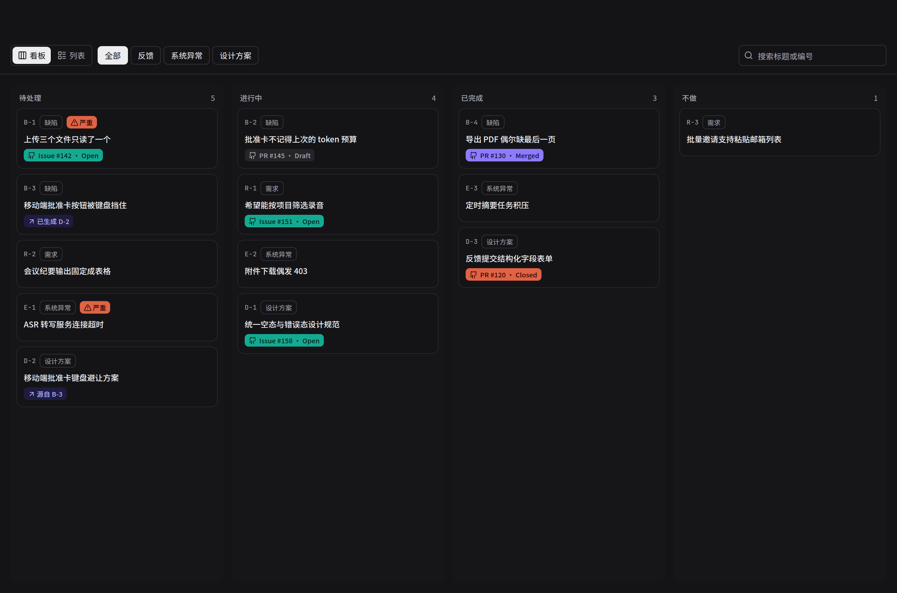
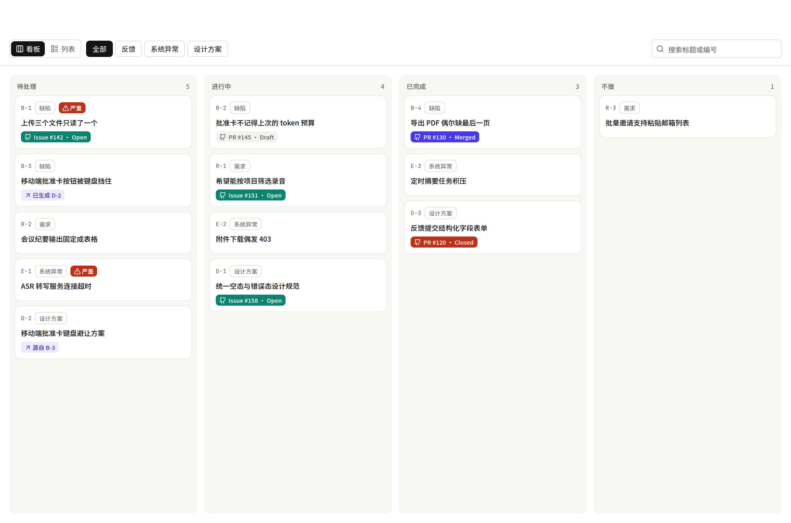
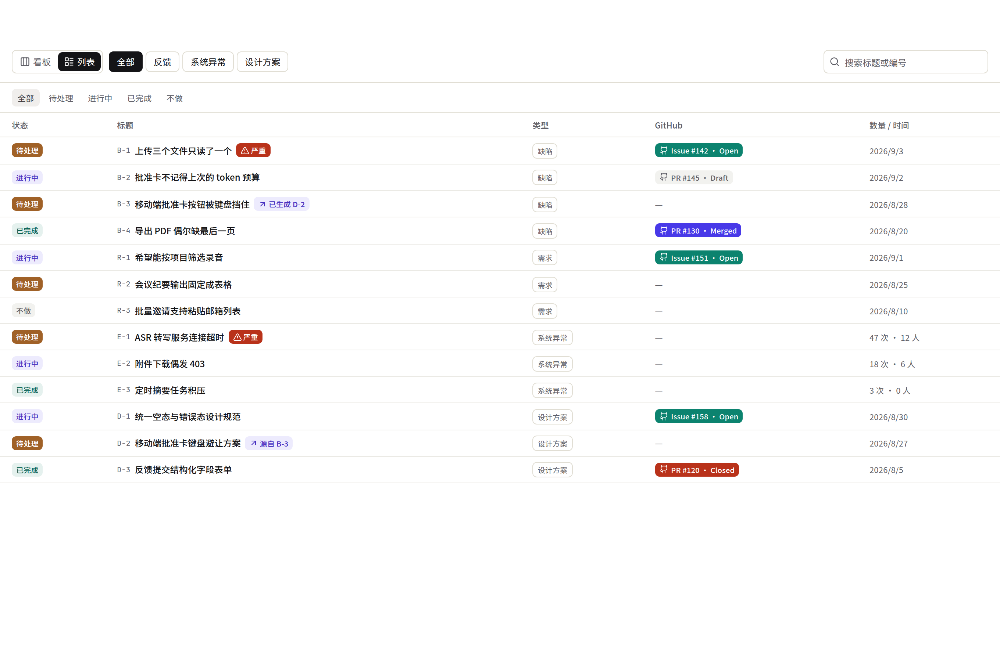
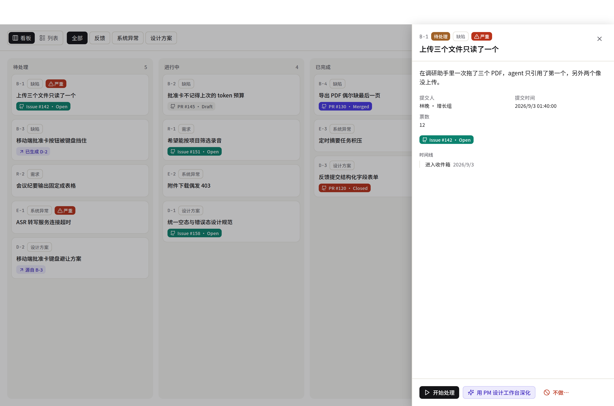
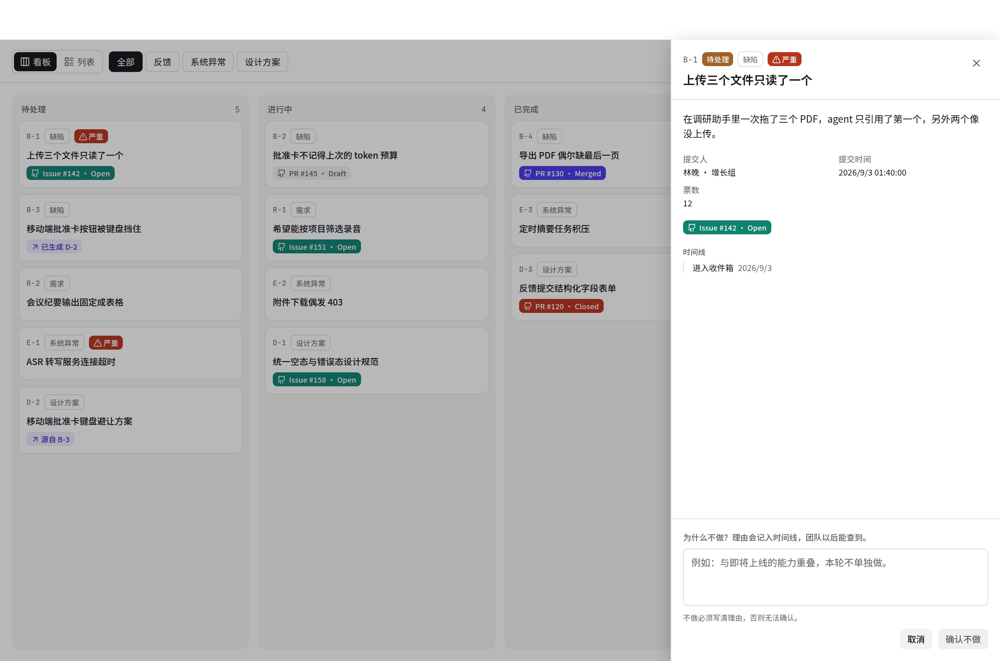
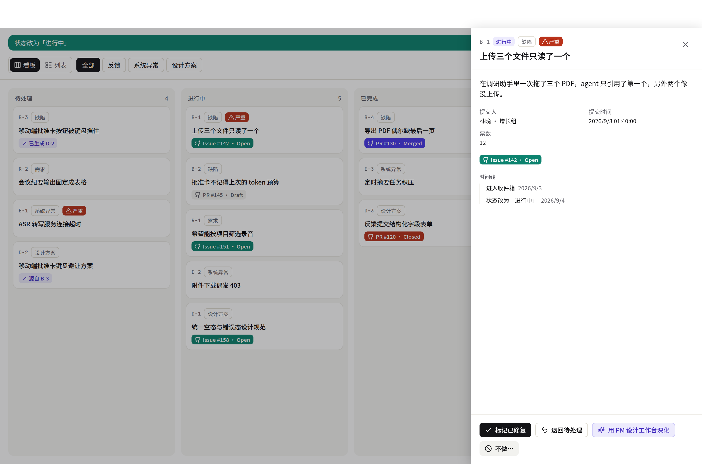
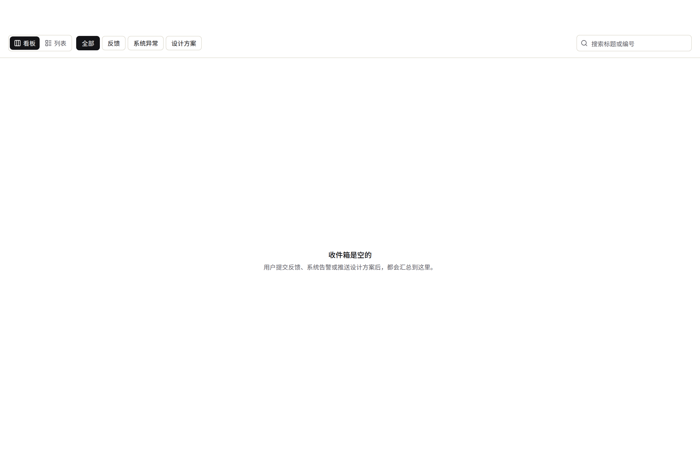
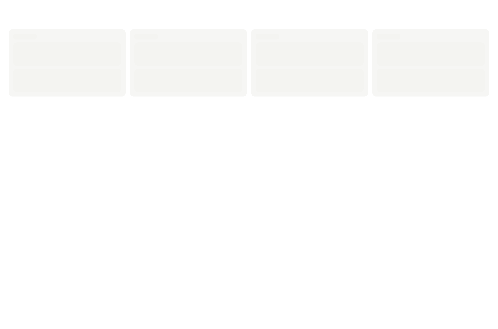
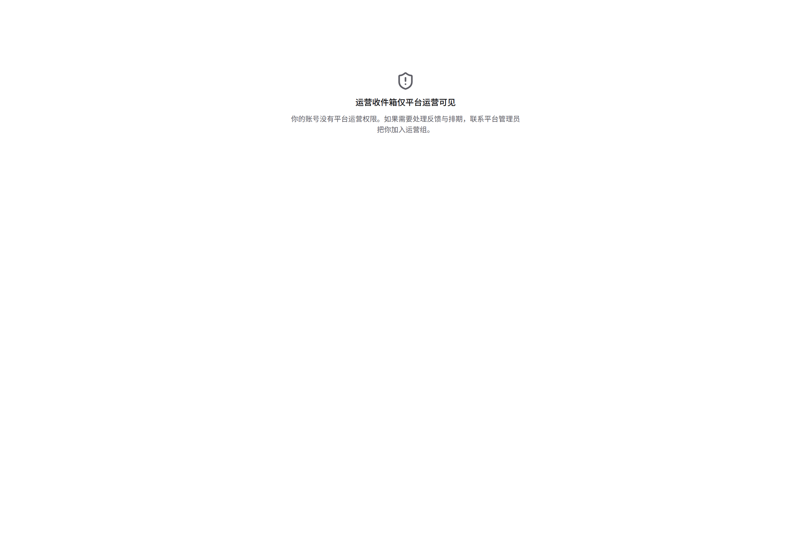
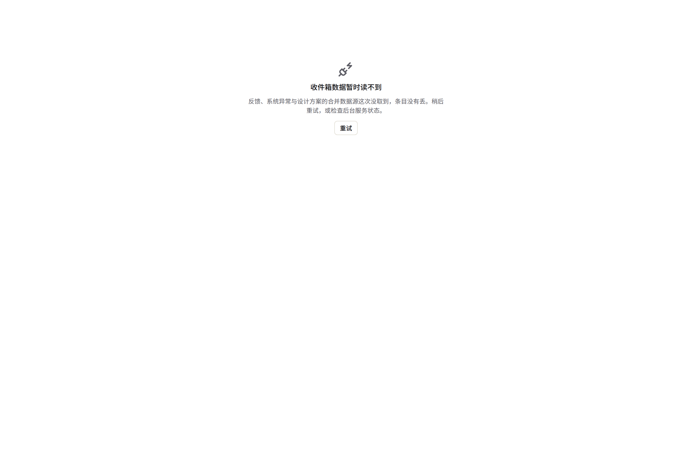

# 契约束 `inbox-unified` — 签核第 ① 件：UI

> **自检**：本文件引用 11 张截图，目录下实际 20 张。
> （共用 `ui-preview/feedback-design-loop/`，孤图由组级并集检查兜底，见
> `.harness/scripts/ui-material-map.json`——另 9 张 `dialog-*`/`drafts-*` 属 `feedback-drafts` 束。）

## 这些图是怎么来的（重要）

由 `apps/web/scripts/shot-feedback-design-loop.mjs` 从取材页 `/preview/feedback-design-loop`
（`scene=inbox-board` / `inbox-empty`）拍摄，**渲染的是生产同一份组件**
（`components/design-loop/inbox-screen.tsx`），数据由脚本 `page.route()` 拦截 `/inbox*`
与反馈/系统异常路由提供——同 `feedback-loop` / `design-workbench` 两束 `ui.md` 的范式。

⚠ 图与生产的差别**只有数据，没有代码**。数据是脚本里写死的固定集合，不连真库。

重跑（需本地起 `apps/web` dev server）：
```bash
BASE=http://localhost:3187 \
  OUT=<repo>/phases/phase-03-reuse-and-governance/ui-preview/feedback-design-loop \
  SHOTS_FILTER='^inbox' \
  node apps/web/scripts/shot-feedback-design-loop.mjs
```

---

## 屏 A · 看板（R4.3：四列 + 类型 chip + 状态子筛选）

- 
- 
- 

签核要点：四列顺序 = `InboxStage`；卡片上 `code`（B-/R-/E-/D-）、类型标、GitHub 徽标、
`severe` 红标；系统异常卡片对「已完成」列无 drop 目标（V6）。

## 屏 B · 列表视图

- 

签核要点：同一份数据同一套过滤；「数量/时间」列口径（系统异常「N 次 · M 人」，其余日期）
是 UI 先行的决定 7，待确认。

## 屏 C · drawer（贴边）

- 
- 
- 

签核要点：状态标签显示 `sourceStatus` 原文；操作按钮只出**出得去的边**；时间线读
`listFeedbackStatusEvents`；「用 PM 设计工作台深化」→ `deepenFeedback`。

## 屏 D · 七态里的其余四态

- 
- 
- 
- 

⚠ 未产出：**非超管 withheld 提示**（系统异常 chip 禁用 + 「仅平台运维可见」）没有单独一张
截图——它是看板默认态在非超管身份下的变体，B3.4 单测覆盖（`inbox-exception-withheld-hint`），
签核时可在取材页切 `role` 查看；是否要补一张图请人类决定。
