# 契约束 `design-workbench` — 签核第 ① 件：UI

> ## 自检（可机械核对）
>
> **本文件引用 16 张截图，目录下实际 16 张。N == M，无死链、无多列、无遗漏。**
>
> 这一行由 `.harness/scripts/lint-ui-material.mjs` 双向对账（引用集合 == 实存集合），
> 不是一句自述——写错了会红。

## 这些图是怎么来的（重要）

由 `apps/web/scripts/shot-feedback-design-loop.mjs` 从取材页
`/preview/feedback-design-loop`（`scene=workbench*`/`scene=detail*`）拍摄，**渲染的是生产
同一份组件**（`DesignWorkbenchHome` / `DesignDetailScreen`），数据由脚本 `page.route()`
拦截 `designWorkbench` 契约的 `/pm-designs*` 提供——同 `feedback-loop` 束 `ui.md` 的范式。

⚠ **UC-17.8 B4.6 补的正是这条拦截**：B4.5 把这两屏从 `lib/design-loop-store.tsx` 的本地
mock 切到真实 `/pm-designs*` 之后，取材页在没有真实后端可打的环境下，`workbench-*`/
`detail-*` 这 16 张原来是没法生成的（`listMyProjects()` 会挂起或直接网络失败）——`ui.md`
这次和拦截是同一次动作补上的，同 `feedback-loop` 束 `ui.md` 第 36 行那条纪律一样：
「产出截图与建 `ui.md` 是同一次动作」。

⚠ 所以图与生产的差别**只有数据，没有代码**。复刻一遍界面来拍照是本仓最不该犯的错——
签核签的是照片，上线的是另一份代码。

⚠ 数据是脚本里写死的固定集合，不连真库：截图脚本要能在任何机器上重跑出**同一张图**。
连真库的话图会随那台机器上的数据变，而签核签的是图。

⚠ **目录**：`workbench-*`/`detail-*` 这 16 张单独落进 `ui-preview/design-workbench/`，
不与同一份脚本产出的 `dialog-*`/`drafts-*`/`inbox-*`（那些属于反馈草稿/运营收件箱两块，
分别对应另外的契约束，本束不重复登记）混在同一目录——`lint-ui-material` 是一束一目录的
双向对账，混目录会让本束的「反向」判定把别的束的图也算进来。

重跑（需要本地起 `apps/web` dev server，`BASE` 指向它）：
```bash
BASE=http://localhost:3187 \
  OUT=<repo>/phases/phase-03-reuse-and-governance/ui-preview/feedback-design-loop \
  SHOTS_FILTER='^(workbench|detail)' \
  node apps/web/scripts/shot-feedback-design-loop.mjs
```
`workbench-*`/`detail-*` 两类文件名会被脚本自动分流到 `ui-preview/design-workbench/`
（`OUT` 的上级目录下），不需要另外指定输出路径——`SHOTS_FILTER` 只是让重跑更快，省掉
`dialog-*`/`drafts-*`/`inbox-*` 那些跟本束无关的场景；不传时脚本仍会把全部场景跑一遍，
产出位置不变。

---

## 屏 A · 工作台首页（R4.4：三张模板入口 + 「我的设计项目」网格）

- 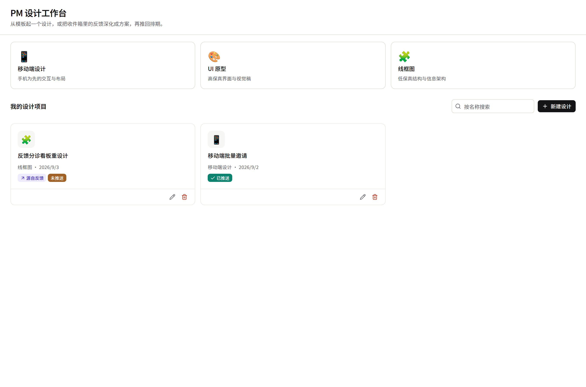
- 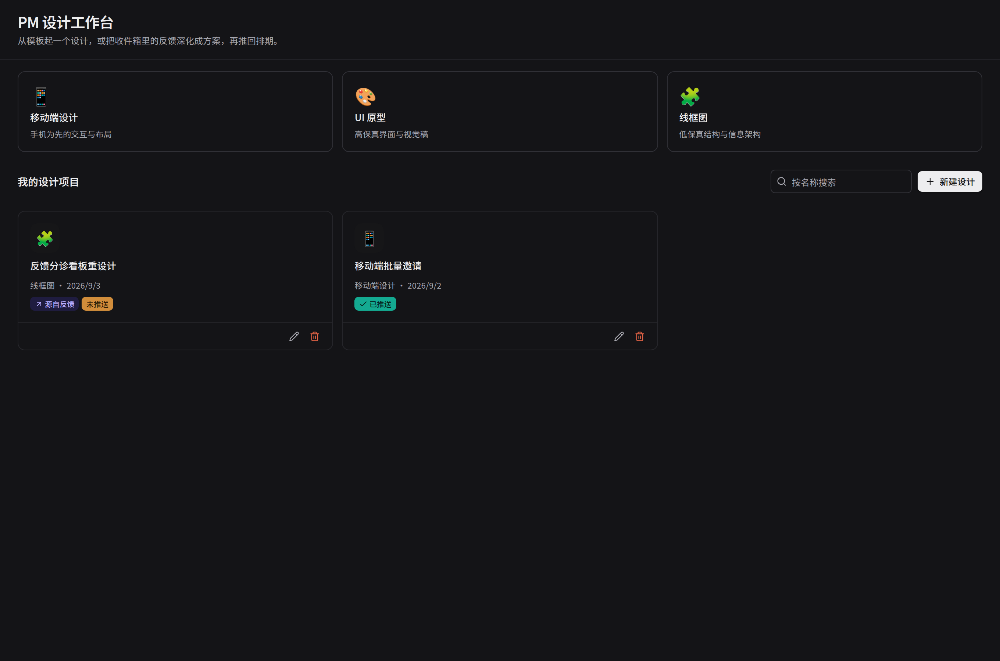
- 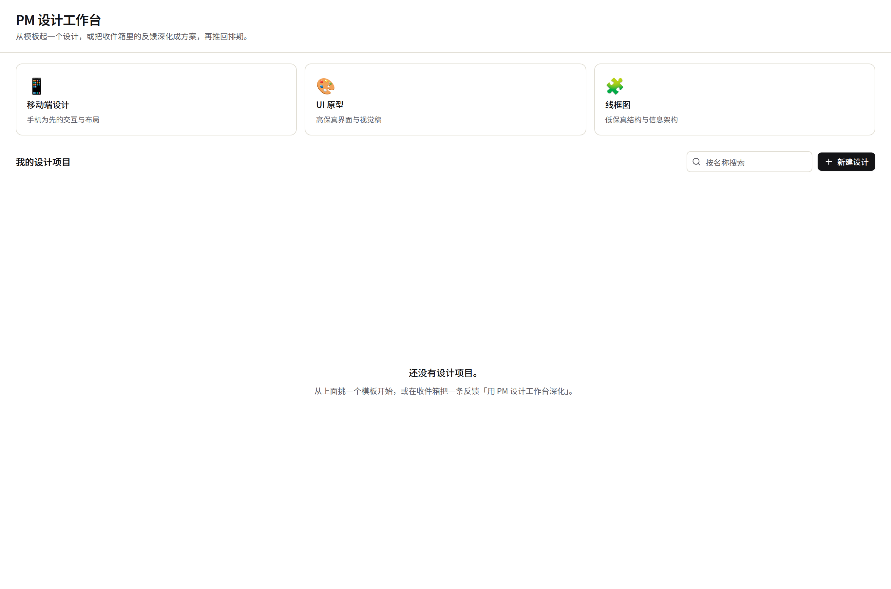

要看的四处：
1. 顶部三张模板入口（移动端设计 / UI 原型 / 线框图），点击直接进新建弹窗（见屏 B）；
2. 「我的设计项目」网格：每张卡片显示模板图标、名称、模板类型 + 更新日期、
   `源自反馈`（`linkedFeedbackId` 非空时）与 `已推送`/`未推送` 两态徽标；
3. 右上角**服务端参数搜索**（`workbench-search`，`listMyProjects({ q })`）——同
   `inbox-screen.tsx` 的 `q` 是同一套纪律：不是本地过滤，避免"列表已加载"和
   "搜索结果"分裂成两份状态；
4. 空态：没有项目时的引导语，提示「从模板开始」或「收件箱深化」两条路径。

## 屏 B · 新建 / 编辑弹窗（R4.4）

- 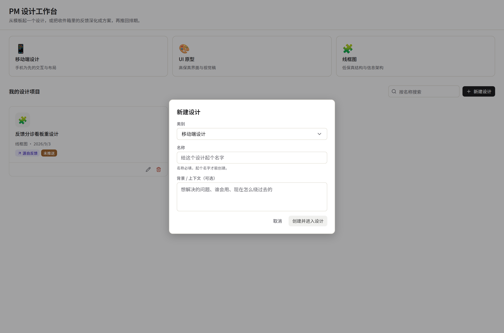
- 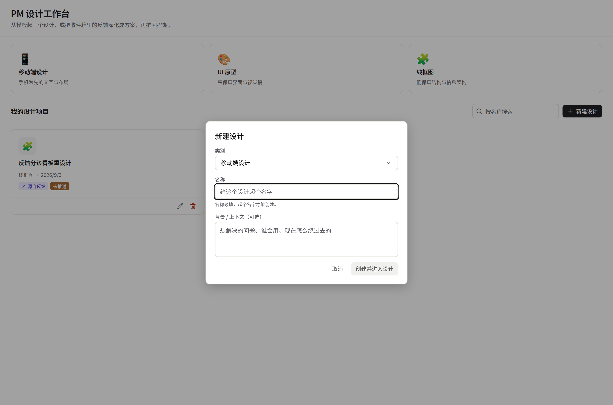

要看的两处：
1. 类别下拉 + 名称 + 背景/上下文（可选）三个字段，编辑弹窗复用同一套字段集
   （只改名称/模板/背景，不改 `criteria`/`frames`/`chat`，见契约头注）；
2. 名称为空时「创建并进入设计」禁用，内联错误提示（`err-name`）。

## 屏 C · 三个新状态（UC-17.8 B4.5 切真栈后才有——B4.6 补拍）

- 
- 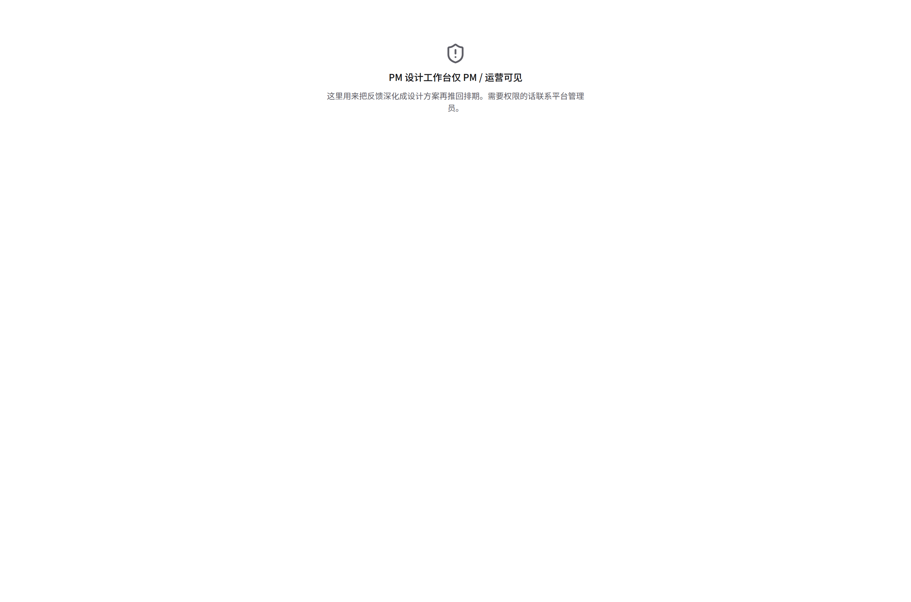
- 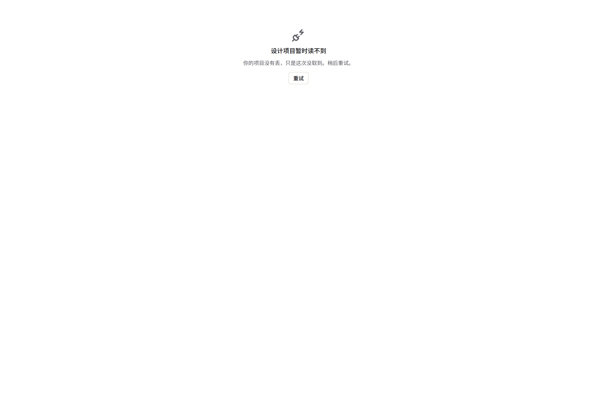

⚠ 这三态在 mock 时代不存在——本地 store 的读取不会失败也不会挂起。B4.5 切到真实
`listMyProjects()` 之后，网络请求本身可能失败或未完成，`workbench-screen.tsx` 因此长出
这三条真实分支（`?state=` 直接驱动展示分支，不发真实请求，同 `inbox-screen.tsx` 既有的
七态约定）：
1. **加载中**：网格位置的骨架屏占位；
2. **无权限**：PM 设计工作台仅 PM/运营可见，非法访问的提示与联系管理员的引导；
3. **依赖失败**（`dep-failed`）：「你的项目没有丢，只是这次没取到」+ 「重试」按钮
   （`workbench-retry`）——不是把网络错误原样甩给用户。

## 屏 D · 生成中过渡（backlog B4.5 原文：等待 `createProject` 真实返回）

- 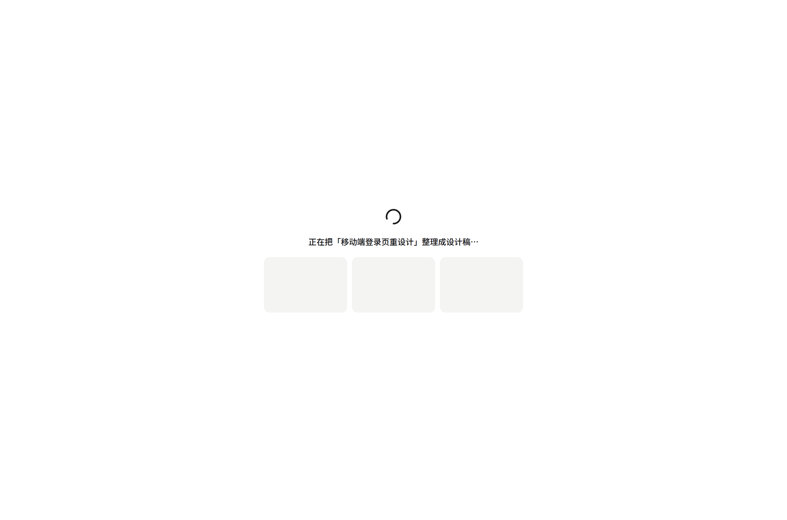

⚠ **这不是一张摆拍的固定图**：截图脚本让 `createProject` 故意晚 2 秒才 `fulfill`，
在真实等待期间截下这一帧——过渡态持续到 `createProject` 真正 resolve/reject 为止
（不再是固定 1.1s 的 `window.setTimeout` 假过渡），失败时退回弹窗并提示错误
（`workbench-action-error`），不静默吞掉。

## 屏 E · 设计详情全屏（Claude Code 风格深色 IDE）

- 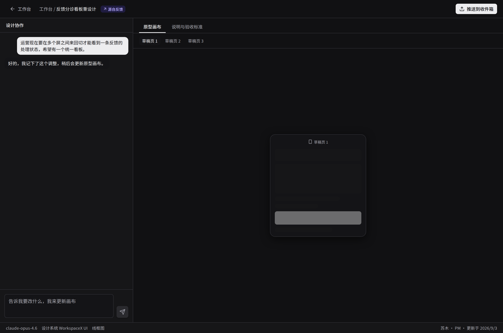
- 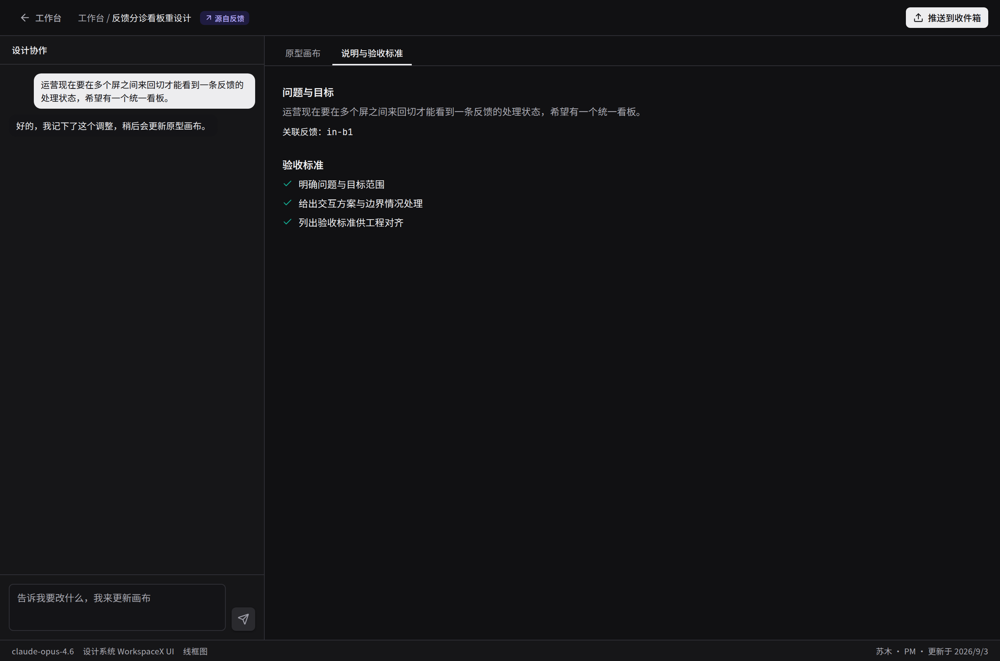

要看的五处：
1. 左侧 360px「设计协作」对话面板，历史为空时展示 `DESIGN_WORKBENCH_CHAT_INTRO`
   固定引导语（不落库，见契约文件头【待确认点 2】）；
2. 右侧「原型画布 / 说明与验收标准」两个 Tab；画布下横向标签条（`frames`）+ 居中手机
   占位块（`PhoneCanvas`，画布内容本身仍是占位块，B5.3 明确 out of scope）；
3. 「说明与验收标准」Tab：问题与目标（`problem`，未填时给出引导语）、关联反馈 id
   （`linkedFeedbackId` 非空时）、三条固定验收标准（`DESIGN_PROJECT_INITIAL_CRITERIA`）；
4. 顶部条：返回工作台、面包屑、`源自反馈` 徽标（有关联时）、右上角推送按钮（未推送/
   已推送两态文案不同，但都可再点——见契约「推送幂等选的是 upsert」）；
5. 底部状态条：模型名、设计系统、模板类型、owner + 更新时间——纯展示，不是可交互控件。

## 屏 F · 推送到收件箱（R4.4）

- 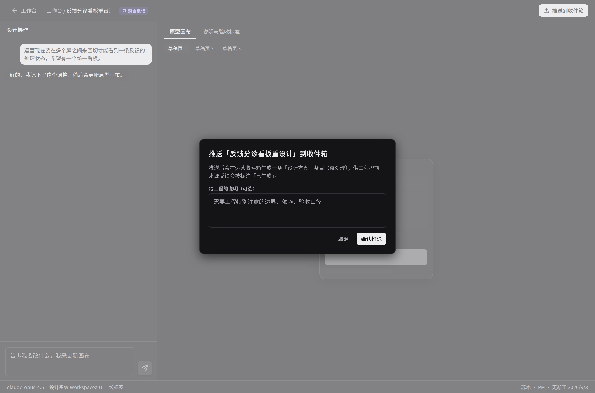
- 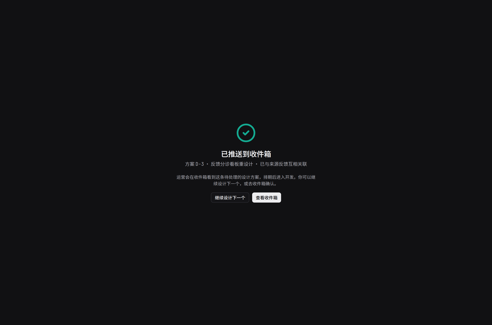

要看的三处：
1. 确认弹窗：给工程的说明（可选，`design-push-note`），说明文案随是否关联反馈变化
   （关联时多一句"来源反馈会被标注「已生成」"）；
2. 推送成功页两个出口（backlog B4.5 原文）：`inboxCode` 来自 `pushToInbox` 的**真实返回
   值**（不再是本地 mock 生成的 `D-` 编号）；「继续设计下一个」不携带 code——出口本身
   不需要它，这条路径从没引用过；
3. 「查看收件箱」出口跳转到统一收件箱（另一契约束，不在本文件范围）。

## 屏 G · 两个新状态（同屏 C 的成因——UC-17.8 B4.6 补拍）

- 
- 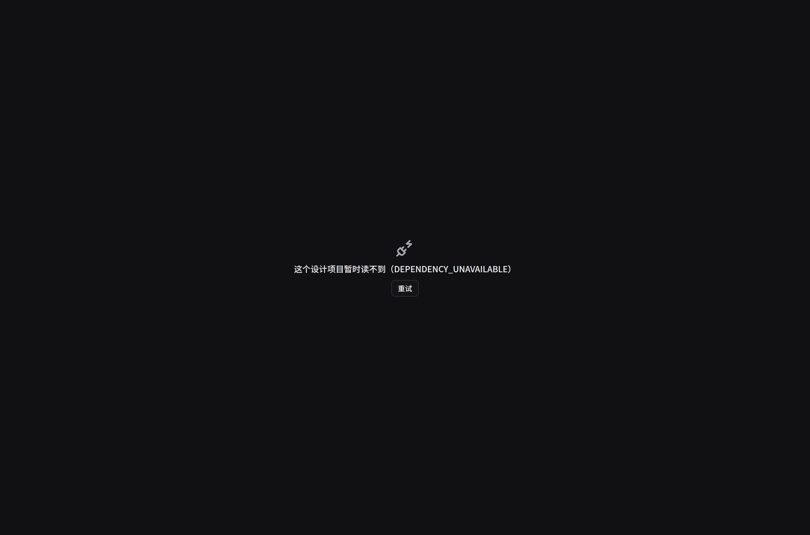
- 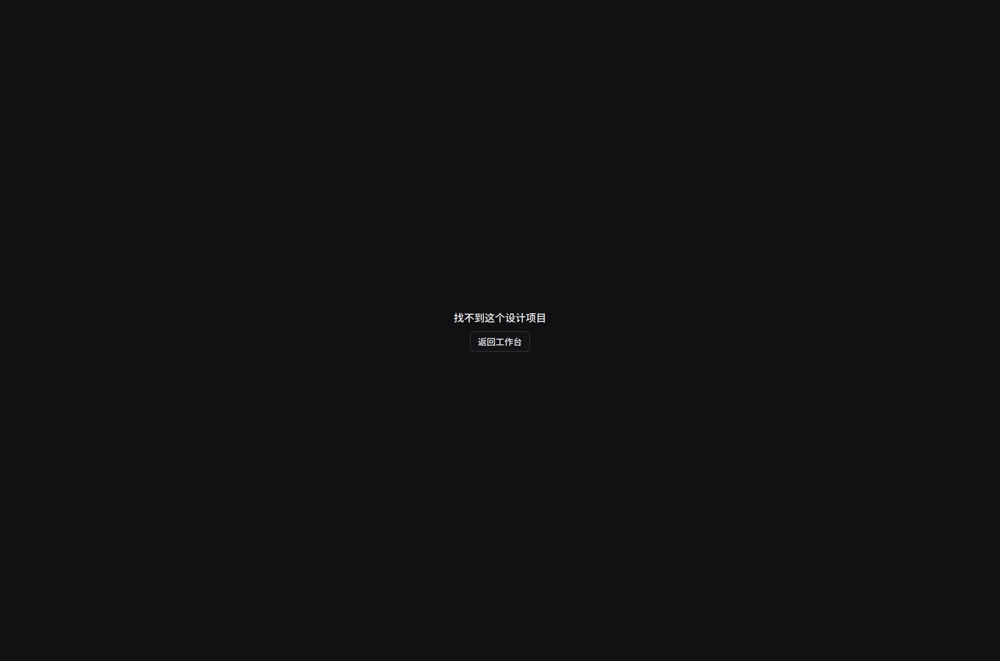

⚠ 与工作台首页的三态不同，**详情页没有 `state` prop**——这三态都是`listMyProjects()`
真实调用的结果分支（`detail-screen.tsx` 的 `Load` 类型），不是 UI 层摆出来的：
1. **加载中**：截图脚本让 `/pm-designs` 挂起不 `fulfill`，在真实等待期间截下这一帧；
2. **依赖失败**：截图脚本让 `/pm-designs` 回 503 `DEPENDENCY_UNAVAILABLE`，页面显示
   「这个设计项目暂时读不到（原因）」+「重试」（`design-detail-retry`）；
3. **找不到这个设计项目**（`design-detail-missing`）：请求成功但按 `id` 在返回列表里
   找不到这一条——见 `lib/live-design-workbench.ts` 文件头注：契约没有单条 `getProject`
   操作，`listMyProjects()` 后客户端按 id 查找，找不到时渲染这一态而不是当网络失败处理；
   `onBack` 回工作台是这一态唯一的出口。
