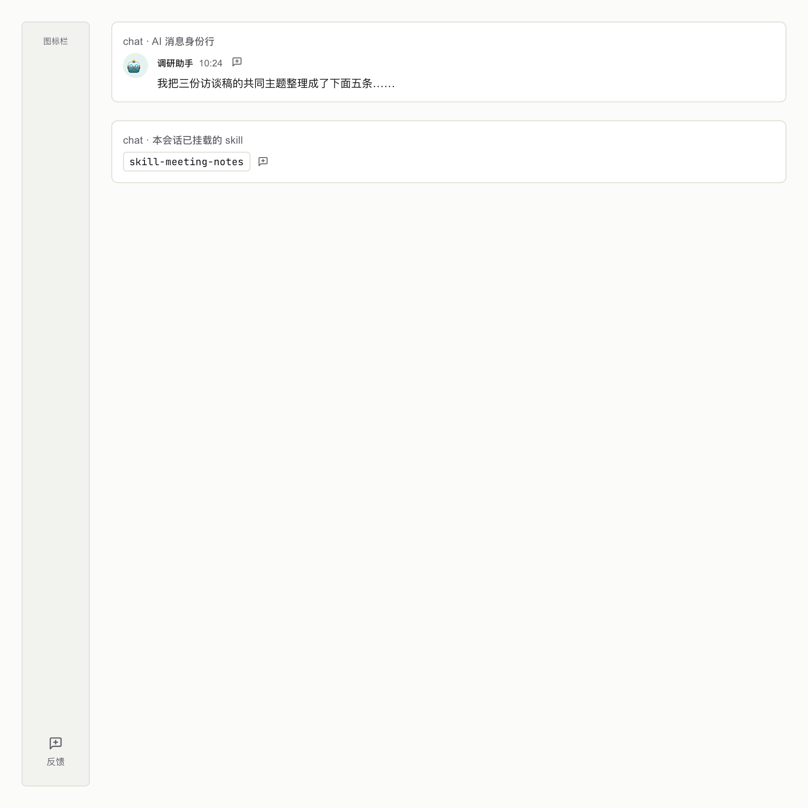
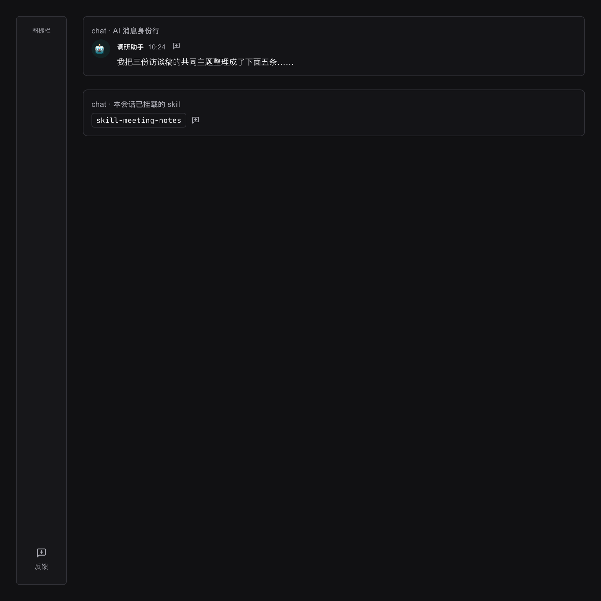
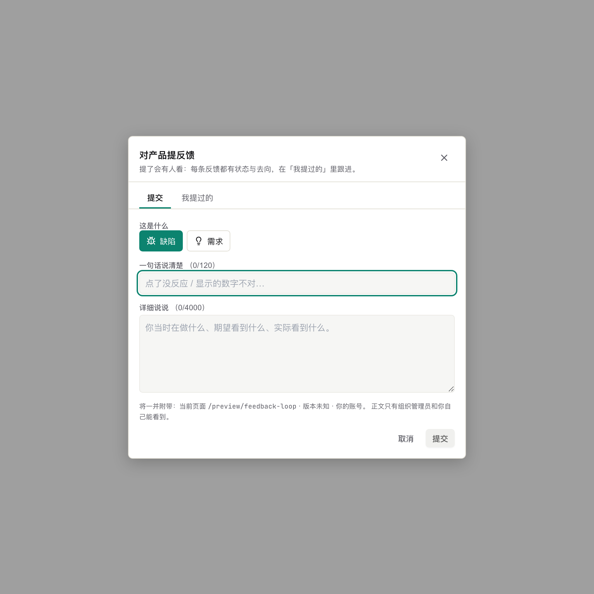
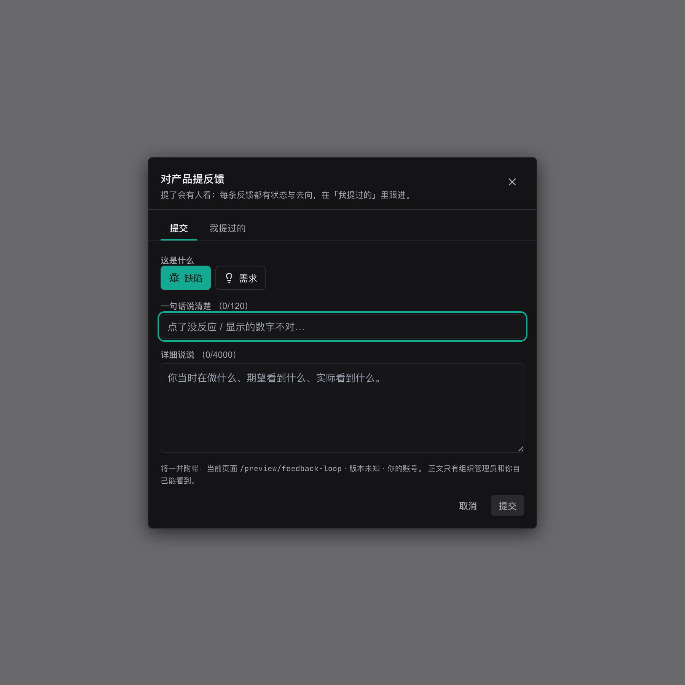
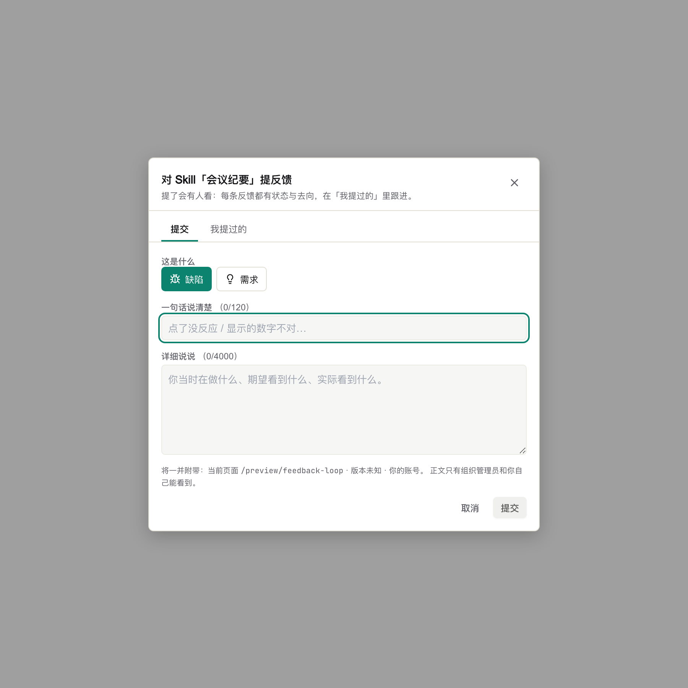
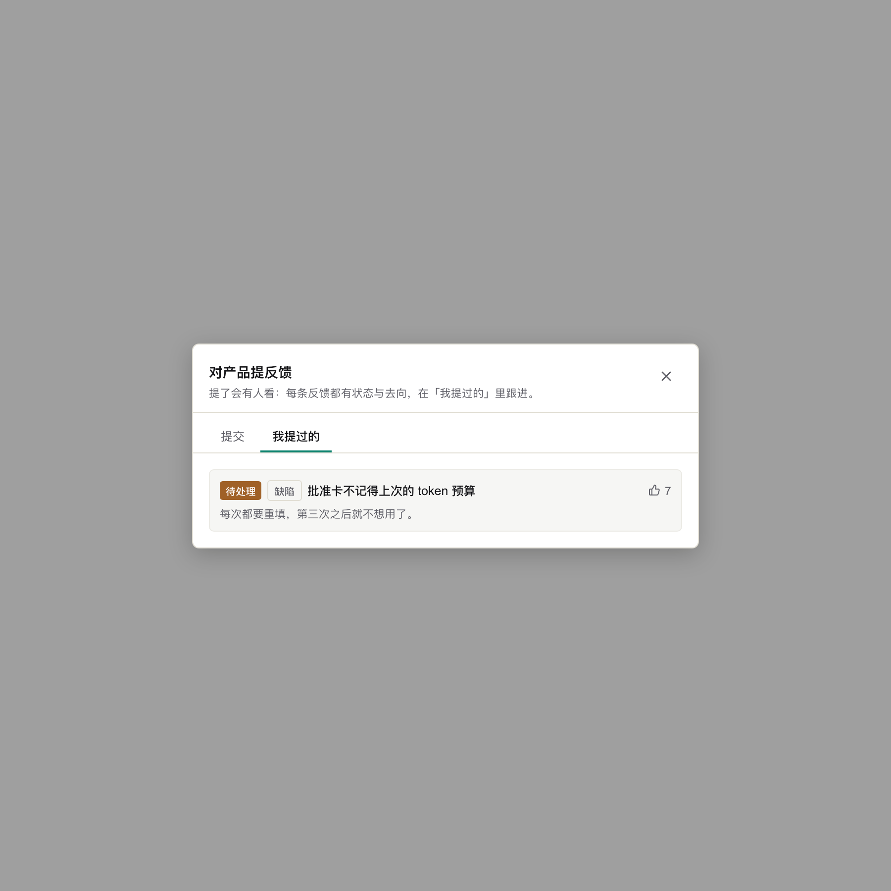
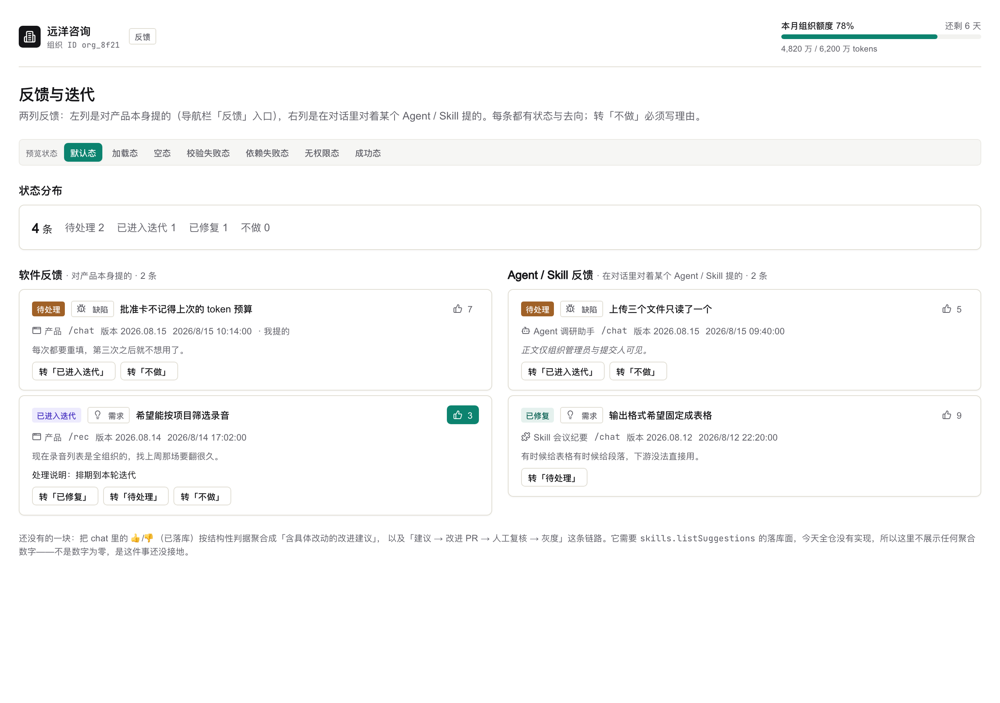
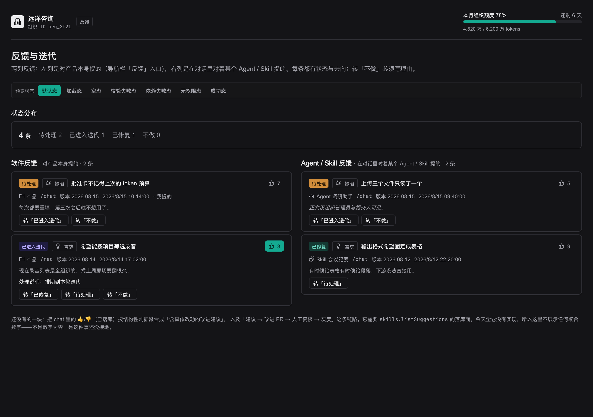
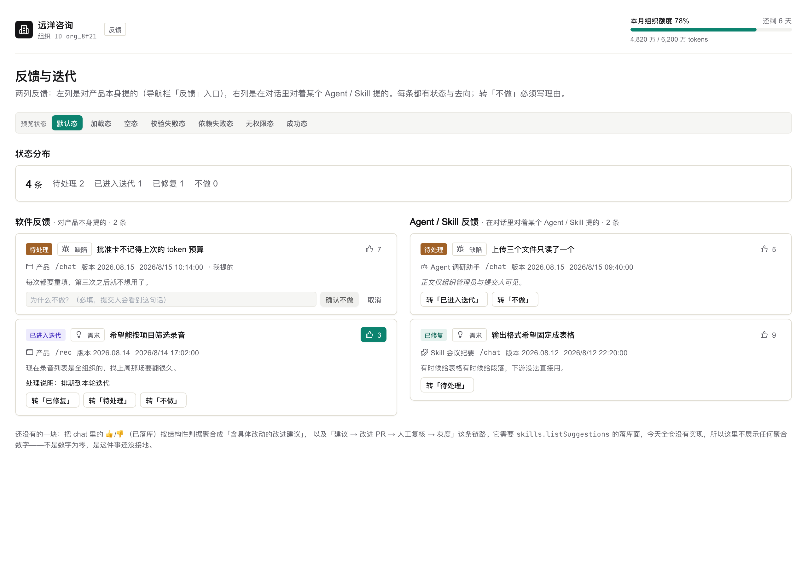

# 契约束 `feedback-loop` — 签核第 ① 件：UI

> ## 自检（可机械核对）
>
> **本文件引用 9 张截图，目录下实际 9 张。N == M，无死链、无多列、无遗漏。**
>
> 这一行由 `.harness/scripts/lint-ui-material.mjs` 双向对账（引用集合 == 实存集合），
> 不是一句自述——写错了会红。

## 这些图是怎么来的（重要）

由 `apps/web/scripts/shot-feedback-loop.mjs` 从取材页 `/preview/feedback-loop` 拍摄，
**渲染的是生产同一份组件**（`FeedbackDialog` / `FeedbackButton` / `FeedbackScreen`），
数据由脚本 `page.route()` 拦截 feedback 路由提供。

⚠ 所以图与生产的差别**只有数据，没有代码**。
复刻一遍界面来拍照是本仓最不该犯的错——签核签的是照片，上线的是另一份代码。

⚠ 数据是脚本里写死的固定集合，不连真库：截图脚本要能在任何机器上重跑出**同一张图**。
连真库的话图会随那台机器上的数据变，而签核签的是图。

重跑：
```bash
BASE=http://localhost:3187 OUT=<repo>/phases/phase-03-reuse-and-governance/ui-preview/feedback-loop \
  node apps/web/scripts/shot-feedback-loop.mjs
```

---

## 屏 A · 入口长在哪（UC-F1 步骤 1 / UC-F2）

D2 已裁：**图标栏常驻图标**，不是顶栏下拉里的一项。
同一张图里还有 chat 的两处按钮——它们是同一个组件（`FeedbackButton`）的两种 variant。

- 
- 

要看的三处：
1. 左侧图标栏**最下方**（分组之外、个人菜单上方）的「反馈」图标；
2. chat AI 消息身份行上的按钮——它挨着 👍/👎 但**不是**同一件事
   （前者对这个 agent 说话，后者对这一条回答打分）；
3. 已挂载 skill 的 chip 旁的按钮。

## 屏 B · 提交弹层（UC-F1）

- 
- 
- 

要看的四处：
1. 标题随目标变（「对产品提反馈」/「对 Skill「会议纪要」提反馈」）——
   用户要知道自己在对谁说话；
2. 类型两枚 chip，**没有「其他」桶**（理由见 `usecases.md` §2）；
3. 底部那行**显式**的上下文说明（「将一并附带：当前页面 X · 版本 Y · 你的账号；
   正文只有组织管理员和你自己能看到」）——I-F1，收集了什么就说什么；
4. 标题或正文为空时「提交」是禁用态（图上即是）。

## 屏 C · 「我提过的」（UC-F1 步骤 6）

- 

提交成功后**自动切到这一页**，刚提交那条标「刚提交」。
反馈的死法不是「没人提」，是「提了没人答」——状态放在需要另找入口才能看到的地方，
等于没有答复。

⚠ 未产出：深色态的「我提过的」。它与屏 B 深色态共用同一个弹层外壳与同一套 token，
本轮只拍浅色；要补的话是同一个脚本加一行。

## 屏 D · 后台两列屏与分诊（UC-F4 / FB-3）

- 
- 
- 

要看的六处：
1. 状态分布条（四个分状态之和恒等于总数——一次查询派生的直接后果）；
2. 左列「软件反馈」/ 右列「Agent / Skill 反馈」，右列的条目带目标徽标；
3. 每条上的分诊按钮**只有当前状态出得去的那几条边**
   （「已修复」那条只有「转待处理」，因为 `已修复 → 不做` 不是一条边）；
4. 无权查看正文的那条显示「正文仅组织管理员与提交人可见」——**不是**「暂无内容」；
5. 转「不做」先展开理由输入框，理由为空时确认按钮禁用；
6. 屏底那句话：聚合改进建议那一块**还没接地**，因此不展示任何聚合数字——
   不是数字为零。

⚠ 已删除：`[打开迭代看板]` / `[导出]`。UC-17.6 A1/A2 逐字「按钮存在，
但点击后无目标屏（原型待补）」——留一个点了会出现「实现者自己设计的看板」的按钮，
比没有按钮更糟，它会被当成已确认的设计继续长。
