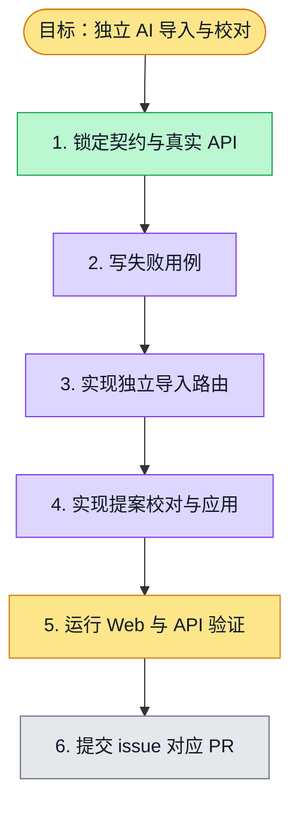

# 执行计划 — 独立 AI 导入与 Markdown 校对

> 规范：`.harness/instructions/execution-plan-visualization.md`。

## 我理解的目标
- **目标**：选择 AI 创建后，先在独立页面生成可编辑、可预览的 Markdown 提案，确认后才应用到真实问卷并进入设计。
- **完成判据**：F09 的 web/API 验证命令退出码为 0；直接访问与刷新保持创建上下文；真实服务错误如实显示。
- **不做什么**：不重做三栏设计器、发布或报告；不在设计页留下 AI 输入和原始 Markdown 编辑区。
- **假设与待确认**：沿用已签核的问卷契约与现有真实生成 API；F08 尚未合并，F09 PR 叠在 F08 上。

## 执行计划

图例：⬜ 灰=未开始 · 🟨 黄=已开始 · 🟩 绿=已完成 · 🟪 紫=已测试（有证据） · 🟥 红=被堵塞

## 进度日志（append-only，每次改颜色追加一行）
| 时间 | 节点 | 状态变化 | 依据（命令 / 证据 / 堵塞原因） |
|---|---|---|---|
| 2026-09-28 | G, S1 | todo → doing | F09 已认领，开始核对契约与真实 API |
