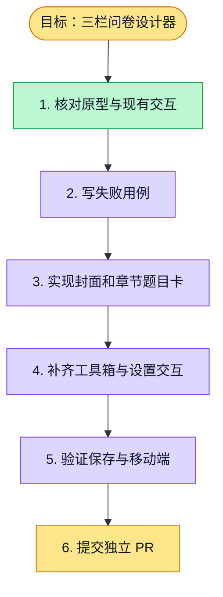

# 执行计划 — 三栏问卷设计器

> 规范：`.harness/instructions/execution-plan-visualization.md`。

## 我理解的目标
- **目标**：设计页按已确认原型展示题型工具箱、封面与章节/题目卡、右侧题目设置，并保存到 canonical Markdown。
- **完成判据**：桌面与移动端交互及 F10 验证命令通过；设计页不出现 AI 输入或原始 Markdown 编辑。
- **不做什么**：不混入发布、答卷或报告工作包；不用 mock 数据作为产品路径。
- **假设与待确认**：沿用当前真实问卷 API 和既有响应式面板；前置 PR 尚未合并，F10 叠在 F09 上。

## 执行计划

## 进度日志（append-only，每次改颜色追加一行）
| 时间 | 节点 | 状态变化 | 依据（命令 / 证据 / 堵塞原因） |
|---|---|---|---|
| 2026-09-28 | G, S1 | todo → doing | F10 已认领，核对原型与现有设计器 |
| 2026-09-28 | S1 | doing → done | 对照题型工具箱、封面、章节卡、设置面板与移动端按需面板 |
| 2026-09-28 | S2, S3 | doing → tested | 新用例先红，随后 vitest 4/4 通过 |
| 2026-09-28 | S4 | todo → doing | 继续补齐交互 |
