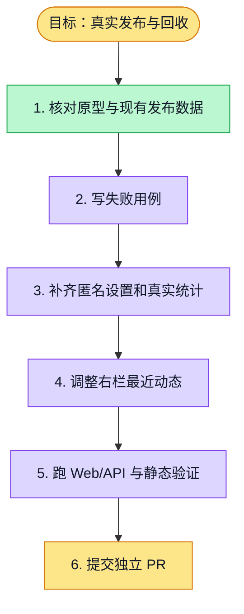

# 执行计划 — 真实发布与回收

> 规范：`.harness/instructions/execution-plan-visualization.md`。

## 我理解的目标
- **目标**：发布与回收页按原型展示真实状态、设置、分享、统计和最近动态。
- **完成判据**：匿名限答、成功页、截止时间和匿名开关走真实持久化；零数据如实显示；Web/API 验证通过。
- **不做什么**：不造假答卷、不改报告或答卷详情工作包。
- **假设与待确认**：沿用已签核发布契约；F11 PR 叠在 F10 上。

## 执行计划

## 进度日志（append-only，每次改颜色追加一行）
| 时间 | 节点 | 状态变化 | 依据（命令 / 证据 / 堵塞原因） |
|---|---|---|---|
| 2026-09-28 | G, S1 | todo → doing | F11 已认领，核对原型与真实发布实现 |
| 2026-09-28 | S1 | doing → done | 发现匿名开关缺失、有效数口径与布局差异 |
| 2026-09-28 | S2–S4 | doing → tested | 新测试先红后绿；Web 38/38、隔离 API 10/10 |
| 2026-09-28 | S5 | todo → doing | 继续跑类型、lint 和计划门控 |
