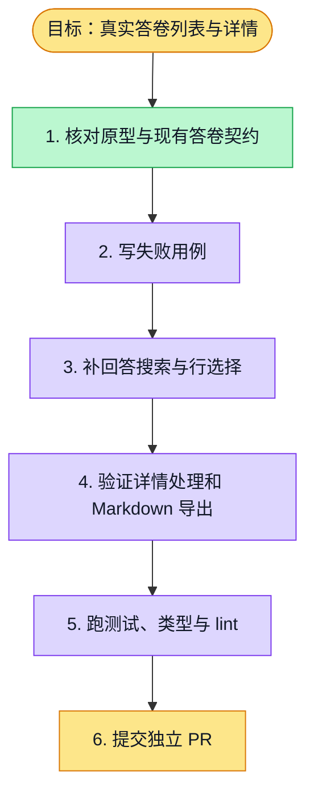

# 执行计划 — 真实答卷列表与详情

> 规范：`.harness/instructions/execution-plan-visualization.md`。

## 我理解的目标
- **目标**：答卷页按原型用真实数据提供搜索、筛选、分页、详情、有效性处理和 Markdown 导出。
- **完成判据**：回答关键词可搜索，所选答卷可导出，零数据与错误如实显示，F12 验证通过。
- **不做什么**：不生成示例答卷，不扩展缺失的 IP/地理数据契约。
- **假设与待确认**：沿用当前真实答卷 API；F12 PR 叠在 F11 上。

## 执行计划

## 进度日志（append-only，每次改颜色追加一行）
| 时间 | 节点 | 状态变化 | 依据（命令 / 证据 / 堵塞原因） |
|---|---|---|---|
| 2026-09-28 | G, S1 | todo → doing | F12 已认领，核对原型与答卷契约 |
| 2026-09-28 | S1 | doing → done | 现有真实 API 支持列表、详情和治理，不含 IP 地理字段 |
| 2026-09-28 | S2–S4 | doing → tested | 新用例先红后绿；相关 35 个测试通过 |
| 2026-09-28 | S5 | todo → doing | 静态检查中 |
