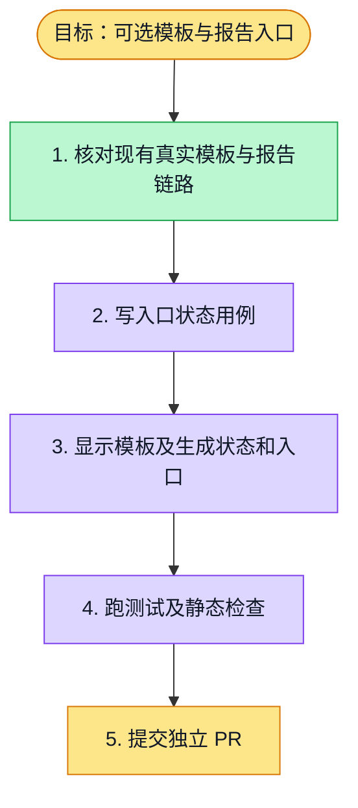

# 执行计划 — 可选模板与报告入口

## 我理解的目标
- **目标**：从答卷步骤清晰进入报告模板和分析报告，且不阻塞设计、发布、查看答卷主流程。
- **完成判据**：真实模板及报告状态可见，入口可达，相关验证通过。
- **不做什么**：不制造示例答卷或示例报告。

## 执行计划

## 进度日志
| 时间 | 节点 | 状态变化 | 依据 |
|---|---|---|---|
| 2026-09-28 | S1–S3 | todo → tested | 真实模板、报告入口已存在；新用例先红后绿，46 个相关测试通过 |
