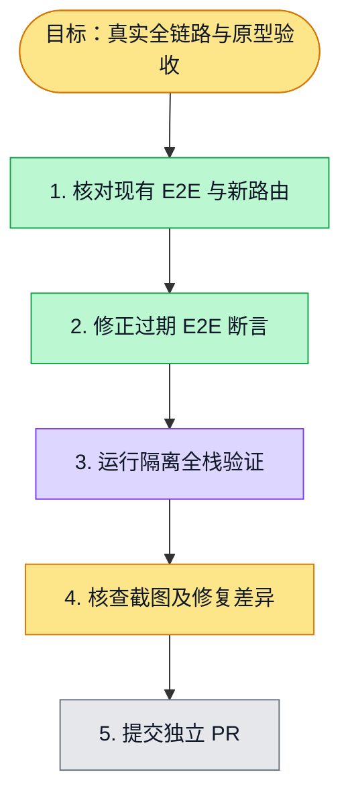

# 执行计划 — 真实问卷全链路验收

## 我理解的目标
- **目标**：在真实浏览器、API、数据库链路上验收空白、模板、AI 导入，设计、发布、填写和答卷，并留下桌面/移动截图。
- **完成判据**：隔离全栈 E2E 成功，截图与原型逐屏核对，失败项修复后复跑。
- **不做什么**：不以 mock 或静态截图替代真实链路。

## 执行计划

## 进度日志
| 时间 | 节点 | 状态变化 | 依据 |
|---|---|---|---|
| 2026-09-28 | G, S1 | todo → doing | F14 已认领，检查旧全链路脚本与新路径 |
| 2026-09-28 | S3 | blocked → tested | 生产构建真实浏览器 4 条主链路通过；修复了旧入口服务端重定向 TypeError |
| 2026-09-28 | S4 | todo → doing | 已核查设计页与移动答卷截图，继续逐屏对照原型；现有视觉间距与按钮仍有差异 |
