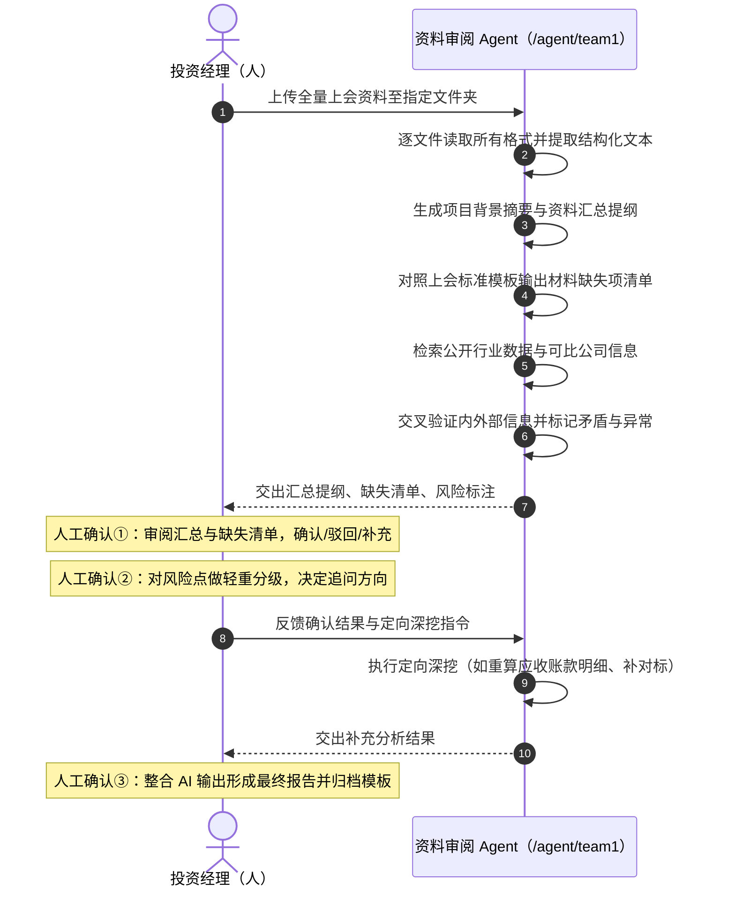

# 01 · 端到端交互过程（时序图逐步拆解）

来源：交互时序图附件（投资经理（人） ↔ 资料审阅 Agent）。本文件把图上的每一格落成
「谁触发 / Agent 做什么 / 用户看见什么 / 失败怎么办」。

## 0. 入口：`http://www.boardx.com.cn/agent/team1`

| 项 | 要求 |
|---|---|
| 路由 | 新增公开路由 `/agent/[slug]`，`team1` 是本 Agent 的稳定 slug；slug 不可被他人抢占或复用 |
| 未登录 | 可看落地页（Agent 介绍、能力清单、挂载的 Skill 与当前模型、示例材料与示例输出），**不能上传真实材料**；点"开始审阅"走登录 |
| 已登录 | 进入该 Agent 的独立会话；会话与产出物归属当前用户/其所在组织的项目层 |
| 可见性错误 | 不区分"存在但无权"与"不存在"，统一走 `NOT_VISIBLE` 语义，不泄漏 Agent 是否存在 |
| 落地页内容来源 | 直接读 Agent 定义（名称、描述、挂载 Skill 版本、模型、权限层级），不另存一份文案副本 |

## 1. 人 → Agent：上传全量上会资料至指定文件夹

- 支持**批量上传 / 拖拽整个文件夹 / 粘贴链接**；单次会话形成一个**材料包（material set）**。
- 每份文件进入材料包时记录：文件名、格式、字节、哈希、上传时间、上传者 —— 这是后续所有出处链的根。
- 前端显示逐文件的解析状态（排队 / 解析中 / 成功 / 失败（原因））；失败文件**不静默跳过**，
  必须出现在最终报告的「未能解析清单」里——"我没读到"和"材料里没有"是两件事，不许混为一谈。
- 容量与格式边界见 `02-capability-mapping.md`（复用既有附件白名单与上限，不新造一套参数）。

## 2. Agent 自处理：逐文件读取所有格式并提取结构化文本

- PDF / DOCX / PPTX / XLSX 走原生结构化解析，保留**页码 / 表格行列 / 幻灯片编号 / 单元格地址与 bbox**；
  扫描件走 OCR 兜底并标记「OCR 来源，置信度 X」。
- 产出**带定位的 chunk 集合**，每个 chunk 可反查到"第几份文件第几页哪个位置"。
  这一步的定位精度决定了 S4（可追溯）能不能成立，是本阶段的技术底座，不允许退化成整文件级引用。
- 表格必须按结构入库（而不是压成一行文本）：B、C 两组测试的多数矛盾点都藏在表里
  （客户明细加总、三年毛利率、折旧政策、关联方金额）。

## 3. Agent 自处理：生成项目背景摘要与资料汇总提纲

- 输出结构化提纲（交易概况 / 标的 / 行业 / 财务 / 估值 / 尽调 / 投后 / 决策事项），
  每节标注**由哪些文件的哪些位置支撑**。
- 提纲是后续所有比对的工作底稿，与最终报告同源，不另写一份。

## 4. Agent 自处理：对照上会标准模板输出材料缺失项清单

- 标准清单（八大类、逐条）见 `03-review-standard-and-evidence.md`，它是**唯一事实源**，
  Agent 的提示词/Skill 不复述其条目，只引用。
- 每条输出四态之一：`满足`（附原文引用）/ `部分满足`（附已有部分 + 缺口）/ `缺失` / `不适用`（须给理由）。
- 清单可按"上会阻断性"排序：缺了它就不具备上会条件的排前面。

## 5. Agent 自处理：检索公开行业数据与可比公司信息

- 只在**材料内事实不足以判断合理性**时才外检索（毛利率是否逆势、资本化率是否超行业、CR10、可比公司 PE…）。
- 每条外部数据必须带：来源标题、URL、发布/获取时间；与材料内事实在 UI 上分栏，永不混排。
- 检索失败或只拿到二手摘录时，明确降级为"未取证的常识判断"，不得冒充已取证。

## 6. Agent 自处理：交叉验证内外部信息并标记矛盾与异常

三类问题分开呈现，判据见 `03`：
- **显性矛盾**：同一事实两份材料口径不同（如收入确认"验收确认" vs "发货确认"；前五大客户 42% vs 明细加总 58%）。
- **隐性异常**：单份材料内部或与行业常识冲突且无解释（毛利率三年 38%→52%、研发资本化率 65%）。
- **关联遗漏**：数据已恶化但风险章节未提（应收周转 62→118 天）；或政策变更时点与业绩承诺期起点重合。

## 7. Agent → 人：交出汇总提纲、缺失清单、风险标注（第一次交付）

三栏并排，可导出。每条风险固定四列：**编号 / 问题 / 原因 / 材料中如何体现（可点击回跳）**。

## 8. 人工确认关口①：审阅汇总与缺失清单，确认 / 驳回 / 补充

- 用户可对每一条做：`确认`（进入最终报告）/ `驳回`（写理由，Agent 必须在后续输出中尊重该裁决）/ `补充`（人工添加一条）。
- 驳回与补充**全部留痕**（谁、何时、理由），随最终报告归档。
- 这一步是**阻断性**的：未确认前 Agent 不进入深挖阶段，不擅自扩大范围。

## 9. 人工确认关口②：对风险点做轻重分级，决定追问方向

- 用户给每条风险打 `高 / 中 / 低 / 忽略`，并勾选需要"定向深挖"的条目，可附自然语言指令。
- 分级结果是深挖阶段的**唯一任务来源**：Agent 不做没被勾选的深挖。

## 10. 人 → Agent：反馈确认结果与定向深挖指令

一次提交，携带：确认后的清单 + 风险分级 + 勾选项 + 自由文本指令（如"把应收账款明细拉出来按账龄分布"）。

## 11. Agent 自处理：执行定向深挖（如重算应收账款明细、补对标）

- 每个勾选项作为一个**可并行的子任务**，各自独立产出与出处；单个子任务失败不拖垮整批。
- 典型深挖动作：重算（把资本化率按行业口径 30% 重算净利润影响）、拉明细（客户/账龄/关联方）、
  补对标（可比公司毛利率与折旧年限）、找缺口（在材料内二次定向检索某条缺失项是否其实存在于附件深处）。
- 重算类结论必须给出**算式与输入数据的出处**，不能只给结果。

## 12. Agent → 人：交出补充分析结果

按勾选项逐条回，标注"是否改变了原风险等级"。

## 13. 人工确认关口③（图中末格）：整合 AI 输出形成最终报告并归档模板

- 一键生成最终报告产出物（可下载 / 可归档），内容 = 提纲 + 已确认缺失清单 + 分级风险 + 深挖结果 + 追问清单 + 未能解析清单。
- 报告头部固定带**运行出处**：Agent 版本、挂载 Skill 版本、模型 ID、权限快照、材料包哈希清单、生成时间。
- 支持按组织自定义的归档模板套用（模板缺省时用平台默认模板）。

## 时序图（对齐附件）

## 贯穿全程的非功能要求
- **可中断可续跑**：任一自处理步骤可取消；取消后已完成的解析结果保留，重跑不重复付费解析。
- **进度可见**：每一步在会话里有独立的状态行（进行中 / 完成 / 失败 + 耗时），不是一个转圈。
- **高风险工具需人批**：涉及外发、执行、下载外部内容的工具调用走既有人工批准关口，默认 fail-closed。
- **失败可读**：任何失败都给"发生了什么 / 影响哪一步 / 你可以怎么办"三句话，不抛原始堆栈。
