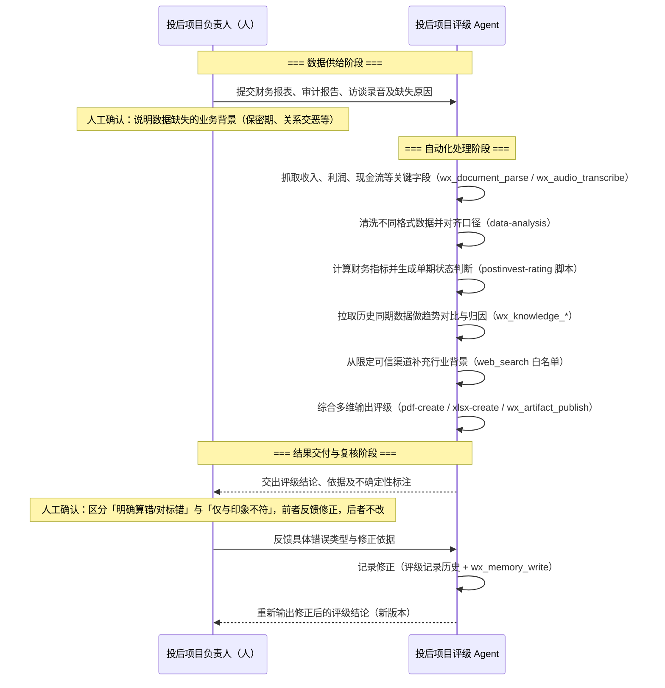

# 原始需求（细化）— UC-16.1 投后财务项目评级 Agent（`/agent/team2`）

> 所属：Phase 16 · postinvest-rating-agent（has_ui）。
> 来源（四份输入，本文只做整合与落地，不改写其结论）：
> 1. **HMW 问题定义卡**（2026-09-15 手写）：「我们如何能够帮助**项目负责人**在**项目财务评价**中，
>    克服**数据质量、来源不一及行业差别**，从而**高效、高质、公允**评价项目呈现的**趋势、风险**？」
> 2. **《投后财务项目评级 Agent — 大模型测试方案与模拟测试文件》v1.0（2026-09-15）**：
>    数据质量处理表、S1/S2/S3 三维评分口径、总分公式、A–E 分级表、两条直接降级触发条件。
>    评分规则的**权威原文是那份 PDF**，本文 R7 只列结构与不变量，不逐条复述数值（同一事实不得声明两处）。
> 3. **序列图**：三阶段——数据供给（人）→ 自动化处理（Agent）→ 结果交付与复核（人+Agent）。
> 4. **MAAU 画布**（Minimum Actionable Agentic Unit）：意图 / 用户 / 人与 Agent 分工 / 工作流 / 上下文 / 闭环验证。
>
> **[人类已拍板 2026-09-15]** 入口为 **`/agent/team2`**（`lib/mock/agent-previews.ts` 六个 team 中的 Team2）。
> D2–D5 由 agent 推荐、人类同日采纳，见 R10「已定决定」。

---

## R1 概览

- **Use Case ID / 名称**：UC-16.1 / 投后财务项目评级 Agent（基于财务报表与访谈录音自动生成投后项目评级，人只做数据供给与结果复核）
- **Actor**：
  - **投后项目负责人 / 投资经理**（主 Actor）：供数、说明缺失原因、复核、反馈修正。
  - **投后评级 Agent**（系统 Actor）：解析、清洗、算分、比对历史、补充行业背景、出评级与依据、记录修正。
  - **组织管理员**（次要）：维护评级规则 skill 版本、可信渠道白名单、查看审计记录。
- **目标**：负责人把财务报表 / 审计报告 / 访谈录音交给 Agent，一次端到端跑通即得到**带依据、带不确定性标注**的
  A–E 评级结论；人工只做「数据供给」与「结果复核」两件事；单项目评级人工工时相比纯人工显著下降，
  且结论与资深投资经理判断偏差在团队定义的阈值内（MAAU 成功指标，阈值由试点项目定）。
- **本用例结果**：`/agent/team2` 上出现一个可分享、可刷新、可直达的独立 Agent 工作台；每次评级留下一条
  **评级记录**（输入文件哈希 + 中间指标 + 分项得分 + 等级 + 标注 + 依据引用 + 修正历史），可下载 PDF/Excel 报告。
- **系统边界**：
  - 前端：`apps/web/app/agent/[teamId]`（现为只读示例页，本用例把 Team2 的页面换成真实工作台）。
  - 运行时：既有 agent-run 单内核链路（`apps/api` 薄网关 → `apps/deep-agent-service`），**不新开第二条执行链路**。
  - 能力：全部复用平台已有 tools / skills（见附录 A「能力复用矩阵」），只**新增一个 skill 包**
    `postinvest-rating`（承载评分规则与确定性计算脚本）和**一个 agent 定义**。
  - 契约：`packages/contracts/src` 新增 `postinvest-rating.ts`（评级记录 / 反馈 / 报告实体的单一事实源）。
  - Agent 定义落地形态（复用 `agent-runtime.ts` 既有操作，不新造）：一条 `agents` 行（`instructions` 非空、
    `model_id`、`tool_whitelist`、`skill_mounts`）→ `submitAgentForReview` / `decideAgentPublish` 发布为不可变
    `agent_versions` 行 → 页面用 `composeThreadTeam` 把该 agent 绑到工作台线程 → 运行走 `POST /agent-runs`
    + `GET /agent-runs/:id/stream`（SSE，`KernelStreamEvent`）。

## R2 前置条件 / 触发条件

- **前置条件**：
  - 用户已登录，且所属组织可见「海创汇」入口（`lib/navigation.ts` 的 `isAgentsNavVisibleForOrg`，现规则=Workspace 组织）。
  - 平台级 skill 已就绪：`document-understanding`、`data-analysis`、`data-visualization`、`audio-transcription`、
    `web-research`、`xlsx-create`、`pdf-create`（Phase 13 平台级可见机制）。
  - 新 skill `postinvest-rating` 已经 starter-pack 导入并处于「已启用」（走既有导入 + 双重门禁，不开手建入口）。
  - `deep-agent-service` 健康；沙箱可用（脚本执行 `network:none`）。
- **触发条件**：
  - 用户打开 `/agent/team2`，上传至少一份文件（或选择历史项目）并点击「开始评级」。
  - 或：用户在该页面对已有评级记录点击「反馈修正」并提交。
  - 或（可选，F08）：`wx_schedule_create` 建立的季度定期评级到期触发，Agent 以上一次输入 + 提示用户补新报表。

## R3 主流程（对齐序列图三阶段；每步标注复用的现有能力）

### 阶段一 · 数据供给（人）

1. 用户 → 进入 `/agent/team2` → 系统展示工作台：项目选择器（复用 `wx_project_list` 读组织内项目，
   也允许「新项目：只填名称」）、上传区、缺失数据原因表单、历史评级列表。
2. 用户 → 拖入财务报表（xlsx/pdf）、审计报告（pdf/docx）、访谈录音（mp3/m4a/wav），
   系统 → 报表 / 报告走既有 `chat-file-upload` 契约（白名单、单文件上限、张数上限均以该契约为准，本文不复述数值）；
   录音**统一**走 `files.ts` 的 `uploadArtifact` 原件上传（不可变 + SHA-256 + 版本；D5）：聊天附件白名单
   虽含 wav/mp3 但不含 m4a，且受单文件上限约束，录音不走聊天附件路径，以免两条上传路径各一套口径；
   每个文件回显文件名 / 大小 / SHA256 / 识别到的类型（报表 / 审计报告 / 录音 / 未识别）。
3. 用户 → 在「数据缺失说明」表单里勾选原因：`保密期（上市/并购）` / `关系交恶` / `重大诉讼` / `失联` / `停业` /
   `破产` / `其他（自由文本）`，并可勾选「仅有单体报表 / 仅有经营报告」「无上年对比数据」。
   系统 → 把它作为**人工确认事实**写入本次 run 输入（这是 PDF 数据质量表的分支依据，Agent 不得自行推断）。
4. 用户 → 点击「开始评级」。系统 → 创建一次 agent run（绑定 `postinvest-rating` agent），页面进入运行态，
   展示既有 agent workbench 的进度 / 工具调用可见性（复用 `ai-message.tsx` 状态结构，不另起渲染路径）。

### 阶段二 · 自动化处理（Agent）

5. **抓取**：Agent 对每个报表 / 报告文件调用 `wx_document_parse`（`document-understanding` skill 口径：
   记录 `sourceHash`/`textHash`/`warnings`，Markdown 输出，`ocr:false`；显式扫描件才 OCR）；
   对录音调用 `wx_audio_transcribe`（`audio-transcription` skill），转录稿只用于**定性佐证与缺失原因核对**，
   不参与算分。
   抽取字段（最小集合，来自 PDF 三维指标）：营业收入（本年 / 上年）、净利润（本年 / 上年）、货币资金、
   近 12 月经营现金流出、经营活动现金流净额、应收账款、存货、其他应收款（本年 / 上年）、总资产、净资产、
   流动资产、流动负债、报表口径（合并 / 单体）、报告期。
6. **清洗与对齐口径**：Agent 用 `data-analysis` skill（沙箱 `execute` + pandas）把不同格式抽出的字段
   归一到统一 schema（单位统一为元；期间对齐；合并/单体标记），并输出「字段来源表」：每个数值 → 文件名 + 章节 /
   表头 / 行标识；当 `wx_document_parse` 的 `structure.json` 给出表格坐标时附上坐标，没有就不写
   （`document-understanding` 规定：不能编造页码 / 单元格地址）。xlsx 原件优先直接读单元格而不是走 Markdown。
   **任一字段缺失 → 记为 `null`，绝不填零**。
7. **数据质量判定**：按 PDF「一、数据质量」表逐条判定，产出标注集合
   `{正常 | 数据不完整 | 数据暂估 | 公司经营异常 | 数据疑似异常}`（可多选），每条标注附触发条件与数值。
   「公司经营异常」直接判 E 并跳到第 10 步。
8. **计算财务指标与分项得分**：调用 `postinvest-rating` skill 内置的**确定性脚本**（Node 或 Python，沙箱执行）
   计算 S1 / S2 / S3、总分、初评等级、降级触发；**LLM 不做算术**，只负责把清洗后的 schema 交给脚本、
   把脚本输出解释成文字。脚本输出必须包含每一步的中间量（体量档、增长率对数得分、现金自给月数等）。
9. **历史同期对比与趋势归因**：Agent 用 `wx_knowledge_search` / `wx_knowledge_read` 检索本项目历史评级记录
   与历史报表（评级记录通过 `wx_artifact_publish` 落为知识可检索的产出物），生成同比 / 环比对比表与
   「趋势判断」（改善 / 平稳 / 恶化）及归因候选（只允许引用报表数据与访谈转录稿里的原话，标注来源）。
   无历史 → 明确写「首次评级，无趋势判断」。
10. **行业背景补充（受限渠道）**：Agent 用 `web-research` skill（`web_search` + `fetch_url`）从**白名单渠道**
    （上市公司官网、交易所 / 监管披露平台、经组织管理员登记的行业数据平台）补充行业共性基准
    （如同业营收增速区间）；**禁止新闻站、贴吧、社交媒体等非结构化舆情**。渠道白名单是组织级配置
    （单一事实源在契约 `postinvest-rating.ts`），命中白名单外域名的结果一律丢弃并在依据里注明
    「已丢弃 N 条非白名单来源」。行业背景**只影响文字评价，不改分数**（HMW 的「行业差别」在本期只做
    解释层，不做行业调权——见 R6 不包含）。
11. **综合输出**：Agent 汇总为**评级结论卡**（等级 + 颜色 + 含义 + 投后管理建议，四者逐字来自 PDF 分级表）+
    **依据表**（每个数值的来源）+ **不确定性标注**（第 7 步标注 + 字段缺失清单 + 估算项）+
    **报告文件**（`pdf-create` 生成评级报告 PDF；`xlsx-create` 生成指标与得分明细表；
    `data-visualization` 生成趋势图 PNG 嵌入报告）。全部产物经 `wx_artifact_publish` 发布，
    并写入评级记录。
    **HITL 关卡**：当第 7 步出现 `公司经营异常`（直接 E）或降级触发（净资产<0）时，Agent 在正式落库前
    通过既有 HITL 中断（`deep-agent-hitl` 契约，LangGraph `interrupt()`，checkpoint 落库）请用户确认
    「触发依据是否属实」，用户可批准 / 驳回并说明。

### 阶段三 · 结果交付与复核（人 + Agent）

12. 系统 → 页面从运行态切到结果态：顶部评级结论卡；下方三个 Tab「依据」「不确定性」「报告下载」；
    产物卡走既有 produced-file 鉴权下载路径（`aria-disabled` → 认证 blob URL 就绪后才可下载 / PDF 内联预览）。
13. 用户 → 复核。对每条依据行可点「反馈」，**必须**先选错误类型（单选）：
    `明确算错` / `对标错（字段抽取或口径映射错误）` / `信息误解（转录 / 文档理解错误）` /
    `信息缺失（我补充新材料）` / `主观偏差（仅与印象不符）`，再填修正依据（文本，可附新文件）。
14. 系统 → 按类型分流：前四类进入**修正流程**；「主观偏差」**只记录不修正**（MAAU「防退化：严禁因与印象不符而
    调整权重或规则」），页面明确回显「已记录，评级不变」。
15. Agent（修正流程）→ 以修正依据 + 原 run 输入重新执行第 6–11 步（只重算受影响字段，其他复用），
    生成**新版本**评级记录（版本号 +1，旧版本只读保留），并把「错误类型 + 修正前后值 + 依据」作为一条
    修正记录写入：① 该评级记录的修正历史；② `wx_memory_write`（组织级 Agent 记忆，MAAU「记忆机制：
    记住明确错误的修正记录，避免同类错误复发」）。下次运行前 Agent 先 `wx_memory_search` 本项目 / 同类错误。
16. 用户 → 确认「采纳」本版本结论。系统 → 评级记录状态 `draft → confirmed`，写入确认人与时间；
    `confirmed` 记录不可再改，只能新开一轮评级。

## R4 备选流程与异常流程

- **备选流程**：
  - A1：**只上传录音、没有报表** → Agent 不出分，只生成「数据需求说明」（缺哪些字段、按 PDF 哪一条处理）
    并标注「无法评级：无财务报表」，要求用户在缺失原因表单里选原因；选了「正常原因（保密期等）」且
    存在历史报表 → 按 PDF 走「数据暂估」用上一期数据出分；选了异常原因 → 直接 E +「公司经营异常」。
  - A2：**无上年对比数据** → 增长类得分按体量给基础分（PDF 口径），结论卡标注「增长指标为基础分」。
  - A3：**仅单体报表 / 仅经营报告** → 正常出分 + 标注「数据不完整」。
  - A4：**多份报表期间不一致**（如一份 2025 年报、一份 2026 半年报）→ Agent 在阶段二开始前通过 HITL 让用户
    指定「本期」与「上期」，不自行猜。
  - A5：**同一项目重复评级** → 新建版本并与上次对比（阶段二第 9 步自然覆盖）。
  - A6：**用户中途关闭页面** → run 继续在后端执行（既有 agent-run 语义），回到页面后从评级记录列表恢复
    到当前状态；未完成的 run 显示「进行中」并可取消（`wx_run_cancel`）。
  - A7：**行业背景检索白名单为空** → 跳过第 10 步，依据表注明「未配置可信渠道，未补充行业背景」，不报错。
- **异常流程**：
  - E1：`wx_document_parse` 失败 / 返回不确定 / 文件损坏 → 该文件标「解析失败」+ 原始 warnings，
    **不自动重试**（skill 规定），其余文件继续；若关键字段全部来自失败文件 → 走 A1。
  - E2：抽取出的字段触发 PDF「数据疑似异常」两条比率规则之一（应收+存货占收入比、其他应收款占总资产比 /
    同比增幅叠加经营现金流为负；阈值只在 skill 包里）→ 正常出分 + 标注「数据疑似异常」+ 列出触发数值；不因此降级。
  - E3：评分脚本执行失败（非零退出）→ 走沙箱既有失败码（`SCRIPT_FAILED_AFTER_RETRIES` / `SANDBOX_TIMEOUT` /
    `SANDBOX_UNAVAILABLE`），run 进入 `failed` 终态并原样带回 stderr；**不允许 LLM 用心算补一个分数**。
  - E4：`deep-agent-service` 不可用 → 网关健康检查快速失败，页面显示明确的服务不可用错误与重试按钮。
  - E5：`web_search` / `fetch_url` 失败或超时 → 行业背景段落标「未获取」，评级照常完成。
  - E6：录音转写失败 → 定性佐证段标「录音未转写」，不影响出分。
  - E7：反馈修正后重算结果与修正前完全一致 → 仍生成新版本并写明「修正后结论未变化及原因」。
  - E8：用户无权限（非 Workspace 组织 / 非项目成员）→ 入口不显示；直达 URL 返回 404（与现有 team 路由一致）。
  - E9：产物文件生成成功但读取校验失败（`data-visualization` / `pdf-create` 口径）→ 该产物标「未验证」，
    不显示为可下载。

## R5 权限与可见性（组织角色沿用 `identity.ts` 的 `admin | lead | consultant | compliance`，组织 ∩ 项目两层交集）

- **投后项目负责人 / 投资经理**（组织角色 `consultant` 或 `lead`，且是该项目成员）：可在自己有权限的项目上
  创建评级、上传文件、说明缺失原因、复核、反馈、采纳；可下载本项目评级报告；可看本项目全部历史版本。
- **组织 `lead`**：同上 + 可跨项目查看组织内评级列表（投后组合视角）+ 建新项目（只有 lead 能建项目）。
- **组织 `admin`**：可维护 `postinvest-rating` skill 版本（走既有 skill 审核双门禁，提交人≠审核人）、
  可配置可信渠道白名单、可查看组织内全部评级记录与修正记录；**不能**替项目成员点「采纳」，也不能建项目
  （「管理员不是超级用户」）。
- **组织 `compliance`**：只读组织内评级记录、修正记录与依据表（审计视角）；不能创建、反馈、采纳。
- **非 Workspace 组织成员、匿名用户**：入口不可见，URL 直达 404；本用例**不做公开 / 匿名访问**。
- **Agent 自身**：只读 `/inputs/` 原件；只能通过网关代理执行工具；`web_search` 结果受白名单过滤；
  写入范围限于本次 run 的产物、评级记录与组织记忆；不得读取其他组织数据（既有 RLS 与 MCP 两层授权）。

## R6 后置条件 / 不包含

- **后置条件**：
  - 每次运行留下一条评级记录（含版本链），输入文件哈希与产物可追溯到 run id；
  - 修正记录同时进入评级记录历史与组织记忆；
  - 报告文件（PDF / Excel / PNG）已发布为产出物并通过读取校验。
- **不包含（本期明确不做，写清楚为什么）**：
  - **行业调权 / 行业差异化评分模型**：PDF 规则未定义行业系数，擅自加权=第二份规则源；本期只做行业背景解释层，
    HMW 的「行业差别」待人类给出行业口径后另开 UC。
  - **修改评分规则的 UI**：规则只在 `postinvest-rating` skill 包里（版本化、审核后生效），不做在线调参。
  - **自动从外部系统拉取报表**（企业财务系统 / 投后管理系统 API 对接）：MAAU 把它列为数据源，但当前平台无此
    connector；本期靠上传，接口对接另立 UC。
  - **公开分享链接 / 匿名访问**、多组织聚合排行、批量一键评级全部项目（F08 的定期触发是单项目的）。
  - **编辑已有 docx/xlsx/pdf**（平台 skill 明确范围外）。

## R7 业务规则（不随实现变化）

1. **评分规则单一事实源**：S1/S2/S3 口径、总分公式、A–E 区间与颜色 / 含义 / 建议、降级触发、数据质量处理表，
   **只**存在于 `skills/<pack>/postinvest-rating/` 包内（规则文档 + 可执行脚本 + 固定测试用例）。
   UI、Agent 提示词、契约只引用，不复述数值；PDF v1.0 是导入时的来源，包内 `PROVENANCE` 记录来源版本。
2. **算分是确定性代码，不是模型输出**：任何得分必须由脚本从清洗后的 schema 算出并可重跑复现；
   同一输入两次运行得分必须逐位一致（验收命令直接断言）。
3. **缺失不填零**：任何字段缺失记 `null` 并进入不确定性标注；零与缺失在报告里必须可区分。
4. **每个数值都有来源**：依据表里没有来源的数值不得进入计算；来源只能是实际读到的章节标题 / 表头 / 行标识 /
   转录稿原句，不得编造页码、单元格地址。
5. **人工确认事实优先于推断**：数据缺失原因、本期/上期指定、降级触发确认三件事必须来自人（表单或 HITL），
   Agent 不得自行判定「保密期」或「失联」。
6. **反馈分流铁律**：`主观偏差` 类反馈只记录、不重算、不改规则、不改权重；其余四类必须重算并生成新版本。
7. **`confirmed` 不可逆**：采纳后的版本只读；再评只能新开版本。
8. **行业背景不改分**：白名单渠道信息只进入文字解释与「趋势/风险」定性段，不参与 S1–S3 与总分。
9. **来源白名单默认拒绝**：未登记域名的检索结果一律丢弃，并在依据里计数披露。
10. **相关不写成因果**（沿用 `data-analysis` skill 规则）：归因段只能写「伴随」「同期」，不得写「导致」除非
    访谈转录稿里当事人原话如此，并注明为当事人陈述。

## R8 界面线索（has_ui，待 UI 先行阶段用真实组件 + mock 产出截图到 `../ui-preview/`）

- **入口**：左栏「海创汇」→ 卡片 Team2 → `/agent/team2`（既有路由，slug 由 `PREVIEW_AGENTS` 派生；本用例把
  Team2 的 `summary` 改为「投后财务项目评级 Agent」，页面内容由只读示例换成真实工作台；其余 team 不动）。
- **页面骨架**（一页三态：空态 / 运行态 / 结果态，`data-testid` 建议）：
  - `rating-workbench`：AppShell 内主容器。
  - `rating-project-picker`：项目选择（下拉 + 「新项目」）。
  - `rating-upload-dropzone` / `rating-upload-item-<n>`：上传区与文件条（文件名、大小、类型标签、SHA256 缩略、
    解析状态）。
  - `rating-missing-reason-form`：缺失原因勾选组 + 自由文本；`rating-missing-reason-<code>` 每个选项。
  - `rating-start-button`：开始评级（无文件且无历史时禁用并提示）。
  - `rating-run-progress`：运行态，复用 agent workbench 的进度 / 工具调用卡；`rating-run-cancel`。
  - `rating-hitl-card`：HITL 确认卡（本期/上期指定、降级触发确认），按钮 `rating-hitl-approve` / `rating-hitl-reject`。
  - `rating-result-card`：等级大字 + 颜色条（绿/蓝/橙/红/深红，颜色 token 从 skill 包读取，不在前端另写一份映射）
    + 含义 + 投后管理建议 + 标注 chips（`rating-flag-<code>`）。
  - `rating-tab-evidence` / `rating-evidence-row-<n>`：依据表（字段、数值、来源文件、来源位置、参与哪个分项）；
    每行 `rating-feedback-button-<n>`。
  - `rating-tab-uncertainty`：不确定性清单（缺失字段、估算项、丢弃的非白名单来源计数、解析警告）。
  - `rating-tab-reports` / `rating-report-<pdf|xlsx|png>`：产物卡（复用 produced-file 卡：禁用→鉴权 blob 就绪）。
  - `rating-feedback-dialog`：错误类型单选（`rating-feedback-type-<code>`）+ 修正依据 + 附件 + 提交
    `rating-feedback-submit`；提交后主观偏差类回显 `rating-feedback-recorded-only`。
  - `rating-version-list` / `rating-version-<n>`：版本链；`rating-confirm-button` 采纳；`rating-status-badge`
    显示 `draft/confirmed`。
- **参考图**：HMW 卡、序列图、MAAU 画布三张图请人类放入 `../ui-preview/refs/`（本文不嵌二进制）。
- **文案 / 视觉**：套 `uiux-standards.md`；改消息行前跑 `lint-design.sh`。

## R9 非功能约束

- **性能 / 规模**：单次评级（3 个文件、1 段 ≤60 分钟录音）端到端 ≤ 10 分钟为目标；事件流延迟沿用
  Phase 14 的 < 500ms 标准；评分脚本本身 ≤ 5 秒。
- **安全 / 隐私 / 合规**：财务文件属敏感数据——原件只落既有对象存储与 `/inputs/` 只读挂载；沙箱 `network:none`；
  `web_search` 查询词**不得包含**被评公司的财务数值（只允许公司名 / 行业名）；凭据不进 skill 包 / 日志 / 报告；
  评级记录与修正记录带操作人与时间，可审计；组织间 RLS 隔离。
- **兼容与降级**：任何外部能力（录音转写、网页检索、图表）失败都不阻断出分（见 R4）；评分脚本失败则不出分，
  不降级为模型估算。
- **可复现**：评级记录保存脚本版本 + 输入 schema 快照，任何版本可原样重跑并得到相同分数。

## R10 已知约束 / 依赖

- 内部能力：agent-run 单内核（Phase 14）、平台级 skill 可见性（Phase 13）、`chat-file-upload` 契约、
  `deep-agent-hitl` 契约、`standard-memory` / `standard-context` / `standard-web` / `standard-canvas` /
  `standard-audio` 工具契约、`native-artifact-publish`、produced-file 鉴权下载路径（#3560/#3586/#3592）。
- 技术约束：skill 包遵循 starter-pack 导入格式与双重门禁；确定性脚本只用沙箱预装依赖（Node：`exceljs`/`pdf-lib`；
  Python：pandas/numpy/matplotlib），**不运行时安装**；不引入 Anthropic 官方限制性许可的 skill 原文。
- 数据约束：无投后管理系统 API；历史数据只有用户上传的历史报表与本 Agent 自己的历史评级记录。
- 已定决定（2026-09-15 人类采纳 agent 推荐）：
  - D1：入口 `/agent/team2`。
  - D2：可信渠道白名单初始清单（组织级配置的**种子值**，正式单源在契约 `postinvest-rating.ts` 的默认项，
    管理员可增删）：巨潮资讯 `cninfo.com.cn`、上交所 `sse.com.cn`、深交所 `szse.cn`、北交所 `bse.cn`、
    港交所披露易 `hkexnews.hk`、证监会 `csrc.gov.cn`、国家企业信用信息公示系统 `gsxt.gov.cn`、
    国家统计局 `stats.gov.cn`、被评公司官网（按项目登记，域名精确匹配）。白名单是**域名精确 / 子域匹配**，
    不做路径级规则；`web_search` 结果域名不在表内即丢弃。
  - D3：偏差阈值 = **等级一致或相差一级**视为可接受（A–E 五档下「差一级」是同一投后动作区间内的分歧，
    差两级则意味着投后建议完全不同）；试点选 **3 个已有人工评级的历史项目**，人工等级分别落在 A/B、C、D/E
    各一，用同一份报表喂 Agent 对比。具体项目名由人类在 `ui-preview/refs/pilot-projects.md` 登记，
    不进 feature 验收（验收只断言机制，不断言业务命中率）。
  - D4：新建 `skills/standard-finance/postinvest-rating/`（金融口径与 `data-workflows` 的通用分析是不同能力域，
    未来投前尽调、估值等 skill 同放此包；随包新增 `skills/starter-packs/standard-finance/1.0.0.json`，
    并登记到 `ensure-standard-skill-packs.ts` 的 `STANDARD_PLATFORM_PACKS`，让 `lint-shipped-pack-version` 覆盖）。
  - D5：录音走 `files.ts` 的 `uploadArtifact` 原件上传（不可变 + SHA-256 + 版本），**不改** `chat-file-upload`
    白名单（它已含 wav/mp3、不含 m4a，是人类签核过的值，改它要重签）；本 Agent 的上传区对音频一律走原件路径，
    走聊天附件路径的音频返回 `AUDIO_NOT_ALLOWED_IN_CHAT_UPLOAD`，避免两条路径各一套口径。
    上传后以 artifact id 交给 `wx_audio_transcribe`。
- 偿债项（做 F03 时一并处理）：`apps/web/lib/mock/agent-previews.ts` 是已申报的原型 mock 债务
  （`apps/api/tests/kernel/no-builtin-capability-lists.test.ts` 的 `DECLARED_MOCK_DEBT`），Team2 接真实 agent 后
  该名单要改为从契约 / `capability_listings`（kind=agent）派生，并同步退掉那条债务申报，不许静默消失。

## R11 切分提示（给 requirement-author）

按「一次会话能做完并验证」切，顺序依赖如下：

| ID | feature | 依赖 | 说明 |
|---|---|---|---|
| F01 | `postinvest-rating` skill 包：规则文档 + 确定性评分脚本 + 固定用例（PDF 数据质量表 / S1 / S2 / S3 / 分级 / 降级各至少一例）+ 导入通过双门禁 | — | 纯后端，先做；验收=脚本对固定用例逐位一致 |
| F02 | 契约 `postinvest-rating.ts`：评级记录 / 版本 / 标注枚举 / 反馈类型枚举 / 白名单配置 + API（创建 run、读记录、提交反馈、采纳）| F01 | 契约单源，生成 DTO / mock |
| F03 | `/agent/team2` 工作台 UI（空态 / 运行态 / 结果态）用 mock，截图入 `ui-preview/` | F02 | UI 先行，签核第①件 |
| F04 | Agent 定义 + 阶段二编排（解析 → 清洗 → 质量判定 → 算分 → 综合输出 → 发布产物）真栈接线 | F01,F02 | 端到端首个可见结果 |
| F05 | 历史对比与趋势归因 + 组织记忆读写 | F04 | 依赖评级记录已可检索 |
| F06 | 受限渠道行业背景（白名单过滤 + 丢弃计数披露） | F04 | 失败不阻断 |
| F07 | 复核与反馈闭环（五类分流、重算新版本、采纳不可逆） | F04 | 序列图阶段三 |
| F08 | 定期评级提醒（`wx_schedule_*`）与 HITL 降级确认卡 | F04,F07 | 可后置 |

## R12 AI Ready 验收线索

一个零先验 agent 读完 R1–R11 应能列出并验证：
- **成功态**：上传报表 → 出 A–E 结论卡 + 依据表 + 三种产物可下载；同一输入重跑得分逐位一致；
  结论卡四个字段与 skill 包分级表逐字一致。
- **数据质量七种分支**（PDF 表每一行各一例）各自产生正确标注 / 分数 / 直接 E。
- **两条降级触发**各一例，且触发前出现 HITL 确认卡。
- **异常态** E1–E9 各自的页面表现与 run 终态。
- **反馈五类**：四类产生新版本且修正记录进记忆；`主观偏差` 不产生新版本且页面回显「已记录，评级不变」。
- **权限态**：项目成员可用；admin 不能采纳；非 Workspace 组织入口不可见、直达 404。
- **安全态**：`web_search` 查询词不含财务数值；非白名单域名结果被丢弃且计数出现在不确定性 Tab。
- **可追溯**：任一评级记录可回指 run id、输入 SHA256、脚本版本。

---

## 附录 A · 能力复用矩阵（本 Agent 用到的现有能力 → 在哪一步）

| 现有能力（tool / skill / 机制） | 契约 / 位置 | 本用例用在 |
|---|---|---|
| 文件上传（白名单 / 上限） | `packages/contracts/src/chat-file-upload.ts` | R3-2 |
| `wx_document_parse` + `document-understanding` skill | `skills/standard-document/document-understanding` | R3-5 抽取报表 / 审计报告 |
| `wx_audio_transcribe` + `audio-transcription` skill | `skills/standard-audio/audio-transcription`、`standard-audio-tools.ts` | R3-5 访谈录音 |
| `data-analysis` skill（沙箱 execute + pandas） | `skills/data-workflows/data-analysis` | R3-6 清洗与口径对齐 |
| 沙箱脚本执行（`network:none`、失败码、重试） | F962 `skill-sandbox-execution` | R3-8 确定性算分 |
| `wx_knowledge_search` / `wx_knowledge_read` / `wx_project_list` / `wx_project_read` | `standard-context-tools.ts` | R3-1 项目、R3-9 历史 |
| `wx_memory_search` / `wx_memory_write` | `standard-memory.ts` | R3-15 修正记忆、R3-5 前置检索 |
| `web_search` / `fetch_url` + `web-research` skill | `standard-web-tools.ts`、`skills/standard-web/web-research` | R3-10 受限渠道 |
| `data-visualization` skill | `skills/data-workflows/data-visualization` | R3-11 趋势图 |
| `pdf-create` / `xlsx-create` 平台 skill | Phase 13 平台级 skill | R3-11 报告 / 明细表 |
| `wx_artifact_publish` / `wx_artifact_download` | `native-artifact-publish.ts` | R3-11 产物发布 |
| HITL 中断 / 审批 | `deep-agent-hitl.ts`、`agent-runtime.ts` call-chain approval | R3-11、A4 |
| `wx_run_status` / `wx_run_cancel` | run-control | A6 |
| `wx_schedule_create/list/cancel` | `standard-schedule.ts` | F08 定期评级 |
| `spawn_async_task` | `standard-subtask-tools.ts` | 多文件并行解析（可选优化，非必做） |
| agent 定义 / 发布 / 线程绑定 / SSE | `agent-runtime.ts`、`streaming-transport.ts`、`agent-run.controller.ts` | R1 系统边界 |
| `files.ts` 原件上传（不可变 + SHA-256 + 版本） | `packages/contracts/src/files.ts` | R3-2 录音、历史报表 |
| `wx_canvas_read` / `wx_canvas_update`（可选） | `standard-canvas-tools.ts` | 把 MAAU 画布 / 评级看板同步到画布（F08 之后，非本期必做） |
| agent workbench 进度 / 工具调用可见性 / produced-file 卡 | `apps/web/components/chat/ai-message.tsx` 等 | R3-4、R3-12 |
| `/agent/[teamId]` 路由与 Team 名单 | `apps/web/app/agent/[teamId]/page.tsx`、`lib/mock/agent-previews.ts` | R8 |

## 附录 B · 序列图（文字版，与用户提供的图一致）

