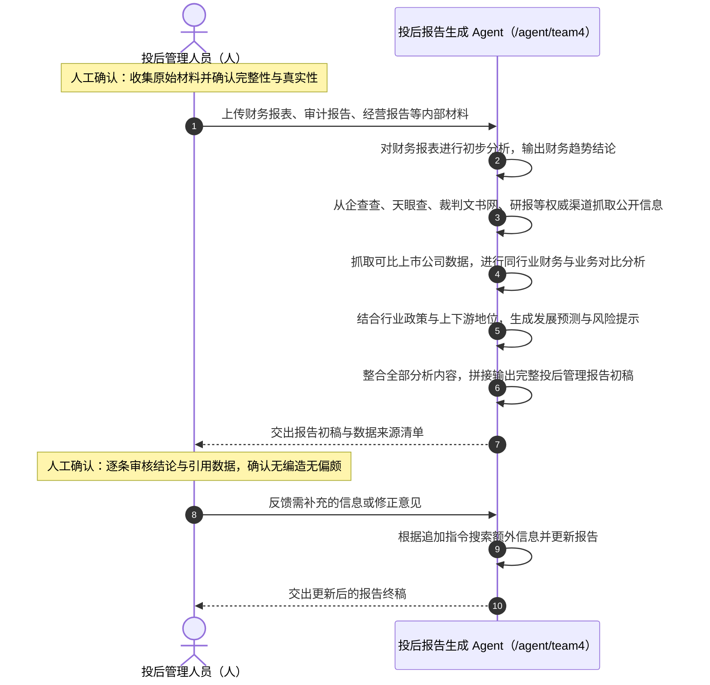

# 01 · 端到端交互过程（时序图逐步拆解）

来源：交互时序图附件（投后管理人员（人） ↔ 投后报告生成 Agent）。
本文件把图上的每一格落成「谁触发 / Agent 做什么 / 用户看见什么 / 失败怎么办」。

## 0. 入口：`http://www.boardx.com.cn/agent/team4`

| 项 | 要求 |
|---|---|
| 路由 | 复用 Phase 16 建成的公开路由 `/agent/[slug]`，`team4` 是本 Agent 的稳定 slug；slug 不可被他人抢占或复用 |
| 未登录 | 可看落地页（Agent 介绍、能力清单、挂载的 Skill 与当前模型、示例材料与示例报告），**不能上传真实材料**；点"开始分析"走登录 |
| 已登录 | 进入该 Agent 的独立会话；会话与产出物归属当前用户/其所在组织的项目层 |
| 可见性错误 | 不区分"存在但无权"与"不存在"，统一走 `NOT_VISIBLE` 语义，不泄漏 Agent 是否存在 |
| 落地页内容来源 | 直接读 Agent 定义（名称、描述、挂载 Skill 版本、模型、权限层级），不另存一份文案副本 |
| 会话起手 | 首轮由 Agent 主动给出"需要哪几类材料"的清单（引用 `03` A 节编号，不复述条目正文），降低空白页焦虑 |

## 1. 人 → Agent：上传财务报表、审计报告、经营报告等内部材料

- 支持**批量上传 / 拖拽整个文件夹 / 粘贴链接**；单次会话形成一个**材料包（material set）**。
- 每份文件进入材料包时记录：文件名、格式、字节、哈希、上传时间、上传者、**期间标签**
  （如 `2025H1` / `2025Q2`）—— 期间标签是后续同比环比对齐的依据，缺失时 Agent 必须回问，不许猜。
- **人工确认：收集原始材料并确认完整性与真实性**（时序图第一格注记）。上传完成后 Agent 列出
  「已收到 N 份 / 覆盖哪些 `03` A 节类目 / 还缺哪几类」，由人勾选"材料齐了，开始分析"才进入第 2 步。
- 前端显示逐文件的解析状态（排队 / 解析中 / 成功 / 失败（原因））；失败文件**不静默跳过**，
  必须出现在最终报告的「未能解析清单」里——"我没读到"和"材料里没有"是两件事，不许混为一谈。
- 容量与格式边界见 `02-capability-mapping.md`（复用既有附件白名单与上限，不新造一套参数）。

## 2. Agent 自处理：对财务报表进行初步分析，输出财务趋势结论

- PDF / DOCX / PPTX / XLSX 走原生结构化解析，保留**页码 / 表格行列 / 幻灯片编号 / 单元格地址与 bbox**；
  扫描件走 OCR 兜底并标记「OCR 来源，置信度 X」。
- 表格必须按结构入库（而不是压成一行文本）：A/B/C 三组测试的多数风险点都藏在表里
  （研发资本化明细、存货与应收、关联方采购均价、入组进度、现金与费用）。
- 抽取 `03` B 节定义的财务指标集，自动算同比/环比/占比/周转天数，并按 `03` C-1 判据标异常。
- **趋势结论必须带算式**：如"资本化率 = 960/1200 = 80%"，而不是只给"资本化率偏高"。

## 3. Agent 自处理：从企查查、天眼查、裁判文书网、研报等权威渠道抓取公开信息

- 只在**材料内事实不足以判断合理性或完整性**时才外检索（工商变更、股权质押、涉诉、行政处罚、
  行业政策、补贴退坡、竞品获批…）。
- 每条外部数据必须带：来源标题、URL、发布/获取时间；与材料内事实在 UI 上分栏，永不混排。
- 抓取失败或渠道需要登录/付费时，**明确降级**为"未取证的常识判断"并进"需核实清单"，
  不得冒充已取证，也不得凭模型记忆编一个数字。

## 4. Agent 自处理：抓取可比上市公司数据，做同行业财务与业务对比

- 对标口径见 `03` E 节：可比公司选取理由、口径年度、指标定义要一并输出，否则对比无意义。
- 对比结论固定三件：本司数值 / 行业区间 / 偏离方向与幅度（如"研发资本化率 80% vs 行业 30%-50%"）。

## 5. Agent 自处理：结合行业政策与上下游地位，生成发展预测与风险提示

- 政策类风险必须落到**时点**（生效日 / 退坡日 / 到期日 / 触发日），形成"风险窗口时间轴"——
  这是本 Agent 区别于普通摘要工具的核心产出（对应 `04` 测试 C 第 2 问）。
- 预测一律标注为**推断**，并写明推断所依赖的前提；前提不成立时结论失效要写出来。

## 6. Agent 自处理：整合全部分析内容，拼接输出完整投后管理报告初稿

- 章节结构见 `03` F 节，与最终报告同源，不另写一份。
- 初稿同时交出**数据来源清单**（时序图："交出报告初稿与数据来源清单"）：
  每个进入报告的数字 → 文件/页/位置或外部 URL，一行一条，可导出核对。

## 7. Agent → 人：交出报告初稿与数据来源清单（第一次交付）

三栏并排，可导出。每条风险固定四列：**编号 / 问题是什么 / 为什么属于问题 / 材料中如何体现（可点击回跳）**。

## 8. 人工确认关口①：逐条审核结论与引用数据，确认无编造无偏颇

- 用户可对每一条做：`确认`（进入最终报告）/ `驳回`（写理由，Agent 必须在后续输出中尊重该裁决）/
  `补充`（人工添加一条）/ `标记存疑`（进需核实清单）。
- 驳回与补充**全部留痕**（谁、何时、理由），随最终报告归档。
- 这一步是**阻断性**的：未确认前 Agent 不进入深挖阶段，不擅自扩大范围。

## 9. 人工确认关口②：对风险点做轻重分级，决定追问与深挖方向

- 用户给每条风险打 `高 / 中 / 低 / 忽略`，并勾选需要"定向深挖"的条目，可附自然语言指令。
- 分级结果是深挖阶段的**唯一任务来源**：Agent 不做没被勾选的深挖。

## 10. 人 → Agent：反馈需补充的信息或修正意见

一次提交，携带：确认后的结论 + 风险分级 + 勾选项 + 自由文本指令
（如"把应收账款按账龄拉开""按 30% 资本化率重算净利润""测算现金跑道到 III 期完成还差多少"）。

## 11. Agent 自处理：根据追加指令搜索额外信息并更新报告

- 每个勾选项作为一个**可并行的子任务**，各自独立产出与出处；单个子任务失败不拖垮整批。
- 典型深挖动作：
  - **重算**：按行业口径重算（资本化率、存货跌价、扣非利润）；
  - **拉明细**：客户/账龄/关联方/存货结构；
  - **补对标**：可比公司毛利率、补助占比、研发口径；
  - **测算**：现金跑道 = 货币资金 ÷ 月均净流出，并与里程碑时间轴对齐算出缺口月数；
  - **找缺口**：在材料内二次定向检索某条结论是否其实在附件深处已有答案。
- 重算类结论必须给出**算式与输入数据的出处**三元组，不能只给结果。

## 12. Agent → 人：交出更新后的报告终稿

按勾选项逐条回，标注"是否改变了原风险等级"；随后一键生成最终报告产出物（可下载 / 可归档）。
报告头部固定带**运行出处**：Agent 版本、挂载 Skill 版本、模型 ID、权限快照、材料包哈希清单、生成时间。
支持按组织自定义的归档模板套用（模板缺省时用平台默认模板）。

## 13. 闭环沉淀（MAAU 画布「闭环验证」格）
- 每次人工核准的修订记录（驳回理由、补充条目、改判的风险等级）回流为**分析规则与检索策略的优化输入**；
- 记忆只写**方法论与口径偏好**（如"本基金资本化率按 30% 口径重算"），
  **不写标的敏感财务明细**（见 `02` 数据与合规要求）。

## 时序图（对齐附件）

## 贯穿全程的非功能要求
- **可中断可续跑**：任一自处理步骤可取消；取消后已完成的解析结果保留，重跑不重复付费解析。
- **进度可见**：每一步在会话里有独立的状态行（进行中 / 完成 / 失败 + 耗时），不是一个转圈。
- **高风险工具需人批**：涉及外发、执行、下载外部内容的工具调用走既有人工批准关口，默认 fail-closed。
- **失败可读**：任何失败都给"发生了什么 / 影响哪一步 / 你可以怎么办"三句话，不抛原始堆栈。
- **长材料包不阻塞**：解析完成可选发通知（`wx_schedule_*` / 站内通知），人不必守着页面。
