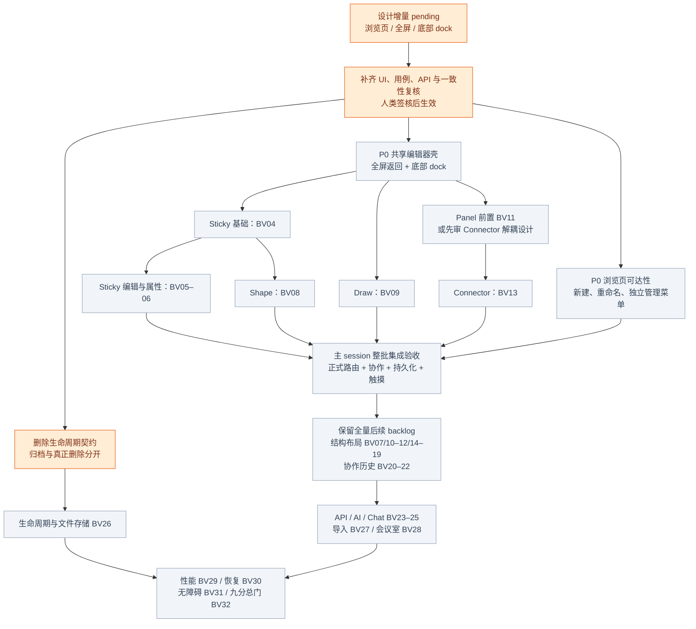
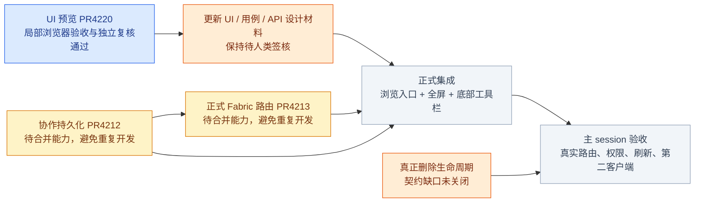
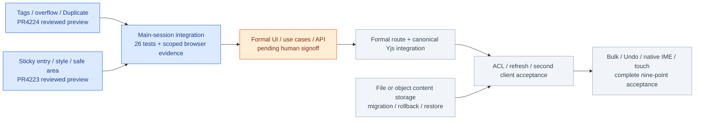

# Board 浏览入口与底部触摸工具栏设计变更

- 状态：**pending — 待真实 UI 材料、一致性复核与人类签核**。
- 来源：2026-09-26 用户要求 Board nav 打开浏览页，可新增、删除、修改；打开 Board 后全屏编辑；底部工具栏参考 FigJam，优先便利贴、Shape、Draw、Connector，并加强动画与可视化。
- 追踪：[issue #4217](https://github.com/boardx/workspacex/issues/4217)。这是待审设计增量，不是功能状态或签核记录。
- 权威功能状态仍在 `../feature_list.json`；本稿不改 feature、sprint、已签核契约或估点。

## 1. 现状与需要修复的入口

以 origin/main `d22a2739b` 检查 `apps/web/components/whiteboard/whiteboard-library.tsx`：已有 list/create/get/update 和名称、归档、成员管理 API。卡片主动作当前调用 `open(id)` 展开管理信息，没有直接进入正式 `/studio/board/:boardId` 编辑器；仍包含“画布编辑与多人协作尚未接入”提示。不得把已有能力描述为从零开发，也不得把旧 `whiteboard-screen.tsx` 原型当正式路由。

正式编辑器以 `collaborative-editor` / Fabric 路由为集成目标。移除过期提示的时机是正式路由接通并实测可达之后，不能仅删除文案制造已集成的假象。

## 2. 浏览页与管理状态

| 场景 | 可见行为与失败处理 |
|---|---|
| Board nav | 打开 `/studio/board` 浏览页；画板卡片显示名称、授权角色和可用状态；不直接进入固定演示画板 |
| 加载/空/失败 | 首次加载有状态；空列表有新建入口；网络失败保留已取得列表并提供重试，不能伪装为空 |
| 打开 | 卡片标题/主动作直接进入 `/studio/board/:boardId`；管理溢出菜单独立且不会冒泡打开编辑器；键盘可分别到达两个入口 |
| 新建 | 名称沿用现有契约校验；提交中禁重入；不确定失败重用 requestId；成功只出现一个 Board 并进入该 Board；失败保留输入 |
| 修改 | 有权限者在管理菜单重命名；取消不提交，成功后卡片和编辑器名称一致；失败不显示成功，刷新后仍一致 |
| 归档/恢复 | 复用现有 `updateBoard({archived})`；明确标为“归档/恢复”，可见归档状态与恢复入口 |
| 删除 | 当前已核对 API 只有归档，**不能将归档按钮改名为删除后宣称满足删除需求**。永久删除、可恢复删除及保留期尚无已确认契约；必须补充生命周期/ACL/内容回收契约和确认界面后才实现真正删除。此项保持显式缺口 |
| 拒绝访问 | 401/403/404 显示适当不可访问状态，不泄露板内容；菜单隐藏不替代服务端 ACL |

卡片预览优先使用受 Board ACL 保护的缩略图；没有缩略图时显示诚实空态，不生成假内容。缩略图生成与缓存失效作为待细化项，不能阻塞基本列表可达性修复。

## 3. 全屏编辑器与返回

进入正式 Board 后占满应用可用视口，隐藏 Studio 侧栏；不是必须调用浏览器 Fullscreen API。上方保留紧凑的 Board 名称、协作/保存状态和“返回白板”入口。返回恢复浏览页位置；有未确认写入时清楚显示保存状态/失败恢复，不以离开页面丢弃数据。

直接访问、刷新、浏览器前进/后退与从卡片进入必须得到同一真实 Board。Viewer 可浏览、缩放、选择阅读，但工具栏和快捷键不得产生写操作。打开归档 Board 的可编辑性必须复用现有服务端政策，不能由前端自行放行。

## 4. 底部 dock 交互建议

这是 FigJam 风格的交互方向，不声称已完成产品对照研究或像素级复刻。采用 WorkspaceX 自有 token、图标与视觉语言。

- 底部中央浮动 dock；一级视觉优先级：**便利贴、Shape、Draw、Connector**，辅以 Select/Hand；Text、Image 等保留可发现的 More 入口。缩放/Undo 控件分区，避免拥挤。
- 图标呈现工具本身：彩色叠纸、基础几何、笔尖及笔触、带端点连线；选中同时有轮廓/背景/文字语义，不只依靠颜色。
- 点按工具立即激活默认行为；旁侧展开控件提供颜色/形状/笔粗/连接样式，避免把“开菜单”和“创建对象”混成不可预测动作。
- 同时仅一个子面板，向上展开；点击外部或 Escape 关闭，焦点返回来源按钮。面板内点击和触摸不得穿透到画布创建对象。
- 触摸目标建议至少 48×48 CSS px；底部 safe-area 留白；窄屏保留四核心工具可达，可折行或让次级工具进入 More，不依赖 hover/长按。
- 手指/笔在画布上的绘制、拖动和双指平移缩放有明确模式与 pointer-cancel 处理；指针取消不留下半次提交。
- 工具激活使用短暂抬升/缩放，面板淡入上移；建议 120–180ms，输入反馈不等待动画结束；不循环摆动、不使用动画伪装保存成功。
- `prefers-reduced-motion` 下关闭位移/缩放，用即时状态反馈；键盘 Tab 进入 toolbar、方向键导航、Enter/Space 激活；声明工具名、选中状态、展开状态，输入法编辑时不触发全局快捷键。
- 软键盘弹起时 dock 与行内编辑器互不覆盖；320/375/768/1280px、触摸屏横竖屏及 400% reflow 都需验证。上下文工具条与 dock 各司其职，不互相遮挡对象。

## 5. 四核心工具验收

| 工具 | 主 session 集成验收出口 |
|---|---|
| Sticky（BV04–06） | dock 创建后直接输入；颜色、三尺寸模式、IME；第一张后连续 10 张 <30 秒；刷新及第二客户端内容一致；基础 Undo/Redo 边界按签核契约验证 |
| Shape（BV08） | 可视化面板选择矩形/圆/菱形，创建/输入/resize/改样式；稳定 object id，真实 Fabric 对象；刷新和协作不丢形状属性 |
| Draw（BV09） | 鼠标/触摸/笔画 stroke，颜色/粗细可见；一次手势有界 operation；缩放后轨迹命中正确；取消无半成品，重载/协作一致 |
| Connector（BV13） | 从对象锚点创建独立连接；两个对象建立 Arrow ≤2 次操作；移动/resize 保持绑定；样式/label 可改；无效目标/取消/远端删除按契约处理 |

这些是验收要求，不是已有测试通过声明。每条必须有真实正式路由、API、Yjs/存储证据；子 agent 负责代码与单元测试，主 session 负责所有浏览器/API/DB/WS/Docker 全栈验收。

## 6. 与既有规格的冲突及映射

| 项目 | 对应功能/缺口 | 需要更新的设计材料（本稿不直接覆盖） |
|---|---|---|
| 浏览页先行、卡片打开 | BV01 路由可达性 + 新浏览管理增量（未分配 feature ID） | `00-overview.md#R8` 当前写顶级入口打开全屏，需要区分 library 与 editor |
| 全屏编辑与底部 dock | BV01/BV03、BV31；dock 是新增共享 UI 工作项 | `01-fabric-surface.md#R8`、`02-object-authoring.md#R8` 当前左侧工具栏；S01 UI 变更需补审 |
| Sticky 连续创作/属性 | BV04–06 | S02 尚待签核材料需同步 dock，不将旧预览自动算新设计确认 |
| Shape / Draw | BV08/BV09 | 对象创作契约新增可视化工具面板和触摸验收 |
| Connector | BV13，现依赖 BV11 | 提前用户优先级不等于删除 Panel 依赖；如解耦基础 Connector，先更新领域/API 契约和 feature 拆分 |
| 真正删除 Board | BV26 生命周期相关，但没有现成完整删除 feature | 删除类型、保留期、在线会话失效、blob 回收/恢复及审计均需明确；归档不能代替 |
| 动效、keyboard、touch | BV31 + dock 各组件 | 基础触摸可用性前置到四工具交付；全面 a11y 门仍由 BV31 收口 |

后续将已审 UI 和上述缺口转换为 feature 四元组时，必须经 `loadFeatureList`/`saveFeatureList`；本稿不新造 BV 编号或静默改 dependencies。已有十轮目标全量保留，以下是优先级提案而非已生效 sprint 排期。

## 7. Mermaid 优先级与并行 backlog

图例：橙色＝本次待确认设计；灰色＝后续交付边界。没有绿色节点，避免以静态设计稿宣称当前实现/CI 状态。

并行边界：浏览页组件可与独立工具模块并行；先由一个 owner 交付 dock/selection/command 接口，再让不同 owner 扩展工具模块。同一 `collaborative-editor`、Fabric surface 或共享 E2E 文件不可同时修改；按依赖整合，不把四工具全部塞进一个 PR。每 feature 一个 issue/PR，全部提交后主 session 集中验收；不得以合并授权推定设计签核，也不得以设计签核推定合并授权。

## 8. 交付前检查

- 本稿仅定义需求；没有运行浏览器或启动 Docker，也没有改变人类签核。
- 后续验收证据应包含 exact SHA、入口到编辑器视频/trace、四工具操作计数、触摸/键盘/reduced-motion 录制、API 权限失败与刷新后持久化断言。
- 删除缺口、Connector 依赖、dock 共享文件归属、正式路由过期文案必须在实现 issue 中逐项关闭；缺一项不宣称本次需求完成。

## 9. 可审查材料与接入顺序（2026-09-26 快照）

这部分是 review 材料索引，不是第二份 feature 状态源；合并与 CI 以链接的实时状态为准。

- [PR #4220](https://github.com/boardx/workspacex/pull/4220)：浏览页与底部 dock 的真实 Fabric mock 预览。实现复核绑定 `dd0f477f0c8455121395ec46506d06f59537e6eb`，独立 review 无 P0/P1/P2；11 项组件/几何/真实 Fabric 测试通过。主 session 的操作证据见该 PR 的 `evidence/board-workspace-preview/2026-09-26-main-session.md`。这不代表正式保存、协作或人类签核。
- [PR #4213](https://github.com/boardx/workspacex/pull/4213)：正式 Fabric 路由工作。不能因预览分支缺少动态路由就安排重新实现；先核对并集成此 PR 的最终版本。
- [PR #4212](https://github.com/boardx/workspacex/pull/4212)：协作与持久化工作。不能将它与预览页面内 Fabric JSON 草稿混同；正式内容保持 canonical Yjs/Board command 边界。
- 元数据已有 list/create/get/update（名称与 archived）；永久删除仍无既有契约。正式接入必须保留 create 的 requestId 重试语义和服务端权限，不能直接搬运预览数组操作。

蓝色仅表示局部预览材料已复核；黄色表示已有待合并工作；橙色表示设计门或缺口；灰色表示后续正式集成验收。此图不将任何节点标为正式交付完成。

正式接入验收详见 [Given/When/Then 矩阵](./2026-09-26-workspace-acceptance-matrix.md)。补充静态核对：PR4213 `e48bf80631dca1963f70a046f5d084acdd3e88c6` 基于 PR4212 `aa35c58ebe69476765b02c60f0f9950c368e9c2f`，已包括动态路由、canonical command host、Yjs provider/gateway 与 Fabric 增量投影。真正剩余项是浏览卡片/创建后导航、正式底部 dock、Fabric Draw/Connector 及删除契约，不能重写整套 host。

**存储要求仍未满足**：上述协作 PR 的 `PgWhiteboardCollaborationStore` 将 snapshot/update bytes 存 PG；用户要求和 `requirements/07-interchange-storage.md` 规定内容进入文件/对象存储、PG 仅存 metadata/pointers。此差异必须在存储迭代完成并用真实恢复/增长证据验收，不能因为 PG 持久化可用就宣称存储需求通过，也不能将 UI 确认解释为接受该存储偏差。

## 10. 用户补充：标签、菜单、复制与便利贴九分目标

2026-09-26 用户审阅预览后补充以下要求。此前截图仅是上一版材料，不能视作这些增量已经确认或完成。

- [#4221](https://github.com/boardx/workspacex/issues/4221)：浏览页加入标签管理与过滤。标签使用稳定 ID；重命名保持引用；删除标签解除关联但不删除 Board。多标签采用 AND，与名称搜索同时生效，并提供清空筛选。卡片上的管理操作收进独立三点菜单，支持键盘打开、Escape 关闭及焦点返回；打开菜单不得进入画板。
- Duplicate 属于同一浏览页增量：复制名称、标签和画板内容到新 Board ID，原副本独立修改；未打开过的画板也必须有完整内容。预览先证明页面内草稿复制；正式 API 还需定义快照一致性、对象 ID/连接引用重映射、媒体引用、幂等重试和权限。建议新 Board 默认仅创建者可见，不复制原成员权限、历史记录或在线状态；该建议须进入正式契约，不可由 mock 行为推定已生效。
- [#4222](https://github.com/boardx/workspacex/issues/4222)：用户给当前便利贴体验六分，要求以 Mural 为十分基准达到九分。第一批改进覆盖快速创建、Tab 连续输入、中文输入、排版和上下文样式；完整验收还包括批量创建/编辑、复制、Undo/Redo、触摸、协作与恢复。不能把第一批 UI 改进或单元测试通过换算为九分。

### 主 session 验收补充

| 链路 | 必须观察的结果 |
|---|---|
| 标签 CRUD | 建立标签、关联两张 Board、重命名后两处同步；删除标签不会删除 Board |
| 组合过滤 | 两标签 AND 与名称搜索同时生效；无匹配有空态；清空恢复完整授权列表 |
| 三点菜单 | 点击不打开 Board；Tab/Enter/Escape 可操作；关闭后焦点回触发器 |
| 内容复制 | 未打开的源板与已编辑的源板均复制完整；新增ID；原副本分别修改互不影响 |
| 复制失败 | 正式请求失败不出现假成功卡片；不确定响应重试不产生重复副本 |
| 连续便利贴 | 双击空白与双击文字行为不混淆；Tab 保留当前文字并创建相邻便签；中文组合输入不提前提交 |
| 文字与样式 | 长中文/英文及换行不溢出纸面；深色纸面可读；属性修改对应正确选中对象 |
| 持久与协作 | 同一动作经 canonical command/Yjs 到达第二客户端，刷新恢复；只读者无法写入 |

Mural 官方参考：[创建与自定义便利贴](https://learning.mural.co/lessons/add-create-and-customize-sticky-notes)、[便利贴协作](https://www.mural.co/use-case/sticky-notes)。上述计时、可靠性及验收门槛是 WorkspaceX 的目标，不宣称为 Mural 官方评分标准。

## 11. Incremental preview evidence (2026-09-26)

Evidence index only; feature/signoff/merge state is unchanged. Read live CI from each PR.

- [Library PR #4224](https://github.com/boardx/workspacex/pull/4224): tags, AND/search filters, overflow actions and content duplication. Independent APPROVE at `f5dd6752d58666cd9c867817ea4fb4ed5069df9e`; 18 tests passed. If filtering removes the originating card, closing the tag dialog focuses Manage tags.
- [Sticky PR #4223](https://github.com/boardx/workspacex/pull/4223): rapid entry, padding/growing text, color/size/alignment and measured toolbar safe areas. Independent APPROVE at `d640473140ac68612a167f08013c4e978dd01996`; 19 tests passed. Main-session browser repros confirmed fixes for Fabric DOM reparenting crash and top/bottom occlusion.
- Main-session integration `a753c2c35`: six test files, 26/26 tests passed. Browser observed independent copied content, contextual styling, 375px editor visibility and readonly rejection of empty-space double-click, Return/Tab, existing-note double-click and drag. Final local integration evidence commit `940564e3f`; both PRs contain earlier detailed observations in `evidence/board-ui-integration/2026-09-26.md`.
- Native IME, physical touch, bulk operations, complete Undo/Redo, server ACL, refresh recovery and two-user convergence remain unproven by this preview. Refresh resets its state. This does not establish nine-point completion.

Blue means scoped preview evidence; orange means pending design; gray means remaining implementation/acceptance. No node denotes production completion.
