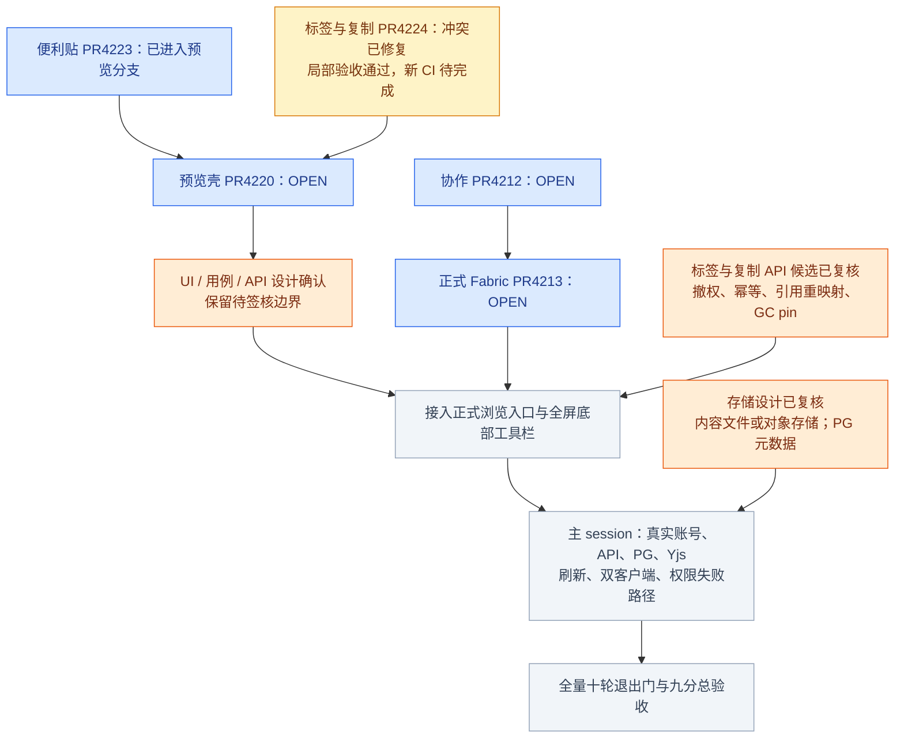
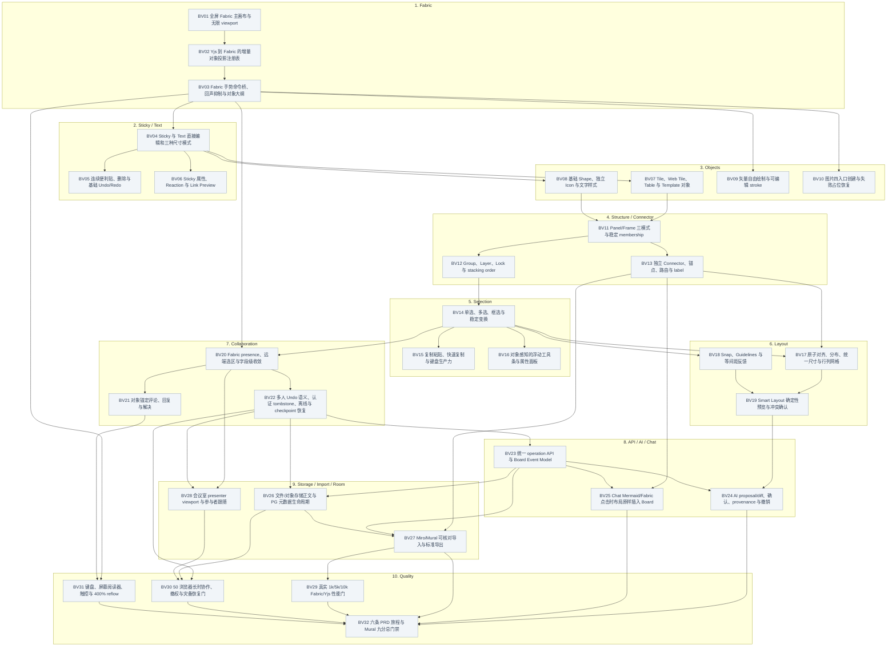

# Board 全量 Mermaid 执行计划

本图是开发和验收导航，不修改 feature 状态、签核或授权。功能和依赖以 `feature_list.json` 为单源；十轮退出指标见 [phase.md](../phase.md)。本次经 `loadFeatureListIn` 读取该设计分支，BV01–BV32 尚无 passing 记录，不能以预览测试或 PR 状态抵扣正式完成。

## 1. 当前交付链与下一步

2026-09-26 GitHub 实时核对：PR4212、4213、4220、4224 均 OPEN；PR4223 已合入 `codex/board-workspace-preview`，不是 main。PR4224 冲突修复为 `e7552403f`，独立复核及 26 项测试通过；新 CI 仍需等待。后续状态以链接对应的实时 PR 为准。

蓝色＝已有实现或局部证据；黄色＝检查待完成；橙色＝设计材料及签核边界；灰色＝正式实现或验收待完成。绿色只留给完整验收通过且符合仓库完成定义的能力，本图没有绿色节点。

## 2. 十轮全量范围与真实依赖

下图边由 `loadFeatureListIn` 的 `depends_on` 生成，分组来自既有 wave。轮次表示验收组织，不把所有轮次强行串成一条线。不同轮次中无依赖且不触碰相同文件的工作可以提前并行；不得修改既有依赖来追求并行数量。

<!-- dependency-graph:start -->

<!-- dependency-graph:end -->

## 3. 三条开发通道，主会话统一验收

| 通道 | 工作边界 | 并行条件 |
|---|---|---|
| Worker A：浏览与前端工具 | 浏览页、标签菜单、工具子模块、局部交互与组件测试 | 共享 canvas、selection、command adapter 由一个 owner 串行维护；其他 worker 通过稳定接口接入 |
| Worker B：领域与协作 | canonical command、Yjs、Undo、引用关系、对象协议 | 先交付共享接口；一个 owner 同时只领一个 feature；禁止第二套 Fabric JSON 写模型 |
| Worker C：存储与外部集成 | blob adapter、迁移、导入转换、API/AI/Chat/会议室独立模块 | 满足图中依赖和签核后实施；存储 schema、copy/GC 共用协议不可多人同时改 |
| 主 session | 合并到本地验收分支、真实浏览器/API/DB/WS、Docker、性能与恢复验收 | 收齐一批子任务后集中测试；不让子 agent 启动完整环境或代做端到端验收 |

子 agent 交付 exact SHA、所改文件、组件/单元测试和复现步骤。独立 reviewer 不代替主 session 的真实链路验收。每个 feature 一个 issue/PR，失败退回对应 owner 修复；没有明确授权不合并 GitHub PR。

## 4. 下一批执行顺序

1. 收尾 PR4224 修复后的 CI，保留已验收预览；不要重复开发 PR4212/4213 的 host、transport 和投影。
2. 将已审 UI、[标签/复制 API 候选](./2026-09-26-library-api-design.md)及 [存储方案](./2026-09-26-storage-integration-acceptance.md)纳入对应契约束及一致性复核。候选设计不等于已签核的可执行 schema。
3. 正式接入时先打通浏览列表、创建返回真实 ID、动态路由、全屏返回与底部工具栏；再沿依赖推进 Sticky、Shape、Draw、Connector。保留创建重试的 requestId 和服务端权限。
4. 收齐并行实现后，主 session 按 [正式集成矩阵](./2026-09-26-workspace-acceptance-matrix.md)验收。存储单独按其故障矩阵验证，不能用 PG 正文持久化代替文件/对象存储目标。
5. 保留所有后续范围：批量布局、Undo/Redo、离线恢复、API/AI、Chat Mermaid/Fabric 插入、Miro/Mural 导入、会议室、性能、无障碍和灾备。按 phase 原定阈值执行 BV32，不降低门槛。

## 5. 九分判定

不以 PR 数、单元测试数或截图打分。九分必须由正式入口的完整用户旅程、协作与刷新恢复、真实迁移板和性能/可访问性证据支撑。便利贴还需原生 IME、实体触摸、批量操作和完整撤销重做；现有长文本及只读预览验收只证明其记录的局部行为。
