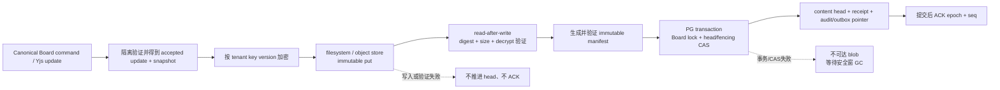

# Board 内容存储正式接入与验收计划

关联：[浏览页与底部 dock 设计增量](./2026-09-26-library-bottom-dock.md)、[正式集成验收矩阵](./2026-09-26-workspace-acceptance-matrix.md)、[issue #4217](https://github.com/boardx/workspacex/issues/4217)、[设计 PR #4218](https://github.com/boardx/workspacex/pull/4218)。

本文只记录正式 Board 接入时的存储差距、可复用实现和验收边界。它不是新的 feature 状态源，不改变 `feature_list.json`、设计签核或任何 PR 的合并状态。BV26 的状态、依赖、验证命令和证据仍以 `feature_list.json` 为唯一权威；实现前仍需独立的存储契约束和人类签核。

## 1. 审计基线与结论

本次只读核对绑定以下本地 Git 对象：

| 范围 | exact SHA | 已核实事实 |
|---|---|---|
| PR #4212 协作与持久化 | `aa35c58ebe69476765b02c60f0f9950c368e9c2f` | `PgWhiteboardCollaborationStore` 把完整 snapshot 和每次 accepted update 写入 PG `bytea` |
| PR #4213 正式 Fabric 路由 | `e48bf80631dca1963f70a046f5d084acdd3e88c6` | 包含上述 PR #4212 SHA；路由、command host 与 Fabric 投影继续使用同一 PG collaboration store |
| 可复用 blob donor | `b44b8e2fc576fbba5a90aac4c33517ec709e3ca6`，本地 ref `origin/codex/board-blob-gc` | 含 filesystem、Hosted object store、blob-first publication、在线迁移、rollout 与 GC 实现 |
| 本设计分支审计起点 | `8d83f8bb173965b3e5915c3bd2e4923ee0b6cd74` | 仅用于记录本文写作基线 |

`b44b8e2f` 不是 `origin/main` 或 PR #4213 exact SHA 的 ancestor；这些文件是可移植 donor，不能写成已经合入或已经在正式 Board 生效。PR/CI 的实时状态也不能由本地 ref 推断，合入前由主 session 重新读取 GitHub 动态状态。

目标由 `requirements/07-interchange-storage.md` 和 BV26 约束：PG 保存 Board 元数据、ACL、索引、epoch/seq、manifest pointer、幂等 receipt、迁移/保留/审计状态；Yjs checkpoint/update segment、媒体、导入原件和导出包进入租户隔离、加密、内容寻址的 filesystem 或对象存储。Fabric JSON 永不成为协作文档或持久化格式。

因此，PR #4212/#4213 当前持久化可用于验证 canonical command/Yjs 协作链，却不能通过用户要求的“内容文件、元数据 PG”验收。

## 2. 当前正式链路的具体差距

在 PR #4212 exact SHA 中：

- `apps/api/migrations/20260924000200_whiteboard_collaboration.sql` 定义 `whiteboard_documents.snapshot bytea NOT NULL` 和 `whiteboard_updates.update bytea NOT NULL`。
- `apps/api/src/infrastructure/whiteboard/pg-collaboration-store.ts` 的 `document()` 从 PG 读取 snapshot；`load()` 直接基于该 snapshot 生成 diff。
- `commitInTransaction()` 先插入 accepted update body，再把完整 accepted snapshot 重写到 `whiteboard_documents`。持续编辑会同时增长主表/TOAST、WAL、复制和数据库备份体积。
- PR #4213 继承 PR #4212，但其树中没有 Board blob port、content head、内容迁移或 GC 实现。

目标状态与当前状态如下：

| 数据 | 当前 #4212/#4213 | 正式目标 |
|---|---|---|
| Board、组织、成员、ACL、归档状态 | PG | PG，沿用现有关系模型与 RLS |
| epoch、seq、fencing、request/update receipt | PG | PG，但 receipt 不携带 update body |
| Yjs snapshot | PG `bytea`，每次提交重写 | 加密不可变 checkpoint blob；PG 只指向 verified manifest |
| Yjs accepted update | PG `bytea` append log | 加密 update segment blob；PG 只保留接纳元数据与 pointer |
| manifest | 不存在 | 加密、不可变、含 checkpoint/tail 连续范围与 parent pointer |
| 导入原件、导出包、Board 媒体 | 本链路未定义 | 同一租户隔离的 blob 契约和生命周期 |
| 回收 | PG 外键删除 | retention/legal hold 感知的有界 mark-and-sweep |
| 备份恢复 | PG 内容随数据库备份 | PG 恢复点与可达 blob 的联合恢复点，并从 manifest 重建 Y.Doc |

## 3. donor 逐项复用映射

移植以符号和行为为边界，不能直接把 donor 分支整体合入。尤其是该分支的 ADR 文件与主分支现有 `ADR-114` 编号冲突，设计结论应由 Phase 19 契约束承接，不能覆盖主分支 ADR。

| 接入职责 | donor 文件 / 符号 | 接入 #4212/#4213 的位置 | 必须保留的不变量 |
|---|---|---|---|
| 窄存储端口 | `apps/api/src/application/whiteboard/blob-ports.ts`：`BOARD_BLOB_STORE`、`BOARD_BLOB_PURGE_STORE`、`BOARD_BLOB_CODEC`、`BoardBlobStore`、`BoardBlobPurgeStore` | application 层新增依赖，collaboration writer 只注入写/读端口，GC 才注入 purge capability | 普通写路径没有物理删除权限；读取必须核对 digest、size、MIME |
| Blob 身份与错误 | `domain/whiteboard/blob-identity.ts`、`blob-errors.ts` | domain 层统一租户/Board/kind/digest key 与稳定错误 | key 在租户命名空间内不可变；相同 key 不同内容硬失败 |
| Manifest 契约 | `domain/whiteboard/content-manifest.ts`、`packages/contracts/src/whiteboard-content-manifest.ts` | contracts/domain 单源，供 writer、loader、migration、GC 共用 | checkpoint + tail 连续重建 headSeq；parent manifest 使用完整可验证 pointer |
| 自托管 filesystem | `infrastructure/whiteboard/fs-board-blob-store.ts` | `BoardBlobStore` 与受限 `BoardBlobPurgeStore` adapter | 真实 POSIX 文件；临时文件、文件和目录 fsync、原子发布、回读 digest、路径围栏和 symlink 防护 |
| filesystem 生产门 | `board-storage.providers.ts` 的 `boardBlobRoot()`；`board-blob-runtime.ts` 的 runtime gate | API 启动配置 | 生产必须显式绝对持久目录，拒绝 tmp；本地 filesystem 仅显式单副本，不能把容器临时盘当持久盘 |
| Hosted object store | `hosted-board-blob-store.ts`、`hosted-board-blob-clients.ts`、`hosted-board-provider-factory.ts` | Hosted adapter 与 SDK factory | Aliyun OSS、AWS/S3-compatible/MinIO/R2 走同一端口；conditional immutable put、回读校验、分页删除和 bucket policy readiness |
| 运行时选择 | `board-storage-selection.ts`、`board-storage.providers.ts` 的 `boardStorageProviders` | `kernel.module.ts` 注册并向 collaboration store 注入 | 生产配置缺失或不一致时 fail closed；不能静默退回节点本地目录 |
| 加密与 key version | `aes-gcm-board-blob-codec.ts`、`file-board-master-key-source.ts` | codec/KMS adapter | AES-GCM；租户派生与 versioned key；PG/manifest 不保存明文 key |
| PG content head | migrations `20260924000800_whiteboard_content_heads.sql`、`20260924000900_whiteboard_blob_primary.sql` | 现有 collaboration schema 上做兼容迁移 | head 含 epoch/seq、manifest pointer/digest/size、key/schema/protocol version 和 fencing token；rollback 期才允许旧 body |
| blob-first publication | donor `pg-collaboration-store.ts` 的 `snapshot()`、`activateNewBoard()`、`publish()`、带 CAS 的 `commitInTransaction()` | 复用 #4212 的 ACL、幂等、限流、validator 与 transaction boundary | 先写密文 checkpoint/manifest并回读验证，再在 PG 事务 CAS head；PG 失败只留下不可达 blob，不能发布半成品 |
| 迁移 journal | `20260924001000_whiteboard_content_migrations.sql`、`content-migration-ports.ts`、`pg-board-content-migration.ts` | 每 Board 持久迁移状态 | job/request 幂等；watermark 与 current head 在锁内复核；失败默认保留旧事实源和 candidate |
| 在线迁移 use case | `migrate-board-content.ts` 的 `MigrateBoardContent`、`RetireLegacyBoardContent`；`scripts/migrate-board-content.ts` | 运维 CLI/worker，不能进入请求热路径 | bounded phase、双向 Yjs state-vector 等价、CAS cutover、rollback window、签名 retirement credential、批量清理 |
| 批量 rollout | `run-board-content-rollout.ts`、`pg-board-content-rollout.ts`、`20260924001200_whiteboard_content_rollouts.sql`、`docs/design/whiteboard/content-migration-rollout.md` | 多 Board 编排 | dry-run、resume、pause、cancel、租约 fencing、有界 page/phase/retry；单板失败不推进为成功 |
| retention/GC | `20260924001100_whiteboard_blob_retention_gc.sql`、`blob-gc.ts`、`pg-board-blob-reference-guard.ts`、`pg-board-blob-sweep-coordinator.ts`、`scripts/sweep-board-blobs.ts` | 独立受限 job | Board 锁内遍历 current head、parent history、migration candidate、backup/legal-hold roots；安全窗后重查，扫描不完整时不删 |

对应 donor 历史可用于追溯实现来源：`eb727ca62c80300b318d4448149014aa0675f685`（#4050，foundation）、`1697e01d60c40774b0838faca1262da3e32eef41`（#4093，blob-first collaboration）、`1658d5997d8289b74d1a02f2589dbddae2c129ce`（#4135，GC）、`9325409c464bcf5f2f0b1b81c903703b4ac86915`（#4139，Hosted/KMS）和 `b44b8e2fc576fbba5a90aac4c33517ec709e3ca6`（merge PR #4138，bounded rollout）。这些提交都需要重新基于正式集成 SHA 验证。

## 4. 正式发布协议



ACK 只能发生在 PG pointer 事务提交后。Fabric surface 继续投影 canonical Yjs 文档，不读取或保存 Fabric JSON；存储切换不能改变 command、object ID、ACL、readonly 或协作收敛语义。

## 5. 分阶段接入与迁移

### Gate 0：契约与安全边界

为 BV26 新建独立存储契约束，覆盖 domain、use cases、API/CLI、迁移、GC、备份恢复和权限，并经人类签核与一致性复核。本文不能替代该签核。先固定 manifest/version、错误码、配置 schema、retention policy 单一事实源和观测指标，再接产品代码。

### Gate 1：端口、adapter 与空板接入

移植 blob ports、manifest、codec、filesystem 和 Hosted adapters；通过 runtime selection 注入现有 `PgWhiteboardCollaborationStore`。新 Board 的空 Y.Doc 也先生成 verified checkpoint/manifest，再发布 `blob_primary` head。filesystem 与 Hosted 使用同一契约测试；多副本 Hosted 环境不得加载节点本地 store。

### Gate 2：blob-first 正常写与读

保留 PR #4212 的 ACL、幂等接纳、速率限制、update validator 和事务语义，把内容 body 替换为 verified manifest pointer。读路径只从 PG 取得授权与 head，再读、校验、解密 checkpoint + tail；缺失、损坏、版本不支持或序列不连续均显式失败，不能返回空板。

donor 当前 `publish()` 对每次 accepted update 写完整 checkpoint，并生成 `tail: []`。该行为可证明 PG 不再保存正文，但不满足长期的 checkpoint + bounded update segments 成本模型。正式 BV26 必须补 segment 累积、连续性检查、压缩/新 epoch 与旧 epoch retention，或以真实性能证据和经签核的简化范围明确首发边界。

### Gate 3：现有 PG Board 在线迁移

每个 Board 按持久状态机推进：

1. `legacy_pg`：锁内捕获 epoch/seq watermark，盘点 snapshot 和顺序 updates。
2. `candidate_ready`：在锁外重建 canonical Y.Doc，上传并回读验证 candidate checkpoint/manifest。
3. `verified`：重新捕获 watermark；对 legacy 与 candidate 做双向 Yjs state-vector diff，并核对所有 blob digest/size/key version。
4. `cutover`：短暂围栏写入，用 headSeq + fencing token CAS 发布 blob head；保留 PG mirror 和明确 rollback deadline。
5. `active/retirement`：rollback window 结束且联合备份恢复演练通过后，使用签名 credential 分批清空旧 `bytea`；删除列另走兼容 schema migration。

批量 rollout 必须支持 dry-run、暂停、恢复、取消和失败隔离。迁移指标至少按 tenant/Board 记录状态、watermark、bytes moved、digest、attempt、错误码和持续时间，不记录明文内容。

### Gate 4：rollback

- cutover 前失败：保留 `legacy_pg` 读写事实源，candidate 作为不可达对象等待安全窗 GC。
- rollback window 内 blob 主路径故障：围栏该 Board，证明 PG mirror 已追到当前 verified watermark，再 CAS 回 legacy/dual-write 状态；旧 blob 保留供诊断与重试。
- retirement 后：不再把正文写回 PG；切换到兼容 BlobStore adapter，或从联合备份恢复到新的 verified head。

donor 会在 `content_state='rollback'` 时保留 PG mirror，但本次审计没有找到可执行的“blob primary 切回 PG”operator command。该命令、权限、幂等和演练证据是 Gate 4 的缺口，不能只靠表状态或 ADR 描述验收。

### Gate 5：retention、GC 与真正删除

GC 标记集必须包含当前 head 和完整 parent history、未完成 migration/rollout candidate、rollback epoch、备份恢复点、legal hold、导入/导出和 Board 媒体引用。sweep 使用专用 purge capability、有界分页、固定水位、安全窗和删除前二次比对；PG/manifest/tenant 状态不确定时 fail closed。

归档不是物理删除。只有正式删除契约确认 tombstone、保留期、hold、恢复与审计后，才可释放对应 root；不能因为 Board 在浏览页不可见就回收内容。

### Gate 6：备份、恢复与损坏副本处理

联合恢复点由 PG PITR/元数据快照水位与该水位可达的不可变 manifest/blob 集合组成。恢复必须在隔离环境读取 PG head，恢复并校验 manifest/checkpoint/tail，重建 Y.Doc，核对 epoch/seq、ACL、digest 和对象计数，再将新 head 以 CAS 发布。只证明对象存储里“文件存在”不算恢复通过。

donor 有 retention root schema 和 GC 对 backup/legal-hold roots 的保护，但本次没有发现 Board 专属的 backup root 创建、恢复命令、从 verified secondary copy 自动恢复或 recovery alarm 实现。仓库通用 starter backup 脚本不能替代 Board 联合恢复链。上述能力和故障注入证据必须新增。

## 6. donor 不能直接视为完成的缺口

| 缺口 | 已观察到的 donor 行为 | 正式完成条件 |
|---|---|---|
| update segments | 每次写完整 checkpoint，manifest `tail: []` | 有界 segment、连续 seq、压缩与 epoch 切换；证明大 Board 写放大可接受 |
| Hosted migration CLI | Nest provider 可选 Hosted；`createConfiguredBoardStorageRuntime()` 仍固定创建 `ConfiguredFsBoardBlobStore` | 迁移、rollout、read/write 和 GC 使用同一个已选 Hosted store/codec；生产配置无本地盘回退 |
| rollback operator path | rollback 状态会保留 PG body | 有权限、围栏、watermark 验证与 CAS 的可执行回滚命令和演练 |
| Board backup/restore | retention roots 能阻止 GC；没有 Board 恢复 use case/CLI | 创建联合恢复点、恢复到隔离环境、重建 Y.Doc、CAS 发布和定期演练 |
| 损坏副本恢复 | `getVerified()` 检测错误并失败 | 按策略读取 verified secondary/version、恢复告警、无可用副本时拒绝空板 |
| BV26 契约与门控 | donor 的旧 ADR 记录决定，但未在 Phase 19 存储束签核 | 新契约束经人类签核；`design_ref` 由权威流程填写；一致性复核通过 |
| Phase 19 指名测试 | PR #4213 exact SHA 上四个测试文件均不存在 | BV26 verification 中的 atomicity、retention-GC、backup-restore、PG-growth 命令真实通过并留证据 |

Hosted adapter 的单对象读取上限和 whiteboard document 限额也需与 Phase 19 大 Board 性能目标对账。限额值只应在运行时/契约单一事实源定义，本文不复制一组可能漂移的数字。

## 7. 主 session 验收矩阵

以下全部在最终集成 exact SHA 上执行。donor 原有测试可以作为移植回归起点，但不能替代 BV26 的新门控；真实对象存储、PG 增长、恢复与双客户端行为需要主 session 运行。

| 场景 | 注入 / 操作 | 必须观察的结果 | 必需证据 |
|---|---|---|---|
| 新 Board blob-primary | 创建 Board，首次写入 Sticky，刷新 | PG head 指向 verified manifest；snapshot/update body 不进入 PG；刷新后内容一致 | exact SHA、API/DB 查询、blob descriptor、刷新录像 |
| 正常连续写 | 两客户端持续创建/移动/编辑并重连 | command/Yjs 收敛；seq 单调；manifest 连续；PG 只增 metadata/receipt | 两客户端记录、head/manifest 检查、PG 列采样 |
| Blob 写失败 | 在 checkpoint、segment、manifest put 各点注入失败 | PG head/seq 不前进，不 ACK；旧版本仍可读 | 故障注入日志、前后 head、客户端结果 |
| Blob 回读损坏 | 返回错误 digest/size/密文 | 不发布 head；读路径不返回空板；触发稳定错误和恢复告警 | fault test、告警事件、旧版本可读证明 |
| PG pointer 事务失败 | blob 验证后让 PG CAS/commit 失败 | 客户端无 durable ACK；原 head 不变；新 blob 不可达并在安全窗后可回收 | transaction trace、head 对照、GC candidate |
| 并发 CAS | 两个 writer 对同一 head 发布 | 最多一个 CAS 成功；失败者基于新 head 重试，不覆盖已提交内容 | fencing/headSeq 记录和最终 Yjs diff |
| 幂等重试 | 丢弃成功响应，以相同 request/update ID 重试 | 返回同一 accepted seq/receipt；不重复发布逻辑对象 | 请求与 receipt 对照、对象计数 |
| legacy 单板迁移 | 对有真实历史的 PG Board 逐 phase 迁移 | 双向 state-vector diff 为空；对象/连接计数一致；切换只发生在 verified watermark | migration journal、digest、Yjs diff、切换前后截图 |
| rollout 暂停与恢复 | 多 Board 批次中注入单板失败，pause/resume | 失败隔离；租约/fencing 有效；resume 不重复成功 Board；报告可审计 | rollout rows、命令输出、状态分布 |
| rollback window | cutover 后注入 blob outage 并执行回滚 | 先围栏；PG mirror 水位校验；CAS 后协作恢复且不丢 ACK 内容 | operator command、watermark、两客户端回读 |
| retirement | rollback window 未过、恢复演练未过、credential 错误分别尝试清理 | 三种情况都拒绝；全部满足后才有界清空 legacy body | 拒绝码、credential receipt、批次计数 |
| GC 可达性 | 构造 current、parent、migration、backup、hold 与 orphan blobs | 所有 roots 保留；仅超过安全窗且二次确认仍不可达的 orphan 删除 | mark/sweep 清单、前后对象列表、PG roots |
| GC fail closed | PG 不可用、manifest 损坏、分页中断或 tenant 不确定 | 本轮不删除并发出诊断 | job 结果、对象列表保持、告警 |
| 联合备份恢复 | 从指定 PG restore point 和对象存储版本恢复隔离租户 | manifest 可解密；Y.Doc、epoch/seq、ACL、对象计数一致；恢复 Board 可继续协作 | restore run ID、digest 报告、DB/blob 水位、两客户端验证 |
| 元数据-only 增长 | 记录基线后执行长时间/大量 Yjs 更新 | PG 不随 snapshot/update 正文线性增长；增长仅来自已定义 metadata/receipts | 表/TOAST/WAL 前后数据、blob bytes、操作计数 |
| 租户隔离 | 跨租户复用 digest/key、直接猜测 blob key | ACL 和 adapter 都拒绝；错误不泄漏对象是否存在 | 双租户 API/adapter 测试与审计日志 |
| filesystem 耐久 | 自托管挂载上写入，进程重启并校验；再用 tmp/多副本错误配置启动 | 持久挂载恢复成功；危险配置启动失败 | 挂载配置、重启读回、启动拒绝输出 |
| Hosted 拓扑 | 在正式对象存储配置执行写、迁移、rollout、GC | 全链使用同一 Hosted adapter；节点磁盘没有 Board 正文；权限最小化 | provider 选择、bucket policy、对象事件、节点目录检查 |

机械门至少包括 BV26 已登记但当前尚不存在的：

```bash
pnpm --filter api exec vitest run tests/whiteboard/blob-pointer-atomicity.test.ts tests/whiteboard/blob-retention-gc.test.ts tests/whiteboard/blob-backup-restore.test.ts
pnpm --filter api exec vitest run tests/whiteboard/pgsql-metadata-only-growth.test.ts
```

移植时还应重跑 donor 中与 storage selection、filesystem/Hosted adapter、manifest、migration、rollout、GC、collaboration persistence 相关的测试，并将路径调整到最终树。测试通过只能证明相应层级；Hosted 真 SDK、联合恢复、PG 增长和多客户端恢复仍需上述主 session 证据。

## 8. 通过判据与缺失证据

只有同时满足以下条件，才能把 BV26 存储目标计为完成：

1. 经签核的 Phase 19 存储契约束覆盖正文、pointer、迁移、rollback、GC、备份恢复和错误语义。
2. 最终 exact SHA 包含复用后的端口、正式 runtime adapters、PG metadata schema 和 blob-first collaboration 接入。
3. filesystem 与 Hosted 两种拓扑分别通过契约和运行时验收；Hosted 迁移/GC 不落到节点本地盘。
4. 现有 PG Boards 在线迁移、回滚和 retirement 均有可执行命令、稳定状态和故障演练。
5. backup/legal hold roots 有实际创建方，联合恢复从真实恢复点重建 Y.Doc 并重新协作。
6. BV26 的全部 verification 在最终 SHA 上退出码为 0，证据写回权威 feature；合入 main 与 CI 仍按仓库完成定义核验。

当前缺失证据明确如下：本次没有运行 donor 测试、真实 PG、filesystem、OSS/S3、迁移、GC、浏览器或双客户端；没有读取 GitHub 当前 PR checks；没有发现 BV26 存储契约束、人类签核、四个指名测试文件、Board 专属备份恢复执行链、verified secondary copy 恢复告警或 blob-primary 回退 PG 的 operator command。因此本文是接入与验收计划，不是通过声明。
