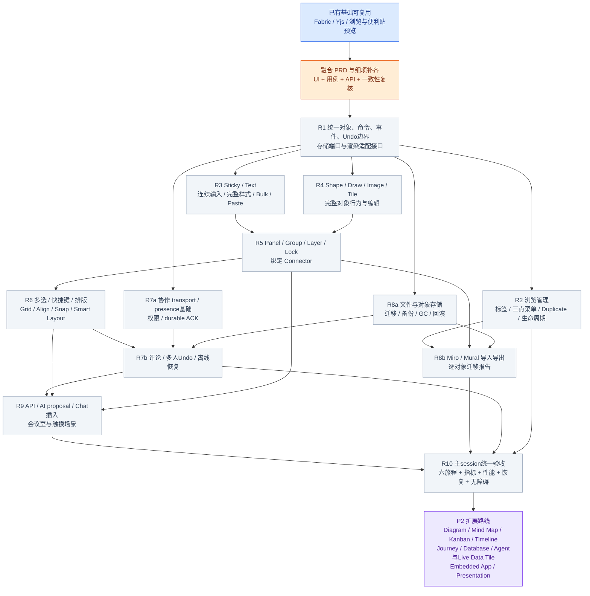
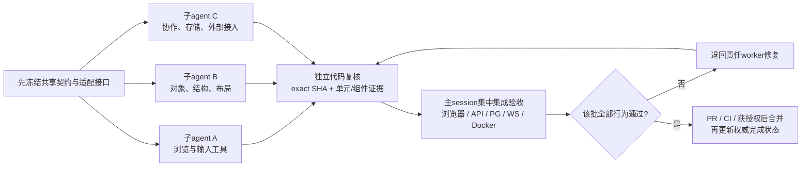

# Board 融合需求执行计划 V0.2

本计划融合用户本轮完整 PRD（第 1–60 节）及后续补充。它替代旧 Mermaid 作为讨论入口，但不自动修改 `feature_list.json`、既有依赖、签核或完成状态。现有 BV01–BV32 是功能单源；新增或遗漏的细项必须补进需求、契约及可执行验证，再通过既有流程分配。本文工作包不是新增 feature ID。

## 1. 融合后的产品边界

- 产品是人和 AI 共享的空间对象系统：Visual、Structural、Semantic 三层同在；不能只是在 Fabric 上摆 Shape。
- Studio 顶级 Board 入口先到浏览页：新建、搜索、标签过滤/管理、三点菜单、重命名、Duplicate、归档/恢复及真正删除的明确生命周期。
- 进入后全屏编辑，采用用户后续指定的底部触摸工具栏，替代原 PRD 第 5 节的左侧位置；Sticky、Shape、Draw、Connector 保持一级入口。Text、Tile、Panel、Image、Select、Hand 也须易达，低频项进 More。
- Fabric 是可丢弃的视觉投影；Yjs + canonical Board objects/operations 是内容单源。人、AI、Chat、导入器与 API 使用相同权限、幂等、审计和撤销语义。
- 正文、更新段、媒体、导入原件及导出包进入文件/对象存储；PG 保存元数据、ACL、索引、指针及审计引用。迁移期遗留正文只能存在于明确受控的回滚窗口。
- 默认以开源、自托管和公开 API 可用为交付条件；配置、迁移、启动、备份恢复和 API 示例必须可复现。
- V0.1 完整包含 PRD P0 与 P1；PRD P2 保留为后续扩展路线，不能删掉，也不能声称本期已经完成。

## 2. 现状与颜色

现有证据只支持：正式 Fabric/协作分支的基础能力，以及新浏览页、便利贴增强的局部预览验收。六条正式 PRD 旅程完整通过记录为 0/6。之前的 26 项局部测试不能换算为产品完成百分比。

图中蓝色表示可复用的局部实现/证据；橙色表示本轮需完成的设计或契约；灰色表示待实现/验收；紫色表示明确保留的 P2。绿色仅用于完整验收通过且满足仓库完成定义的交付，本计划不使用绿色。

## 3. 总体 Mermaid：先统一基础，再并行交付

这是一张目标工作流，不是替代 BV 依赖的执行 DAG。R1 可提前冻结端口并做存储/协作设计；正式存储、导入等实现仍满足既有 BV 依赖。确需风险前移时先拆分 feature 或审查依赖变更，不静默提前认领。R7/R8 的 a/b 表示前置基础与最终接入两个交付面，不重复计算完成。

## 4. 十轮交付包与退出门

| 轮次 | 完整交付范围 | 退出条件；由主 session 验收 |
|---|---|---|
| R1 基础 | 全屏 Fabric、Pan/Zoom/Fit、Grid/Mini Map；稳定 id、空间坐标、parentId、锁/隐藏/层级、metadata/provenance；operation/event/Undo 与 BlobStore 接口 | 正式入口对象不由 DOM/SVG 充当主表面；变换走 canonical command；远端投影不回声；readonly 不可绕过 |
| R2 浏览管理 | 新建/搜索、标签 AND 过滤与治理、卡片三点菜单、重命名、Duplicate、归档恢复、删除语义 | 刷新保持；复制完整服务端版本且新 ID/引用正确；撤权不越权；失败重试无重复；删除不伪装成归档 |
| R3 思考输入 | Sticky 四种创建入口、三形状、八色与自定义、Tab 方向/间距、尺寸模式；Text 五层级与完整文本属性；智能粘贴、Bulk、Reaction/Link Preview、对象级 Tag | 连续输入与原生 IME；长文/多行不丢；固定尺寸与自动高度明确；create/edit/delete 可Undo；批量一次operation |
| R4 内容对象 | 全套初始 Shape 与文字/边框；Pen/Marker/Highlighter/Eraser及压感矢量笔画；图片所有入口、格式和基础编辑；结构化Tile/WebTile/Table/Icon/Template | 各对象真实渲染、可编辑/变换/协作/撤销/回读；图片失败可恢复；Draw不退化成背景位图 |
| R5 空间与关系 | Panel Freeform/Grid/Flow、嵌套、拖入高亮、parentId、Auto Expand/Clip、删除保留内容、复制子图；Group/Layer/Lock；Connector handles/routes/tips/styles/label/semanticRelation | 移动Panel带子对象，resize不强制缩放；连接随端点移动；断点/删除行为确定；锁定不能经批量路径修改 |
| R6 编辑与组织 | 单/多/框选；Alt拖复制、Cmd/Ctrl+D及完整快捷键；浮动/精确属性面板；Align/Distribute/Grid/Row/Column/Tidy/Snap/Guides；Smart Layout预览 | 多选混合值正确；复制内部引用；整理保序；取消布局零写入；一次布局一次Undo；远端变化不被覆盖 |
| R7 团队可靠性 | 光标/头像/选区/编辑状态；Comment/Reply/Mention/Resolve；所有操作的多人Undo/Redo、认证恢复、离线重放 | 两会话字段收敛；仅撤销本人的允许动作；AI/布局/上传等批量操作可整体撤销；断网/撤权/崩溃不丢已ACK内容 |
| R8 存储与迁移 | 文件/对象正文+PG元数据；在线迁移、retention/GC、联合备份恢复；Miro/Mural导入、标准导出 | 原子指针与ACK；copy/backup roots安全；PG正文不线性增长；三块真实迁移板逐项报告、幂等、布局/关系可核对 |
| R9 人与AI及会议室 | 版本化API/Event订阅；AI生成/聚类/排版proposal与确认；Chat Mermaid/Fabric原布局插入；人/AI身份；presenter跟随/退出、触摸屏 | Agent与UI同权限/命令；AI操作一键撤销；Chat三类图layout hash一致；会议室长时跟随不回退；自托管/API示例可运行 |
| R10 总验收 | 六旅程、六体验指标、1k/5k/10k、50浏览器长时、安全、键盘/读屏/触摸/400% reflow、恢复 | 同一集成SHA证据齐全，所有P0/P1细项有断言；独立review、CI和仓库完成定义通过后才评九分 |

本表补齐的细项不自动成为已生效验收命令。特别是 Draw 压感/工具、Image 编辑、Text 样式、Panel 生命周期等，须补契约与测试，不能仅挂到一个已有大标题下就标覆盖。

## 5. 容易混淆的要求必须分开

- **Board 标签与对象标签**：浏览过滤的组织标签，不等于 Sticky/Tile 的内容标签；分别定义作用域、权限及删除影响。
- **Duplicate Board 与 Duplicate Object**：前者捕获服务端版本、新Board ACL与copy-job pins；后者重映射选区内部引用、偏移和一次Undo。两条链路都要验收。
- **Panel 与 Group**：Panel 是语义空间容器；Group 是编辑关系。不能用 Fabric Group 直接替代领域parentId。
- **线与 Connector**：自由线预览不抵扣对象绑定、锚点、label和semanticRelation。
- **基础布局与 P2 应用**：V0.1 可有 Flow/Cluster/Mind Map/Timeline 排版策略；完整思维导图、时间线等独立应用仍属 P2。
- **预览、设计、实现、正式验收**：四种证据分开。PR合入预览分支不等于main交付，UI确认也不等于API/存储通过。

## 6. 原 PRD 章节追溯

| PRD章节 | 融合后的归属 |
|---|---|
| 1–3 产品/原则/结构 | R1领域与交互基础；贯穿所有轮次 |
| 4–5 Canvas/工具栏 | R1；后续用户指令将主工具栏移至底部 |
| 6–9 Sticky | R3；Tag/Comment/AI分别与R3/R7/R9接通 |
| 10–13 Text/Tile | R3/R4 |
| 14–16 Panel | R5 |
| 17–23 Shape/Connector | R4/R5 |
| 24–27 Draw/Image | R4 |
| 28–35 Selection/Layout | R6 |
| 36 AI Organize | R9，依赖R5/R6的结构与布局 |
| 37–41 Toolbar/Properties/DnD/Duplicate/Shortcuts | R3/R4/R6；DnD到Panel依赖R5 |
| 42–44 Layer/Lock/Group | R5 |
| 45–47 Comment/Collaboration/Undo | R7；每类对象也须在所属轮提供基础Undo |
| 48–49 Paste/Bulk Sticky | R3 |
| 50–53 模型/Event/AI Operation | R1统一边界、R9公开接入 |
| 54–55 P0/P1 | 全部R1–R10，不能以已出现同名功能代替细项验收 |
| 56 P2 | 明确保留扩展路线，不计本期通过 |
| 57–60 指标/旅程/判断/验收 | R10最终裁定，前轮持续测量 |

追加需求：浏览管理归R2；Chat图形插入/API/开源/会议室归R9；Yjs与人AI同操作归R1/R7/R9；文件内容/PG元数据、Miro/Mural迁移归R8；九分目标归R10。

## 7. 并行组织与验收责任

- 同时最多三个开发子 agent；每个 owner 一次一个feature，轮内需求使用独立issue追踪。按用户最新明确要求，每个iteration只创建一个集成PR，不再每feature创建PR。子agent提交分支/commit，由主session集成；子agent不运行完整Docker或端到端验收。
- `canvas/surface`、command schema、selection、Yjs store、DB migration和共享spec是热点；同一批只允许一个owner修改同一热点，其他人实现独立模块或等待接口。
- 同一轮无需等待无依赖模块；但有依赖、共享文件冲突或未完成设计门时不能强行并行。旧BV清单需经正式流程映射本计划后才分派。
- 主session收齐一批后集中验收。失败回归只重测受影响链路，最后在统一SHA完成全量门。

## 8. 统一最终验收

六旅程：无菜单连续20张Sticky；20张Grid；Panel拖入10对象并整体移动；三Shape绑定Arrow且移动保持；截图+Sticky+Text+Arrow+Tile混排；Agent经正式API完成Create/Read/Update/Move/Arrange/Connect/Delete。

六体验指标沿用 [phase.md](../phase.md) 的唯一阈值，不在本计划另设更宽松数字。所有旅程在正式入口、真实权限和持久化链路上执行，刷新与第二客户端必须一致。性能、迁移、会议室和灾备使用既有BV29–BV32门槛。

缺少任一P0、正文仍长期保存在PG、存在越权或丢失ACK内容、只支持预览、或六旅程任一未通过，均不得宣称九分。

## 9. 每个 iteration 一个 PR（用户最新要求）

用户明确要求“每个iteration一个pr”，本计划据此覆盖仓库默认的一个feature一个PR交付粒度。本计划共10个主交付PR，对应R1–R10；这是未来交付规则，不自动关闭、合并或重写现有PR。

| PR | iteration 范围 | 合入前条件 |
|---|---|---|
| Iteration 01 | R1 统一基础 | 本轮完整退出门、集成测试与独立复核 |
| Iteration 02 | R2 浏览管理 | 同上，并覆盖完整API与失败路径 |
| Iteration 03 | R3 Sticky/Text | 同上，并完成Brainstorm旅程与输入指标 |
| Iteration 04 | R4 内容对象 | 同上，逐对象创建/编辑/保存/协作验收 |
| Iteration 05 | R5 空间与关系 | 同上，Panel及绑定Connector旅程 |
| Iteration 06 | R6 编辑与组织 | 同上，Grid整理、快捷键与布局Undo |
| Iteration 07 | R7 团队可靠性 | 同上，多客户端/撤权/恢复链路 |
| Iteration 08 | R8 存储与迁移 | 同上，PG正文边界、迁移与恢复演练 |
| Iteration 09 | R9 AI/API/Chat/会议室 | 同上，Agent完整操作与长时会议室 |
| Iteration 10 | R10 总验收 | 六旅程与所有硬门在统一SHA通过 |

每个iteration PR关联该轮所有issue，逐项列出需求、实现、证据和未完成项；不能仅因部分模块通过就关闭整轮。子agent分支不单独创建主交付PR，修复提交继续进入同一轮PR。存在共享热点或依赖时分批集成，PR数量不成为降低范围或跳过验收的理由。跨轮预研可并行，正式实现仍遵守依赖；最终合并须有用户明确授权。

## 10. 下一批具体交付

1. 将本计划新发现的细项映射到原需求/契约/verification，补齐遗漏；保留原BV依赖，不手改passing。
2. 收尾现有PR检查，复用正式Fabric/Yjs实现；浏览与底部dock不重做协作host。
3. 优先完成R3完整Brainstorm与R2正式浏览链；并行推进R4独立对象模块的设计/适配，及R8存储前置协议。
4. 再交付Panel+绑定Connector与布局，尽早打通前三条可见用户旅程，而不是继续累计彼此不相连的预览。

设计材料索引：[Library API](./2026-09-26-library-api-design.md)、[存储接入与恢复](./2026-09-26-storage-integration-acceptance.md)、[正式集成验收](./2026-09-26-workspace-acceptance-matrix.md)、[原BV真实依赖图](./2026-09-26-mermaid-execution-plan.md)。本计划不构成人类签核或合并授权。
