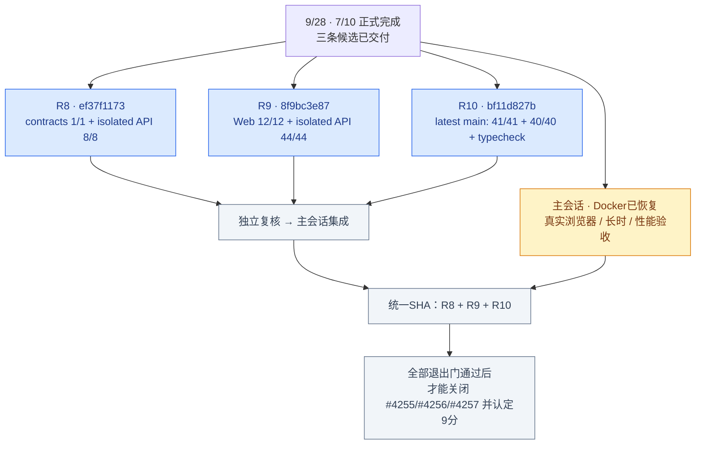
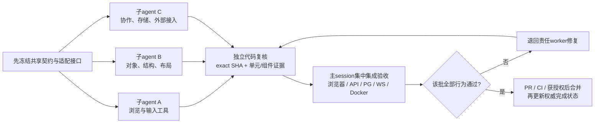
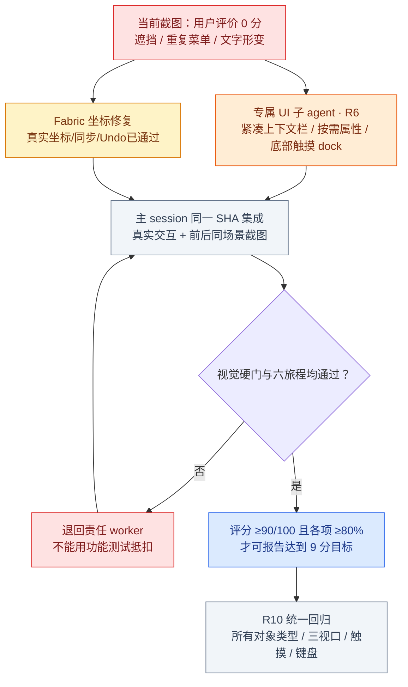
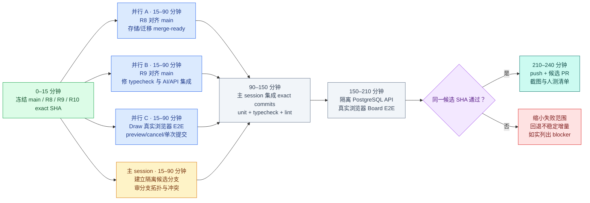

# Board 融合需求执行计划 V0.3

本计划融合用户本轮完整 PRD（第 1–60 节）及后续补充。它替代旧 Mermaid 作为讨论入口，但不自动修改 `feature_list.json`、既有依赖、签核或完成状态。现有 BV01–BV32 是功能单源；新增或遗漏的细项必须补进需求、契约及可执行验证，再通过既有流程分配。本文工作包不是新增 feature ID。

## 1. 融合后的产品边界

- 产品是人和 AI 共享的空间对象系统：Visual、Structural、Semantic 三层同在；不能只是在 Fabric 上摆 Shape。
- Studio 顶级 Board 入口先到浏览页：新建、搜索、标签过滤/管理、三点菜单、重命名、Duplicate、归档/恢复及真正删除的明确生命周期。
- 进入后全屏编辑，采用用户后续指定的底部触摸工具栏，替代原 PRD 第 5 节的左侧位置；Sticky、Shape、Draw、Connector 保持一级入口。Text、Tile、Panel、Image、Select、Hand 也须易达，低频项进 More。
- Fabric 是可丢弃的视觉投影；Yjs + canonical Board objects/operations 是内容单源。人、AI、Chat、导入器与 API 使用相同权限、幂等、审计和撤销语义。
- 正文、更新段、媒体、导入原件及导出包进入文件/对象存储；PG 保存元数据、ACL、索引、指针及审计引用。迁移期遗留正文只能存在于明确受控的回滚窗口。
- 默认以开源、自托管和公开 API 可用为交付条件；配置、迁移、启动、备份恢复和 API 示例必须可复现。
- V0.1 完整包含 PRD P0 与 P1；PRD P2 保留为后续扩展路线，不能删掉，也不能声称本期已经完成。

## 2. 现状与颜色（2026-09-28）

当前交付记录（2026-09-28 实时核对 GitHub issue/PR）：**R1–R7 已完成并合入 main，对应 7/10 轮正式完成**。R1 #4241、R2 #4242、R3 #4246、R4 #4250、R5 #4251、R6 #4253、R7 #4254 均已关闭；R8 #4255、R9 #4256、R10 #4257 仍开放。此前“R1–R6 完成、R7 CI 中”的快照已经失效，不得继续作为完成度依据。

R8/R9/R10 不是从零开始：对象存储、迁移/恢复、Miro/Mural 适配器、AI proposal、真实模型验证、Chat 图形桥接、会议室恢复、触摸/缩放/笔迹以及负载 producer 均已有实现或局部证据。但三个迭代的退出门还没有完整通过：R8 缺真实厂商样本与完整介质/灾难恢复；R9 缺完整 Chat 三图、跨用户一次 Undo、30 分钟会议室和干净自托管 API 验收；R10 缺统一 SHA 的 50 客户端长时、1k/5k/10k真实性能、读屏/物理触控设备和全量安全恢复。因此当前可以报告“7/10 轮完成、后三轮部分实现”，不能报告九分完成。

本轮新增候选与主 session 证据：R8 `ef37f1173` 修复 32 MiB portable bundle 的 Base64 边界，contracts 1/1 与隔离 PostgreSQL API 8/8 通过；R9 `8f9bc3e87` 恢复刷新后的服务端授权 AI Undo target，Web 12/12 与隔离 PostgreSQL API 44/44 通过；R10 `bf11d827b` 增加压感矢量 Draw 实时预览，在最新 main 上集成为 `dcd6376be`，Fabric 41/41、相关编辑器 40/40、typecheck 与 lint 通过。三项均未合并，仍需各轮独立复核、完整集成 PR 与 CI。

追加 UI 交付：新建 Board 默认标题与可选标签 PR #4337 已通过主会话浏览器、独立复核和 CI，已合入 main（8270388ae）。列表隐藏 Workspace 顶栏、保留导航、卡片改版与服务端无标签分页 PR #4340 已通过四项真实浏览器场景（ff257e58c）及 1440/390 截图检查；最终 304cb5b79 独立增量复核通过，已合入 main（baaef1e97，GitHub 当前状态 MERGED）。卡片当前明确显示预览占位，真实缩略图仍是缺口。

颜色口径：绿色=已合入 main；黄色=主 session 正在验收；蓝色=实现与独立复核完成、等待集成；橙色=正在补实现或复核；灰色=待开始；紫色=P2 后续路线。状态只由 PR、exact SHA、CI 和主 session 动态证据支撑。

## 3. 总体 Mermaid：先统一基础，再并行交付

```mermaid
flowchart LR
  R1["R1 统一基础<br/>PR #4241 ✅"]:::merged --> R2["R2 浏览管理<br/>PR #4280 ✅"]:::merged
  R2 --> R3["R3 Sticky / Text<br/>PR #4286 ✅"]:::merged
  R3 --> R4["R4 内容对象<br/>PR #4292 ✅"]:::merged
  R4 --> R5["R5 空间与关系<br/>PR #4308 ✅"]:::merged
  R5 --> R6["R6 编辑与组织<br/>6项视觉/导航 + 4项空间通过 · #4313已合入"]:::merged
  R6 --> R7["R7 团队可靠性<br/>PR #4393 ✅"]:::merged
  R7 --> R8["R8 存储与迁移<br/>Issue #4255 OPEN<br/>portable边界 API 8/8 · 灾备/真实厂商样本待验"]:::accepting
  R8 --> R9["R9 AI / API / Chat / 会议室<br/>Issue #4256 OPEN<br/>刷新后Undo API 44/44 · Chat/会议室待验"]:::accepting
  R9 --> R10["R10 同一 SHA 总验收<br/>Issue #4257 OPEN<br/>Draw预览集成绿 · 长时/性能/设备待验"]:::accepting
  R10 --> P2["P2 扩展路线<br/>Diagram / Mind Map / Kanban / Timeline<br/>Journey / Database / Agent与Live Data Tile"]:::future
  classDef merged fill:#dcfce7,stroke:#16a34a,color:#14532d
  classDef accepting fill:#fef3c7,stroke:#d97706,color:#78350f
  classDef ready fill:#dbeafe,stroke:#2563eb,color:#1e3a8a
  classDef working fill:#ffedd5,stroke:#ea580c,color:#7c2d12
  classDef blocked fill:#fee2e2,stroke:#dc2626,color:#7f1d1d
  classDef todo fill:#f1f5f9,stroke:#64748b,color:#334155
  classDef future fill:#ede9fe,stroke:#7c3aed,color:#4c1d95
```

这是一张目标工作流，不是替代 BV 依赖的执行 DAG。R1 可提前冻结端口并做存储/协作设计；正式存储、导入等实现仍满足既有 BV 依赖。确需风险前移时先拆分 feature 或审查依赖变更，不静默提前认领。R7/R8 的 a/b 表示前置基础与最终接入两个交付面，不重复计算完成。

## 3.1 剩余任务排期与并行负责人

**重新估算基准：2026-09-28，中国标准时间（UTC+8）。** 旧的 9 月 27 日小时级排期已经过期并被实际执行推翻，不能继续显示为承诺。剩余工期以“具备所需基础设施和外部样本后的工作日”表达；每轮仍需完整退出门、独立复核、CI 和用户授权合并。

R1–R7 已交付。R8–R10 的代码基础远高于 0%，但完成状态仍由退出门决定。结合本轮三个候选和 Docker 引擎恢复，完整九分验收重新估计为 **3–6 个有效工作日**；若真实 Miro/Mural 样本或物理设备不可用，这些外部证据门将顺延，其他可本地完成项继续并行。

| 剩余包 | 当前真实状态 | 并行负责人 | 预计开发收敛 | 主 session 验收 | 关键外部条件 |
|---|---|---|---:|---:|---|
| R8 存储与迁移 | portable 边界候选及隔离 API 已绿；issue #4255 OPEN | R8 worker + 主 session | 0.5–1.5 个工作日 | 0.5–1 个工作日 | 真实 Miro/Mural 代表板；完整 PG-loss/介质恢复 |
| R9 AI/API/Chat/会议室 | 刷新后 AI Undo 候选及隔离 API 已绿；issue #4256 OPEN | R9 worker + 主 session | 0.5–1.5 个工作日 | 1–2 个工作日 | 模型凭据、跨用户会话、30 分钟会议室环境 |
| R10 统一验收 | Draw 预览已在最新 main 集成测试绿；issue #4257 OPEN | R10 worker + 主 session | 0.5–1 个工作日修缺口 | 2–3 个工作日 | 50 浏览器资源、读屏与物理触控设备 |

这些时间可重叠，不能简单相加；发现真实回归后进入修复循环。没有外部条件时只报告“代码候选完成”，不把模拟或 fixture 冒充正式验收。

### 当前并行调度

```mermaid
flowchart TB
  START["9/28 · 7/10 正式完成<br/>三条候选已交付"] --> A["R8 · ef37f1173<br/>contracts 1/1 + isolated API 8/8"]:::delivered
  START --> B["R9 · 8f9bc3e87<br/>Web 12/12 + isolated API 44/44"]:::delivered
  START --> C["R10 · bf11d827b<br/>latest main: 41/41 + 40/40 + typecheck"]:::delivered
  START --> M["主会话 · Docker已恢复<br/>真实浏览器 / 长时 / 性能验收"]:::testing
  A --> REVIEW["独立复核 → 主会话集成"]:::planned
  B --> REVIEW
  C --> REVIEW
  REVIEW --> JOIN["统一SHA：R8 + R9 + R10"]:::planned
  M --> JOIN
  JOIN --> ACCEPT["全部退出门通过后<br/>才能关闭 #4255/#4256/#4257 并认定9分"]:::planned
  classDef active fill:#ffedd5,stroke:#ea580c,color:#7c2d12
  classDef delivered fill:#dbeafe,stroke:#2563eb,color:#1e3a8a
  classDef testing fill:#fef3c7,stroke:#d97706,color:#78350f
  classDef planned fill:#f1f5f9,stroke:#64748b,color:#334155
```

并行规则：每个worker一个当前包，交付后才接下一包；独立worktree避免覆盖。同一热点文件、迁移时间戳、共享契约先协调再集成。单位检查可并行，重型类型检查错峰；完整Docker/浏览器/E2E只由主会话一次一套执行。PR/CI审查可与不依赖它的开发并行，但最终验收只能针对实际整合SHA。

真实源板、会议室硬件或真实触笔证据若当前不可获得，对应任务需单独调整验收时间，不能用模拟结果冒充完成；其它不依赖项继续执行。P2扩展仍保留在后续路线：其逐项工期在9分基线与独立需求拆分后估算，不把未排期P2伪报为本表已交付。

## 4. 十轮交付包与退出门

| 轮次 | 完整交付范围 | 退出条件；由主 session 验收 |
|---|---|---|
| R1 基础 | 全屏 Fabric、Pan/Zoom/Fit、Grid/Mini Map；稳定 id、空间坐标、parentId、锁/隐藏/层级、metadata/provenance；operation/event/Undo 与 BlobStore 接口 | 正式入口对象不由 DOM/SVG 充当主表面；变换走 canonical command；远端投影不回声；readonly 不可绕过 |
| R2 浏览管理 | 新建/搜索、标签 AND 过滤与治理、卡片三点菜单、重命名、Duplicate、归档恢复、删除语义 | 刷新保持；复制完整服务端版本且新 ID/引用正确；撤权不越权；失败重试无重复；删除不伪装成归档 |
| R3 思考输入 | Sticky 四种创建入口、三形状、八色与自定义、Tab 方向/间距、尺寸模式；Text 五层级与完整文本属性；智能粘贴、Bulk、Reaction/Link Preview、对象级 Tag | 连续输入与原生 IME；长文/多行不丢；固定尺寸与自动高度明确；create/edit/delete 可Undo；批量一次operation |
| R4 内容对象 | 全套初始 Shape 与文字/边框；Pen/Marker/Highlighter/Eraser及压感矢量笔画；图片所有入口、格式和基础编辑；结构化Tile/WebTile/Table/Icon/Template | 各对象真实渲染、可编辑/变换/协作/撤销/回读；图片失败可恢复；Draw不退化成背景位图 |
| R5 空间与关系 | Panel Freeform/Grid/Flow、嵌套、拖入高亮、parentId、Auto Expand/Clip、删除保留内容、复制子图；Group/Layer/Lock；Connector handles/routes/tips/styles/label/semanticRelation | 移动Panel带子对象，resize不强制缩放；连接随端点移动；断点/删除行为确定；锁定不能经批量路径修改 |
| R6 编辑与组织 | 单/多/框选；Alt拖复制、Cmd/Ctrl+D及完整快捷键；浮动/精确属性面板；Align/Distribute/Grid/Row/Column/Tidy/Snap/Guides；Smart Layout预览 | 多选混合值正确；复制内部引用；整理保序；取消布局零写入；一次布局一次Undo；远端变化不被覆盖 |
| R7 团队可靠性 | 光标/头像/选区/编辑状态；Comment/Reply/Mention/Resolve；所有操作的多人Undo/Redo、认证恢复、离线重放 | 两会话字段收敛；仅撤销本人的允许动作；AI/布局/上传等批量操作可整体撤销；断网/撤权/崩溃不丢已ACK内容 |
| R8 存储与迁移 | 文件/对象正文+PG元数据；在线迁移、retention/GC、联合备份恢复；Miro/Mural导入、标准导出 | 原子指针与ACK；copy/backup roots安全；PG正文不线性增长；三块真实迁移板逐项报告、幂等、布局/关系可核对 |
| R9 人与AI及会议室 | 版本化API/Event订阅；AI生成/聚类/排版proposal与确认；Chat Mermaid/Fabric原布局插入；人/AI身份；presenter跟随/退出、触摸屏 | Agent与UI同权限/命令；AI操作一键撤销；Chat三类图layout hash一致；会议室长时跟随不回退；自托管/API示例可运行 |
| R10 总验收 | 六旅程、六体验指标、1k/5k/10k、50浏览器长时、安全、键盘/读屏/触摸/400% reflow、恢复 | 同一集成SHA证据齐全，所有P0/P1细项有断言；独立review、CI和仓库完成定义通过后才评九分 |

本表补齐的细项不自动成为已生效验收命令。特别是 Draw 压感/工具、Image 编辑、Text 样式、Panel 生命周期等，须补契约与测试，不能仅挂到一个已有大标题下就标覆盖。

## 5. 容易混淆的要求必须分开

- **Board 标签与对象标签**：浏览过滤的组织标签，不等于 Sticky/Tile 的内容标签；分别定义作用域、权限及删除影响。
- **Duplicate Board 与 Duplicate Object**：前者捕获服务端版本、新Board ACL与copy-job pins；后者重映射选区内部引用、偏移和一次Undo。两条链路都要验收。
- **Panel 与 Group**：Panel 是语义空间容器；Group 是编辑关系。不能用 Fabric Group 直接替代领域parentId。
- **线与 Connector**：自由线预览不抵扣对象绑定、锚点、label和semanticRelation。
- **基础布局与 P2 应用**：V0.1 可有 Flow/Cluster/Mind Map/Timeline 排版策略；完整思维导图、时间线等独立应用仍属 P2。
- **预览、设计、实现、正式验收**：四种证据分开。PR合入预览分支不等于main交付，UI确认也不等于API/存储通过。

## 6. 原 PRD 章节追溯

| PRD章节 | 融合后的归属 |
|---|---|
| 1–3 产品/原则/结构 | R1领域与交互基础；贯穿所有轮次 |
| 4–5 Canvas/工具栏 | R1；后续用户指令将主工具栏移至底部 |
| 6–9 Sticky | R3；Tag/Comment/AI分别与R3/R7/R9接通 |
| 10–13 Text/Tile | R3/R4 |
| 14–16 Panel | R5 |
| 17–23 Shape/Connector | R4/R5 |
| 24–27 Draw/Image | R4 |
| 28–35 Selection/Layout | R6 |
| 36 AI Organize | R9，依赖R5/R6的结构与布局 |
| 37–41 Toolbar/Properties/DnD/Duplicate/Shortcuts | R3/R4/R6；DnD到Panel依赖R5 |
| 42–44 Layer/Lock/Group | R5 |
| 45–47 Comment/Collaboration/Undo | R7；每类对象也须在所属轮提供基础Undo |
| 48–49 Paste/Bulk Sticky | R3 |
| 50–53 模型/Event/AI Operation | R1统一边界、R9公开接入 |
| 54–55 P0/P1 | 全部R1–R10，不能以已出现同名功能代替细项验收 |
| 56 P2 | 明确保留扩展路线，不计本期通过 |
| 57–60 指标/旅程/判断/验收 | R10最终裁定，前轮持续测量 |

追加需求：浏览管理归R2；Chat图形插入/API/开源/会议室归R9；Yjs与人AI同操作归R1/R7/R9；文件内容/PG元数据、Miro/Mural迁移归R8；九分目标归R10。

## 7. 并行组织与验收责任

```mermaid
flowchart LR
  C["先冻结共享契约与适配接口"] --> A["子agent A<br/>浏览与输入工具"]
  C --> B["子agent B<br/>对象、结构、布局"]
  C --> D["子agent C<br/>协作、存储、外部接入"]
  A --> R["独立代码复核<br/>exact SHA + 单元/组件证据"]
  B --> R
  D --> R
  R --> M["主session集中集成验收<br/>浏览器 / API / PG / WS / Docker"]
  M --> F{"该批全部行为通过?"}
  F -->|否| O["退回责任worker修复"]
  O --> R
  F -->|是| P["PR / CI / 获授权后合并<br/>再更新权威完成状态"]
```

- 同时最多三个开发子 agent；每个 owner 一次一个feature，轮内需求使用独立issue追踪。按用户最新明确要求，每个iteration只创建一个集成PR，不再每feature创建PR。子agent提交分支/commit，由主session集成；子agent不运行完整Docker或端到端验收。
- `canvas/surface`、command schema、selection、Yjs store、DB migration和共享spec是热点；同一批只允许一个owner修改同一热点，其他人实现独立模块或等待接口。
- 同一轮无需等待无依赖模块；但有依赖、共享文件冲突或未完成设计门时不能强行并行。旧BV清单需经正式流程映射本计划后才分派。
- 主session收齐一批后集中验收。失败回归只重测受影响链路，最后在统一SHA完成全量门。

## 8. 统一最终验收

六旅程：无菜单连续20张Sticky；20张Grid；Panel拖入10对象并整体移动；三Shape绑定Arrow且移动保持；截图+Sticky+Text+Arrow+Tile混排；Agent经正式API完成Create/Read/Update/Move/Arrange/Connect/Delete。

六体验指标沿用 [phase.md](../phase.md) 的唯一阈值，不在本计划另设更宽松数字。所有旅程在正式入口、真实权限和持久化链路上执行，刷新与第二客户端必须一致。性能、迁移、会议室和灾备使用既有BV29–BV32门槛。

缺少任一P0、正文仍长期保存在PG、存在越权或丢失ACK内容、只支持预览、或六旅程任一未通过，均不得宣称九分。

## 9. 每个 iteration 一个 PR（用户最新要求）

用户明确要求“每个iteration一个pr”，本计划据此覆盖仓库默认的一个feature一个PR交付粒度。本计划共10个主交付PR，对应R1–R10；这是未来交付规则，不自动关闭、合并或重写现有PR。

| PR | iteration 范围 | 当前状态 | 合入前条件 |
|---|---|---|---|
| Iteration 01 | R1 统一基础 | ✅ PR #4241 已合入 | 本轮完整退出门、集成测试与独立复核 |
| Iteration 02 | R2 浏览管理 | ✅ PR #4280 已合入 | 同上，并覆盖完整API与失败路径 |
| Iteration 03 | R3 Sticky/Text | ✅ PR #4286 已合入 | 同上，并完成Brainstorm旅程与输入指标 |
| Iteration 04 | R4 内容对象 | ✅ PR #4292 已合入 | 同上，逐对象创建/编辑/保存/协作验收 |
| Iteration 05 | R5 空间与关系 | ✅ PR #4308 已合入 | 同上，Panel及绑定Connector旅程 |
| Iteration 06 | R6 编辑与组织 | ✅ 6项视觉/导航、4项空间通过；[PR #4313](https://github.com/boardx/workspacex/pull/4313) 已合入 | 同上，Grid整理、快捷键与布局Undo |
| Iteration 07 | R7 团队可靠性 | ✅ [PR #4393](https://github.com/boardx/workspacex/pull/4393) 已合入；issue #4254 已关闭 | 已交付；仍参加 R10 统一回归 |
| Iteration 08 | R8 存储与迁移 | 🟡 issue #4255 OPEN；`ef37f1173` portable 上限修复，主 session 隔离 API 8/8 | 补全 PG-loss、介质包、真实 Miro/Mural 样本及统一验收后才能关闭 |
| Iteration 09 | R9 AI/API/Chat/会议室 | 🟡 issue #4256 OPEN；`8f9bc3e87` 刷新后 Undo 恢复，主 session Web 12/12、隔离 API 44/44 | 补全 Chat 三类图、30 分钟会议室、自托管 API 与跨用户验收后才能关闭 |
| Iteration 10 | R10 总验收 | 🟡 issue #4257 OPEN；`bf11d827b` Draw 预览在最新 main 集成测试绿 | 在同一集成 SHA 跑完性能、50 客户端、安全、读屏/设备与六旅程后裁定九分 |

每个iteration PR关联该轮所有issue，逐项列出需求、实现、证据和未完成项；不能仅因部分模块通过就关闭整轮。子agent分支不单独创建主交付PR，修复提交继续进入同一轮PR。存在共享热点或依赖时分批集成，PR数量不成为降低范围或跳过验收的理由。跨轮预研可并行，正式实现仍遵守依赖；最终合并须有用户明确授权。

## 10. 当前执行队列

1. R1–R7 已合入；不再重复开发，全部纳入 R10 的统一回归与视觉评分。
2. R8 候选已交付并通过定向/隔离 API；下一步做整轮分支集成、PG-loss/介质恢复与真实 Miro/Mural 样本。
3. R9 候选已交付并通过 Web/隔离 API；下一步做整轮分支 typecheck、Chat 三图、跨用户 Undo、30 分钟会议室和自托管 API。
4. R10 Draw 实时预览已在最新 main 复验；Docker 引擎已恢复，下一步由主 session 跑真实浏览器、性能、50 客户端、安全与视觉无障碍矩阵。
5. 子 agent 的本轮开发已经交付；主 session 继续集成验收。任何候选都不能在独立复核、PR、CI 和用户合并授权前计为完成。

设计材料索引：[Library API](./2026-09-26-library-api-design.md)、[存储接入与恢复](./2026-09-26-storage-integration-acceptance.md)、[正式集成验收](./2026-09-26-workspace-acceptance-matrix.md)、[原BV真实依赖图](./2026-09-26-mermaid-execution-plan.md)。本计划不构成人类签核或合并授权。

## 11. 视觉体验阻断门（2026-09-27 用户截图反馈）

用户对当前截图的体验评价为 **0 分**；不以功能数量抵扣。问题基线：巨大表单遮住上半画布、多个浮层重叠、精确属性默认展开、底部重复样式条、文字明显形变。以下是待实现与待验收的目标，不是已通过报告。

```mermaid
flowchart TD
  BAD["当前截图：用户评价 0 分<br/>遮挡 / 重复菜单 / 文字形变"]:::fail
  BAD --> UI["专属 UI 子 agent · R6<br/>紧凑上下文栏 / 按需属性 / 底部触摸 dock"]:::doing
  BAD --> GEO["Fabric 坐标修复<br/>真实坐标/同步/Undo已通过"]:::review
  UI --> ROOT["主 session 同一 SHA 集成<br/>真实交互 + 前后同场景截图"]:::wait
  GEO --> ROOT
  ROOT --> GATE{"视觉硬门与六旅程均通过？"}
  GATE -->|否| FIX["退回责任 worker<br/>不能用功能测试抵扣"]:::fail
  FIX --> ROOT
  GATE -->|是| SCORE["评分 ≥90/100 且各项 ≥80%<br/>才可报告达到 9 分目标"]:::target
  SCORE --> FINAL["R10 统一回归<br/>所有对象类型 / 三视口 / 触摸 / 键盘"]:::wait
  classDef fail fill:#fee2e2,stroke:#dc2626,color:#7f1d1d
  classDef doing fill:#ffedd5,stroke:#ea580c,color:#7c2d12
  classDef review fill:#fef3c7,stroke:#d97706,color:#78350f
  classDef wait fill:#f1f5f9,stroke:#64748b,color:#334155
  classDef target fill:#dbeafe,stroke:#2563eb,color:#1e3a8a
```

### 可见、可操作的评分表

| 维度 | 权重 | 九分目标的验收证据 |
|---|---:|---|
| 画布优先与浮层布局 | 25 | 默认无属性大表单；仅一个上下文操作栏；工具不相互重叠、不挡住当前编辑文字；常规单选时画布至少 80% 面积未被 UI 浮层遮挡 |
| 文字与对象视觉稳定 | 20 | 中英文、多行、长文在缩放/Resize/多选/布局/撤销/刷新后无非预期拉伸、裁切、跳位；截图与 canonical 几何对照 |
| 便利贴思考主流程 | 20 | 双击直接输入、连续 Tab、颜色/形状/尺寸低成本切换、20 张整理；沿用第 8 节指标阈值，不另放宽 |
| 工具层级与触摸操作 | 15 | Sticky/Shape/Draw/Connector 一级可达；主触摸目标至少 44×44 CSS px；低频操作按需展开；无重复常驻样式栏 |
| 状态反馈与操作恢复 | 10 | 选中/编辑/锁定/同步/失败可区分；Escape 收起临时浮层；Undo 后视觉与数据一致；动画响应操作并尊重 reduced motion |
| 响应式与无障碍 | 10 | 1440×900、1280×720、1024×768 下无工具遮挡/溢出；键盘可操作、焦点可见；触摸无 hover 依赖；400% reflow 按既有无障碍门验收 |

评分逐项附通过/失败断言与截图，未验收不得记满分；≥90/100 且每一维不少于该维权重的 80% 才达到目标。该分数是本项目验收量表，不声称客观等同 Mural 用户满意度。

**一票否决：** 正文形变或丢失；浮层盖住正在编辑的文字；主工具无法点击；选择/布局后对象跳走；工具栏溢出导致关键操作不可达；数据未保存却显示成功。任一存在，不得报告九分，即使总分达到阈值。

**截图矩阵由主 session 执行：** 空白板、Sticky 单选、Sticky 编辑、Text 中英文长文、混合多选、Panel/Connector、右侧精确属性主动展开、底部四核心工具展开。每个状态记录上述三个视口；同一 board/zoom/数据保留前后对比，附操作录像或 trace、commit SHA 与失败项。截图只能证明视觉，保存/协作/撤销仍须真实 E2E。

专属 UI worker 只交付组件、组件测试和 commit；不启动完整 Docker、不执行最终浏览器验收。修复归入 R6 同一个 iteration PR；R7–R9 新增界面同样受本门约束，R10 统一复验，不能因前轮已合并免检。

### 最新修复证据（尚未退出验收门）

- R6 UI `1bd4cde04`：紧凑上下文栏、按需互斥属性面板、底部核心工具；50 项组件测试与 typecheck 通过。
- R6 字形 `6c74e8817`：容器 resize 不再非均匀拉伸文字；51 项渲染相关测试与 typecheck 通过。
- 独立复核仍阻断：选中对象被平移出视口时浮条越界；批量 canonical patch 重复拆装 ActiveSelection 导致平方级开销。已交回对应 worker；单测绿色不能抵扣。
- 主 session 的真实吸附/同步/Undo 诊断通过；最终 R6 回归在 `6b94257a1` 达到6/6通过，含导航往返与刷新、三视口Sticky/Text截图；见 PR #4313及同提交evidence目录。
- R10 复核问题已记录 [#4257](https://github.com/boardx/workspacex/issues/4257#issuecomment-5852224985)；真实 50 客户端长时运行、性能、完整旅程与安全恢复证据仍待补齐，禁止自动打九分。

### 2026-09-27 后续验收状态

R10 已补真实 producer：六旅程 `fca257584`、50客户端30分钟 `3ccff9486`、1k/5k/10k性能与运行版本绑定 `5fe993950`。仅静态/单测通过，全部等待主 session 实际执行；图片跨会话持久化前置正在检查。禁止把 producer存在等同于测试通过。

### 2026-09-27 集成复验阻断（覆盖较早完成性表述）

- R6：六项局部通过不是全回归通过。CI发现旧Fabric mock、图标定位、空间拖动坐标及默认展开属性假设，单测已修；主session正跑空间回归。
- R7：集成292e32532独立批准；真实运行暴露sync文案定位和浏览器跨域请求，已修8f5e2092b，待复验。
- R8：集成ada4ac398，copy/comment/recovery改对象存储路径并桥接checkpoint schema；图片前端接线、真实PG迁移与回滚待验收。
- R9：proposal接收客户端命令不等于真实模型聚类；receipt存储不等于编辑器Undo。两处已分派补齐；真实Chat三图交接也待验收。
- R10：性能/50client/visual-a11y producer不等于实际通过；会议室producer仍在补齐。原生缩放/真机/读屏器与主观评分不能由CSS/仿真代替。

### 2026-09-27 最新动态验收（覆盖前述历史状态）

- R6：`8ebed5f37` 主session空间4/4通过（2.1m），实际修复connector透明bbox拦截Sticky拖动，同时验证可见线条可选中；`ade5e680a`仅归档脱敏摘要，PR #4313等待CI。历史6项视觉/导航证据继续有效，但不是完整9分视觉矩阵。
- R7：`6f756119a`主session真实协作2/4通过，发现offline仍显示同步及权限变更后tombstone阻止fresh授权；`f3283ae0e`+`432a0b399`修复网络事件与隔代outbox，27项unit绿，独立复核及主session重跑待完成。
- R8：`a95ba9959`主session正在执行上传/readback/刷新/peer/撤权/复制后源删除及PG指针验收。测试尚未终结，不能标通过。
- R9：`5de517e81`整合AI/room与R8，`3a36a3c79`修复独立review发现的proposal freshACL、锁序、model/skill/version来源绑定；真实模型fixture与调用仍待主session执行。
- R10：`af6cc980a`已有9条可执行lane，新增journeys/meeting-room/security等真实producer；只是代码与静态/单元通过，真实长时负载、全量安全、人工视觉/读屏/硬件证据仍未完成。

### 2026-09-27 合并及失败路径更新

- R6：#4313 已于05:21:59 UTC合入main；尚未把合并冒充devapp已部署。
- R7：`bde254b1d` 主session真实运行2/4通过。fresh授权恢复已走通；失败定位到已有线程禁止新评论和全屏编辑器覆盖重连栏，正在修复。
- R8：`a2df8f6c2` 去除不可变导出记录不必要的FOR UPDATE，不扩大app_rw权限；真实图片链路复验中。独立导入审计暴露格式、静默截断、loss与回导缺口，另开隔离工作树修复，未标兼容完成。
- R9：`cb2147f80` 最终事务锁定发布版本和registry，完整pin校验；独立复核20项unit通过，真实双连接PG锁与模型仍待主session执行。

### 2026-09-27 真实验收继续推进（13:43 CST）

- R7：`6e6cc8dd5`评论实际提交与持久化已走通，但整组仍2/4；原ID删除Undo被raw Yjs validator的不可变墓碑规则拒绝，须补本人删除receipt绑定的服务端恢复操作，不能放宽防伪或丢弃评论/外部引用。`eeca9d40b`同时修正banner下创建/跟随中心与评论面板高度，待下一次浏览器复验。
- R8：`34614d5e8`修正HTMLImage异步加载后Fabric父Group缓存未失效，实际像素验收未放宽；`325b3389e`/`7c2d9b3d6`整合Miro和官方Mural REST adapter，48项API/core复验通过；不等于真实厂商白板迁移通过。`c452557cb`加入真实PG+FS migration/rollback/growth/GC验收脚本，尚未运行。联合备份与评论正文blob化继续开发。
- R9：`c508b466b9f840eaa9819cada63d9229b19c1015`主session实际PG双连接验收通过：app_rw权限、tenant/delegator拒绝、发布/禁用等待commit、探针零持久写均经数据库验证。模型验收仅使用内置30条虚构便利贴，自动审批已在确认数据范围后放行；真实模型结果尚未产生。
- 完整九分仍未证明；本轮不新增主交付PR、不改变一轮一个PR规则，不把执行脚本/单测视为E2E结果。

### 2026-09-27 真实模型与视觉复核

- R9：主 session 在 `18dfb0e58216bb8bb4aedf2160eacd7f9c5b6f5c` 完成真实 DashScope 模型浏览器验收（1 passed）。30 条虚构便利贴完整分为新手、性能、费用三个主题；预览零写，确认序列 1→2，服务器一次 Undo 2→3 恢复原内容，独立浏览器收到更新。相同账号的双浏览器不能充当跨用户权限证据。真实 PG 锁验证在同 SHA 再次通过。
- 人工查看实际截图仍发现：确认布局未适应视野、AI 卡片遮挡内容、预览暴露底层命令/修订细节。已分派独立 UI worker 修复，R9/R10 不因功能测试绿而视为九分。经检查的截图、主题列表和白名单证据已提交 `872b53914`。
- R7：monitor 将撤权误映射为可重试故障的 3 个反证已从红变绿（7 单测通过）；保留原 ID 的服务器授权删除恢复和持久队列顺序正独立收尾。真实四场景仍待重新验收。
- R8：评论文件化与 PG+独立文件归档联合备份已产出候选；主 session 尚未执行其真实灾难恢复。当前仅有单元测试，不能声明迁移或灾备完成。图片缓存修复正在完整浏览器链路复验；含图片可移植包另行实现。

### 排期动态更新（9/27，3731e1c12 验收后）

主 session 的协作四场景真实浏览器测试全部通过（7分50秒，含环境构建和清理）：实时收敛、评论权限、离线撤销恢复、多人Undo/Redo重载。R8图片和可移植包真实验收已启动。此结果只更新对应场景，不代表R7全部需求或最终集成已完成。三条开发线继续并行；候选交付时间与正式验收/合并时间分别记录。

### 新增视觉门槛（9/27）

评论提及必须支持按成员姓名搜索选择与键盘操作；不得要求用户填写成员ID或在正文裸露内部ID。当前实现仍存在该缺口，列为9分前必须修复，不能用mention字段已有持久化代替用户体验验收。

### 2026-09-28 主 session 复核与重新排期

- 动态完成度仍为 **7/10**：#4241/#4242/#4246/#4250/#4251/#4253/#4254 已完成，#4255/#4256/#4257 开放。
- R8 `ef37f1173`：修复最大合法 portable 文件的 Base64 四字符量子边界；主 session 重跑 contracts 1/1 与隔离 PostgreSQL API 8/8 通过。该提交依赖 R8 尚未合入的 portable 契约，必须随 R8 iteration 分支集成，不能孤立 cherry-pick 到 main。
- R9 `8f9bc3e87`：刷新后恢复最小、服务端授权的 AI Undo target，不把 inverse commands 放进 sessionStorage；主 session Web 12/12 与隔离 PostgreSQL API 44/44 通过。该提交依赖 R9 proposal 契约，必须随 R9 iteration 分支集成。
- R10 `bf11d827b`：Draw pointermove 期间显示压感 Fabric 矢量草稿，完成/取消/失去 capture/换工具均清理且只提交一次 canonical drawing；在最新 main 上的临时集成 SHA `dcd6376be` 通过 Fabric 41/41、相关编辑器 40/40、typecheck 与 lint。
- Docker Desktop 的 UI 进程曾存在但引擎 socket 缺失；主 session 强制停止并重新启动明确的 Docker Desktop 进程组后，Docker Engine 29.6.1 已恢复。后续真实浏览器/长时测试继续由主 session 独占执行。
- 新估计：在真实厂商样本、模型凭据和设备可用的前提下，R8–R10 全部退出门约需 **3–6 个有效工作日**。外部样本或物理设备等待时间不包含在此区间内。

### 4 小时人测候选计划（2026-09-28）

本轮目标是在四小时内提交一个**可供人类测试的集成候选版本**，不是用时间盒替代 R8–R10 的正式退出门。候选必须来自单一 SHA，主 session 必须完成单元、类型、隔离 PostgreSQL API 和真实浏览器 Board E2E；真实厂商样本、50 客户端长时、读屏与物理触控设备仍按证据门单列。

```mermaid
flowchart LR
  T0["0–15 分钟<br/>冻结 main / R8 / R9 / R10 exact SHA"]:::done
  T0 --> P8["并行 A · 15–90 分钟<br/>R8 对齐 main<br/>存储/迁移 merge-ready"]:::active
  T0 --> P9["并行 B · 15–90 分钟<br/>R9 对齐 main<br/>修 typecheck 与 AI/API 集成"]:::active
  T0 --> P10["并行 C · 15–90 分钟<br/>Draw 真实浏览器 E2E<br/>preview/cancel/单次提交"]:::active
  T0 --> ROOT["主 session · 15–90 分钟<br/>建立隔离候选分支<br/>审分支拓扑与冲突"]:::testing
  P8 --> INT["90–150 分钟<br/>主 session 集成 exact commits<br/>unit + typecheck + lint"]:::planned
  P9 --> INT
  P10 --> INT
  ROOT --> INT
  INT --> E2E["150–210 分钟<br/>隔离 PostgreSQL API<br/>真实浏览器 Board E2E"]:::planned
  E2E --> GATE{"同一候选 SHA 通过？"}:::gate
  GATE -->|是| PR["210–240 分钟<br/>push + 候选 PR<br/>截图与人测清单"]:::release
  GATE -->|否| DISCLOSE["缩小失败范围<br/>回退不稳定增量<br/>如实列出 blocker"]:::blocked
  classDef done fill:#dcfce7,stroke:#16a34a,color:#14532d
  classDef active fill:#dbeafe,stroke:#2563eb,color:#1e3a8a
  classDef testing fill:#fef3c7,stroke:#d97706,color:#78350f
  classDef planned fill:#f1f5f9,stroke:#64748b,color:#334155
  classDef gate fill:#f3e8ff,stroke:#9333ea,color:#581c87
  classDef release fill:#ccfbf1,stroke:#0f766e,color:#134e4a
  classDef blocked fill:#fee2e2,stroke:#dc2626,color:#7f1d1d
```

候选退出条件：① R8–R10 集成在单一 SHA；② Board 关键组件、operation/undo、portable/import 定向测试通过；③ Web/API typecheck 与变更范围 lint 通过；④ PostgreSQL 用隔离包装器执行；⑤ 主 session 运行真实浏览器 Brainstorm、Organize、Panel/Connector、Draw 与恢复主路径；⑥ 创建 PR 并附人类测试步骤。没有通过的外部证据逐项进入 PR 的 Known gaps，不改写为完成。
