# Phase 19 — board-visual-workspace

- **slug**: board-visual-workspace
- **状态**: not_started
- **创建于**: 2026-09-25 00:24:03

## 目标
使用 Fabric.js 主渲染器和 Yjs/whiteboard-core 单一事实源，交付面向人和 AI 的协作视觉工作空间，并达到 Mural 对标 9/10 的可验证体验。

## 范围与边界
- 本阶段交付：Fabric.js 7.x 全屏主画布；以 `whiteboard-core` + Y.Doc 为唯一事实源的对象、结构、布局和协作；Sticky 优先的低摩擦创作；Chat 图形交接；人/AI/导入器共用 operation 与 Board Event Model；Miro/Mural 迁移；文件/对象存储正文 + PG 元数据；会议室、性能、无障碍、灾备和九分门禁。
- 数据边界：Fabric 只做可丢弃的增量视觉投影；禁止把 Fabric JSON 写进 Yjs、PG、文件/对象存储或公开 API。PostgreSQL 只保存 Board 元数据、ACL、索引、version/blob pointer 和审计引用。
- 身份边界：领域 object id、Y.Map key、Fabric object `data.objectId`、可访问 DOM 大纲使用同一稳定 id；人、AI、Chat、导入器、API 都必须经过同一 ACL、幂等和审计链。
- 明确不做：无限插件市场、任意脚本执行、三维画布、完整 BPMN/UML 语义库、专业矢量钢笔/图像滤镜，以及任意第三方私有 widget 的像素级可编辑语义。

## 十轮优先级与退出门

| 轮次 | 类别 | 功能 | 本轮可观察退出门 |
|---|---|---|---|
| 1 | Foundation | BV01–BV03 Fabric surface、Yjs 投影、命令桥/对象大纲 | 真实 Fabric 主表面；1k patch 不 `clear/loadFromJSON`；DOM/SVG 不再承载主对象 |
| 2 | Core | BV04–BV06 Sticky/Text、连续输入、基础 Delete/Undo/Redo、Reaction/Link Preview | TTFI `<5s`；连续 10 张 `<30s`；create/edit/delete 可撤销重做 |
| 3 | Core | BV07–BV10 Tile/Web Tile/Table/Template、Shape/Icon、Draw、Image | 四类结构对象真实可编辑；截图一次 Paste 创建；1k 混合对象基线 |
| 4 | Core | BV11–BV13 Panel/Group/Layer/Lock、Connector | Panel 结构双端一致；完成一次连线 `≤2` 次操作；5k 混合对象基线 |
| 5 | Core | BV14–BV16 选择、复制粘贴、快捷键、上下文控件 | 框选/多选/锁定边界可见；复制保持内部关系；readonly 不可绕过 |
| 6 | Core | BV17–BV19 对齐/分布/网格、Snap、Smart Layout | 整理目标 `≤2` 次操作；500 对象布局一个 operation/undo entry；预览取消零写入 |
| 7 | Collaboration | BV20–BV22 Presence、评论、多人 Undo/tombstone、离线/恢复 | 双浏览器字段级收敛；离线幂等；认证 restore；坏 checkpoint 回退可审计 |
| 8 | Integration | BV23–BV25 operation/Event API、AI proposal、Chat Fabric handoff | 人/AI 同一 operation；AI 聚类 `≤2` 次操作；三种 Chat 图形 layout hash 一致 |
| 9 | Integration | BV26–BV28 blob/PG、Miro/Mural、会议室 | 正文不线性膨胀 PG；迁移逐项报告；会议室 30 分钟/360 revisions 无回退 |
| 10 | Quality | BV29–BV32 10k、50 浏览器、无障碍、九分总门 | 真实 10k；50 浏览器/20 writers/30 分钟；WCAG 核心流程；六旅程与三迁移板全绿 |

```mermaid
flowchart LR
  I1["I1 Foundation\nBV01–BV03"] --> I2["I2 Sticky Core\nBV04–BV06"]
  I2 --> I3["I3 Object Core\nBV07–BV10"]
  I3 --> I4["I4 Structure Core\nBV11–BV13"]
  I4 --> I5["I5 Selection Core\nBV14–BV16"]
  I5 --> I6["I6 Layout Core\nBV17–BV19"]
  I6 --> I7["I7 Collaboration\nBV20–BV22"]
  I7 --> I8["I8 AI/API Integration\nBV23–BV25"]
  I8 --> I9["I9 Storage/Import/Room\nBV26–BV28"]
  I9 --> I10["I10 Quality Gate\nBV29–BV32"]

  classDef foundation fill:#dbeafe,stroke:#2563eb,color:#172554,stroke-width:2px;
  classDef core fill:#dcfce7,stroke:#16a34a,color:#052e16,stroke-width:2px;
  classDef collaboration fill:#fef3c7,stroke:#d97706,color:#451a03,stroke-width:2px;
  classDef integration fill:#ede9fe,stroke:#7c3aed,color:#2e1065,stroke-width:2px;
  classDef quality fill:#ffe4e6,stroke:#e11d48,color:#4c0519,stroke-width:2px;
  class I1 foundation;
  class I2,I3,I4,I5,I6 core;
  class I7 collaboration;
  class I8,I9 integration;
  class I10 quality;
```

同轮允许在共享文件热点不重叠时并行；轮次之间按依赖推进。十轮是验收顺序，不是 `sprint` 已分配事实：设计签核前所有 feature 保持 `sprint: null`、`owner: null`、`status: not_started`。

## 六个不可放宽的体验指标

- 从触发创建到第一张可输入 Sticky：TTFI `<5s`。
- 连续创建 10 张 Sticky：`<30s`。
- 把选区整理成目标布局：`≤2` 次操作。
- 从源对象到目标对象完成连线：`≤2` 次操作。
- 剪贴板截图进入 Board：`1` 次 Paste 完成创建。
- AI 对选区完成聚类：`≤2` 次操作，包含 proposal 预览/确认路径。

这些阈值同时出现在对应 feature 的浏览器 verification 和 BV32 总门禁中；实现不得用更宽松阈值替换。

## 需求 → 功能清单 流水线
1. **原始需求**写进同目录的 `requirements/` 文件夹（可按领域放多份 `*.md`，人类语言、可模糊）。
2. 调 **requirement-author** 智能体：读 `requirements/` 全部 `*.md` → 生成/更新 `feature_list.json`
   （每个 feature 带可执行 `verification`）。
3. `requirements/` 是输入/上下文,**不是权威**;权威永远是 `feature_list.json`。

## 权威功能清单
本阶段的唯一权威功能来源是同目录的 `feature_list.json`。
sprint 通过 `feature.sprint` 字段领取功能;`active-features.json` 是脚本派生的只读视图。

## 退出条件(Definition of Done for this Phase)
- `feature_list.json` 中本阶段所有 feature 均为 `passing`。
- BV01–BV32 必须按各自 verification 产生可入库证据；任何硬指标、P0 行为或失败路径缺证据，阶段保持未完成。
- Fabric.js 是 `/studio/board/:boardId` 唯一对象主渲染面；Y.Doc/领域模型是协作事实源；PG 与 blob 引用一致且 Fabric JSON 未进入持久化/公开契约。
- 同一 exact SHA 通过 10k 真实 Board、50 浏览器协作、会议室长时、Miro/Mural 三块真实迁移板、六条 PRD 旅程、API/安全/灾备和独立 review。
- `runtime-readiness.json` 经 `pnpm harness phase-readiness` 的独立门禁转为 `ready`；
  feature passing 数量本身不能推出 runtime/E2E ready。
- `.harness/state/quality-document.md` 相关领域评级未下降。
- 阶段 `progress.md` 已收尾,无未记录的半成品。
