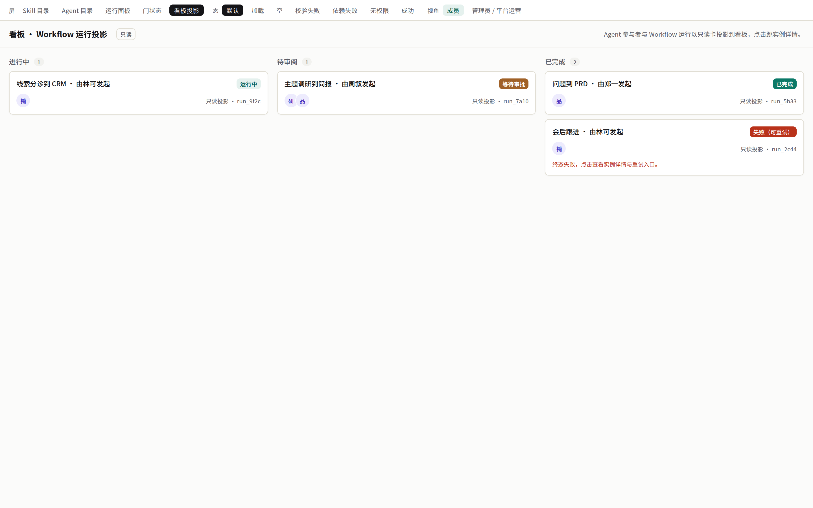

# 契约束 `work-content` — ① UI（签核面第 ① 件）

> **自检：本文件引用 8 张截图，目录下实际 8 张。** 截图目录：`ui-preview/work-content/`。
>
> 依据：`requirements/05-content-lines.md` R8。形状来自 `packages/contracts/src/work-content.ts`；运行面板 / 通用审批抽屉归 workflow-runtime 束 `ui.md`，本束只定义内容线专属界面。
> 截图由并行步骤产出，路径以 `feature_list.json` 的 `design_ref` 为准。

## 一、界面清单

| 界面 | 所属 feature | 数据来源 | 截图 |
|---|---|---|---|
| Board Workflow 运行卡 | CT10 | `listBoardRunCards` | `ui-preview/work-content/board-run-card.png` |
| W011 线索决定卡 | CT09 | `getLeadDecisionCard` / `decideLeadItems` | 待补（无 design_ref，见 Q） |
| W013 G1 三联卡 + G2 邮件确认卡 | CT08/CT09 | `decideMeetingFollowup`、`workflowRuntime.approveGate` | 待补 |
| W001 G2/G3 简报审阅与分发卡 | CT03 | `getInstanceOutput`、`workflowRuntime.approveGate` | 待补 |
| W029 PRD 审批卡 | CT06 | `getInstanceOutput`、`workflowRuntime.approveGate` | 待补 |
| Workflow 目录不可用态 | CT02/CT05/CT08 | `listWorkflowCatalog` | 待补 |

## 二、Board 运行卡（CT10，主截图）

| 区域 | testid | 规则 |
|---|---|---|
| 卡体 | `board-run-card-<instanceId>` | 只读；无拖拽手柄（`draggable=false`）；点击跳 `href` |
| 图标 | `board-run-card-icon` | Workflow 图标，区别于任务卡 |
| 标题 | `board-run-card-title` | Workflow 名 + 发起对象 |
| Agent 头像 | `board-run-card-agents` | 叠放：发起 Agent + 转交链；A1 为空时显示发起人 |
| 徽标 | `board-run-card-badge` | `BoardRunBadge` 五态：进行中 / 待审批 / 完成 / 已驳回 / 失败 |

状态：
- 进行中（in_progress 列）、待审批（review 列）、完成 / 已驳回 / 失败（done 列，徽标区分）。
- **无权限**：卡不渲染，列计数不含它（E10，无占位）。
- 空：Board 既有空态，不新增。

## 三、W011 线索决定卡（CT09）

| 区域 | testid | 规则 |
|---|---|---|
| 条目行 | `lead-item-<itemId>` | 公司、分层（S022）、分诊（S025）、卫生问题（S034）、证据链接 |
| 操作 | `lead-approve-<itemId>`、`lead-reject-<itemId>`、`lead-retier-<itemId>` | 无审批资格时隐藏 |
| 冲突差异 | `lead-conflict-diff-<itemId>` | E4：前值 vs 当前值，要求重新批准 |
| 结果说明 | `lead-outcome-<itemId>` | `written` / `conflict` / `forbidden` / `written_manual` / `rejected` / `held` 各自文案；零副作用明确写出 |
| 人工核对清单 | `lead-manual-checklist` | A5 时出现 |

## 四、W013 三联卡与邮件确认卡

- G1：`meeting-record`（S028 记录）、`meeting-framing`（S023 三选一，可改选 → 批准失效提示）、`meeting-changeset`（字段级前值→新值）；`deferred-proposals` 列出 amount/closeDate/stage 提议（不写入）。
- 事件触发实例显示「需人工批准」，**无**自动批准开关。
- G2：`followup-email-recipients` 只读（服务端解析）；同意不明时显示「已剔除原话引用」提示（E9）。

## 五、W001 简报审阅 / 分发卡

- `brief-claims`：每条结论带证据引用链接。
- `brief-distribution-dualsign`：收件人类别 `board/regulator/external_partner` 时显示「需两人 · 已签 n/2」。
- A4：显示「数据需求说明」而非结论，状态「完成（有待补）」。

## 六、Workflow 目录不可用态

- `workflow-catalog-item-<workflowId>`：`unavailable` 时置灰 + 原因「Skill 版本未解析」+ `unresolvedPins` 列表；其它项正常。
- 白名单外发起：提示「该角色不能运行此 Workflow，可转交 D003」+ 转交按钮（交 agent-role 束 handoff 流程）。

## 附：七态截图（ui-prototyper 产出，`/preview/work-stack` 原型屏）

| 截图 | 状态 |
|---|---|
| `ui-preview/work-content/CT10-board-run-default.png` | default |
| `ui-preview/work-content/CT10-board-run-denied.png` | denied |
| `ui-preview/work-content/CT10-board-run-depfail.png` | depfail |
| `ui-preview/work-content/CT10-board-run-empty.png` | empty |
| `ui-preview/work-content/CT10-board-run-invalid.png` | invalid |
| `ui-preview/work-content/CT10-board-run-loading.png` | loading |
| `ui-preview/work-content/CT10-board-run-success.png` | success |
