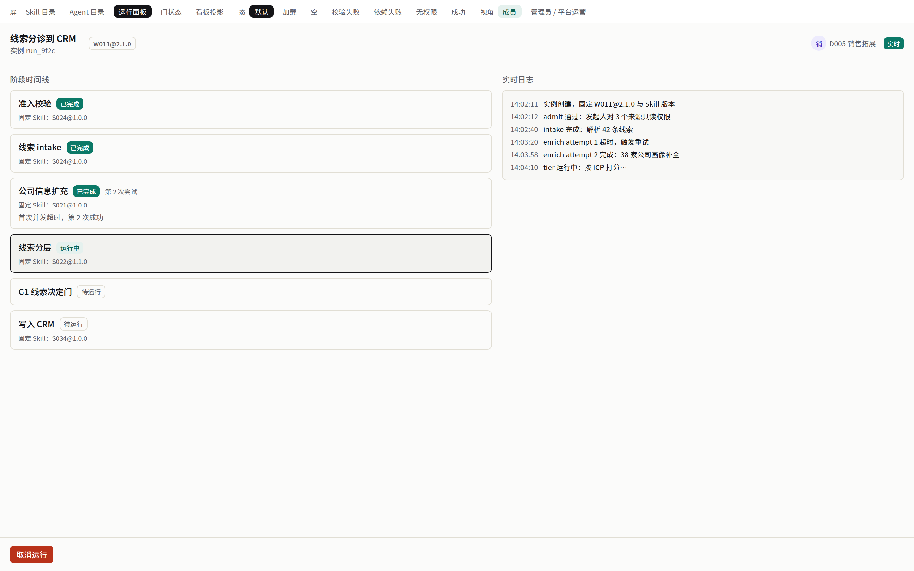

# 契约束 `workflow-runtime` — ① UI（签核面第 ① 件）

> **自检：本文件引用 8 张截图，目录下实际 8 张。** 截图目录：`ui-preview/workflow-runtime/`。

依据：`requirements/02-workflow-runtime.md` R5、R8、R12 最后一条。覆盖 feature 的权威在 `design-signoff.md` frontmatter `covers:`。
数据全部来自 `packages/contracts/src/workflow-runtime.ts` 的 `workflowRuntime.*`；mock 从契约生成，不手写。

## 一、界面落点

| 层级 | 路由 / 组件 | 目的 | 契约操作 |
|---|---|---|---|
| 入口 | Agent 详情 / 对话页「运行 Workflow」按钮 → `WorkflowStartDialog` | 选白名单内 Workflow 与版本，按 `inputSchema` 渲染 trigger 表单 | `listRunnableWorkflows`、`startInstance` |
| 我的运行 | `/workflows/runs`（`WorkflowRunList`） | 按状态筛选实例 | `listMyInstances` |
| 运行面板 | `/workflows/runs/[instanceId]`（`WorkflowRunPanel`） | 阶段时间线、固定版本徽标、SSE 日志、产出链接、取消 / 从该阶段重试 / 继续 | `getInstance`、`streamInstanceEvents`、`cancelInstance`、`retryStage`、`resumeInstance` |
| 待我审批 | `/workflows/approvals`（`WorkflowApprovalList`） | 待决与已决门 | `listMyApprovals` |
| 审批抽屉 | `WorkflowApprovalDrawer`（面板与列表共用） | 副作用预览、能力分类、目标系统、发起人与 Agent、批准 / 拒绝（必填理由） | `approveGate`、`denyGate` |
| 引导式研究 | `/research/[sessionId]` 现有页面 | 外观不变，迁移只换后端 | 现有 `research.ts` 契约 |

路由为本束提案；落地时须同步 `apps/web/lib/navigation.ts` 的 `href`（contract-design.md「物化③连带门」第 2 条）。

## 二、稳定 `data-testid`（实现时须存在）

| 区域 | `data-testid` | 判据 |
|---|---|---|
| 入口按钮 | `workflow-run-entry` | 无运行权限或无可运行 Workflow 时不渲染 |
| 启动对话框 | `workflow-start-dialog`、`workflow-start-submit` | 提交携带客户端 requestId；重复点击不产生第二个实例 |
| 面板根 | `workflow-run-panel` | 头部 `workflow-pinned-version` 显示 `key@version` |
| 阶段时间线 | `workflow-stage-<stageId>` | 含状态、attempt、固定 Skill 版本 `workflow-stage-skills-<stageId>` |
| 实时日志 | `workflow-event-log` | 按 seq 排列、无重复 |
| 连接状态 | `workflow-sse-status` | `live` / `reconnecting` / `polling` |
| 提示条 | `workflow-banner-needs-attention`、`workflow-banner-blocked-permission` | 显示 `reasonCode` 对应文案 |
| 操作 | `workflow-action-cancel`、`workflow-action-retry-<stageId>`、`workflow-action-resume` | 按 `viewerCapabilities` 启用 |
| 审批抽屉 | `workflow-approval-drawer`、`workflow-approve`、`workflow-deny`、`workflow-deny-reason` | 已决定 / 已取消时按钮禁用并显示结果 |
| 列表 | `workflow-run-list`、`workflow-approval-list`、`workflow-run-list-empty` | 空列表态 |

## 三、截图与七态

- 运行面板（运行中主态）：

七种态（02 号 R8）逐条：

| 态 | 触发 | 呈现 | 材料 |
|---|---|---|---|
| 运行中 | status=running | 当前阶段高亮、日志滚动 | 见上图 |
| 等待审批 | awaiting_gate_decision | 阶段标「等待审批」，发起人看到审批人；审批人看到抽屉入口 | ⚠ 未产出：等待审批态截图 |
| 被拒 | rejected / gate denied | 显示拒绝人与理由 | ⚠ 未产出：被拒态截图 |
| 权限阻断 | blocked_permission | 提示条「权限已变更，需管理员处理」+ reasonCode；不自动重试 | ⚠ 未产出：权限阻断态截图 |
| 断线重连 | SSE 断开 | `workflow-sse-status`=reconnecting，重连后日志无缺号无重复；不可用时降级轮询 | ⚠ 未产出：断线重连态截图 |
| 失败可重试 | failed | 失败阶段显示「从该阶段重试」，已完成阶段产出可见 | ⚠ 未产出：失败可重试态截图 |
| 空列表 | 我的运行 / 待我审批为空 | 空态文案 + 引导 | ⚠ 未产出：空列表态截图 |

以上六条缺口是签核缺口，签核人可选择按单图 + 本表文字签①，或要求补齐后再签。

## 附：七态截图（ui-prototyper 产出，`/preview/work-stack` 原型屏）

| 截图 | 状态 |
|---|---|
| `ui-preview/workflow-runtime/WF08-run-panel-default.png` | default |
| `ui-preview/workflow-runtime/WF08-run-panel-denied.png` | denied |
| `ui-preview/workflow-runtime/WF08-run-panel-depfail.png` | depfail |
| `ui-preview/workflow-runtime/WF08-run-panel-empty.png` | empty |
| `ui-preview/workflow-runtime/WF08-run-panel-invalid.png` | invalid |
| `ui-preview/workflow-runtime/WF08-run-panel-loading.png` | loading |
| `ui-preview/workflow-runtime/WF08-run-panel-success.png` | success |
