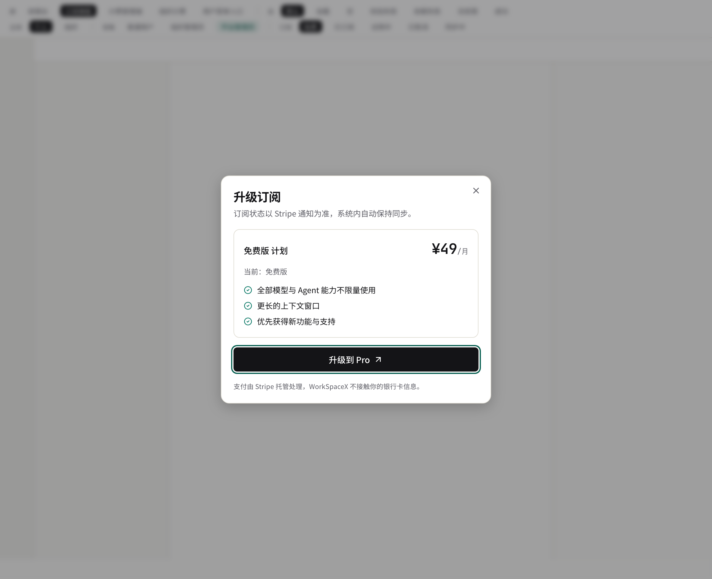
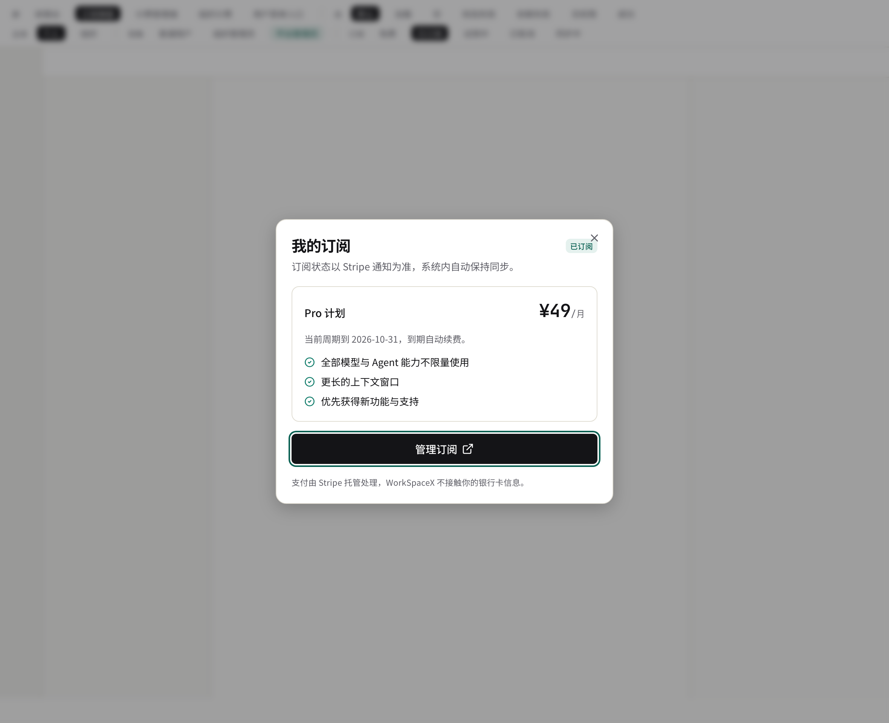
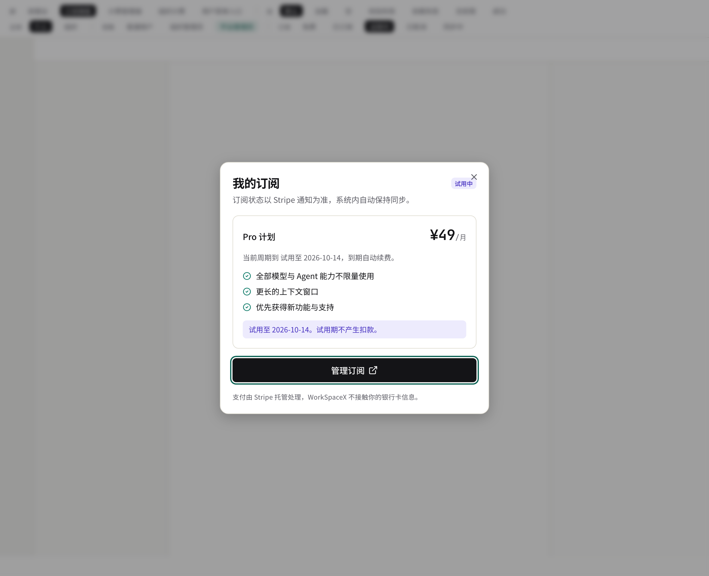
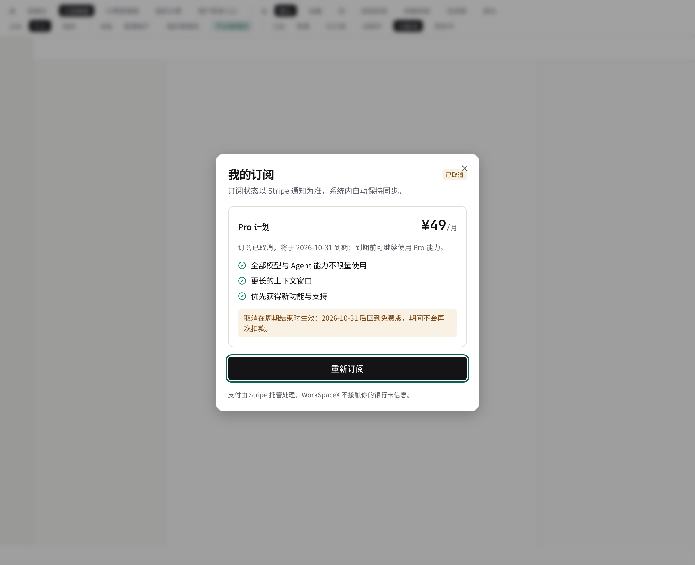
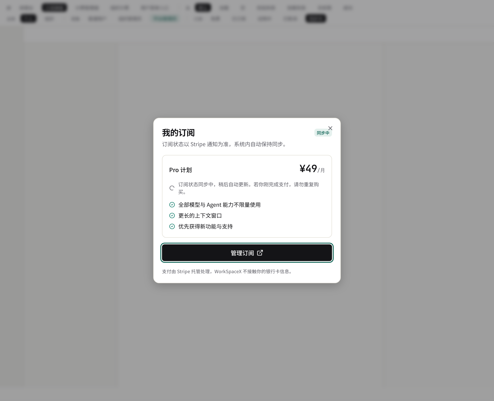
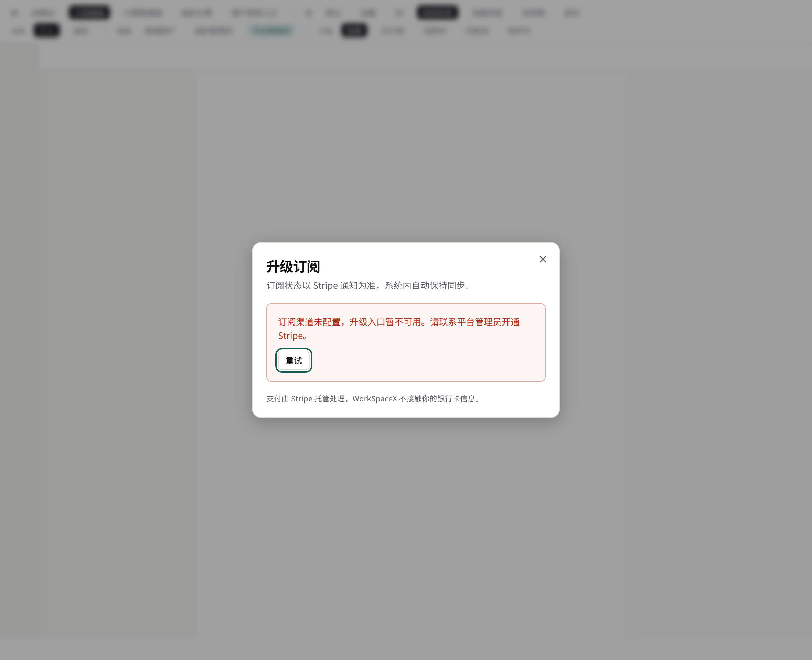
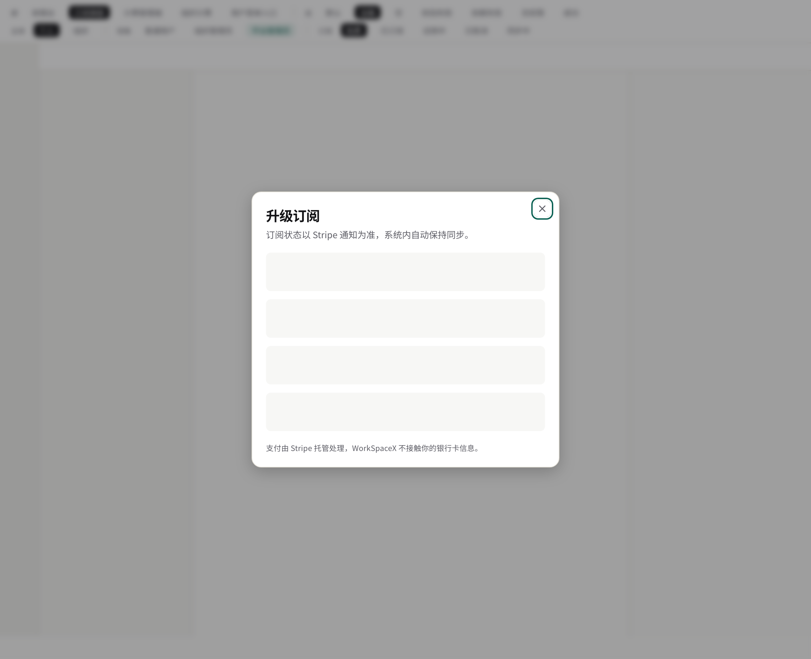
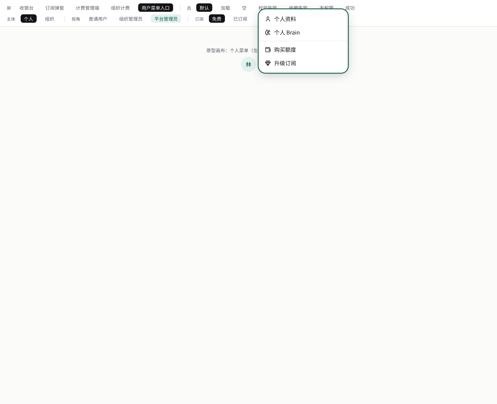

# 契约束 `billing-subscription` — ① UI（签核面第 ① 件）

> **自检：本文件引用 9 张截图，目录下实际 9 张。** 截图目录：`ui-preview/billing-subscription/`。
> （其中 `menu-entries-free.png` / `menu-entries-subscribed.png` 是两束共用的入口证据，各持一份副本；原图保留在同级 `ui-preview/` 下。）

依据：`requirements/03-subscription-stripe.md` R3 / R4 / R8 与 R12。
覆盖 feature 的权威在 `design-signoff.md` frontmatter `covers:`。
数据形状来自 `packages/contracts/src/billing-subscription.ts` 的 `billingSubscription.*`；原型 mock 是**界面投影**，实现期按 ADR-020 单源收敛为从契约生成。

## 一、界面落点

| 层级 | 路由 / 组件 | 目的 | 契约操作 |
|---|---|---|---|
| 预览宿主 | `/preview/billing?screen=subscription`（`components/billing/billing-preview.tsx` 的调试条切 `sub=` 变体） | 签核材料载体 | —（仅原型） |
| 订阅弹窗 | `components/billing/subscription-dialog.tsx`（free / active / trialing / canceled / syncing 五变体） | 升级按钮 → 跳转 Stripe；已订阅 → 管理入口；回跳 / webhook 后状态同步的呈现 | `getSubscriptionInfo`、`getUpgradeLink`、`getManagementLink` |
| 用户菜单入口投影 | `components/billing/menu-entries-preview.tsx` | 升级入口（免费）/ Pro 徽标 + 我的订阅（已订阅） | `getSubscriptionInfo` |

> 实现期落点（本束提案）：用户菜单「升级 / 我的订阅」；落地时须同步 `apps/web/lib/navigation.ts` 与 nav-reachability 配置（contract-design.md「物化③连带门」第 1–3 条）。

## 二、稳定 `data-testid`（实现时须存在；均取自已交付原型组件）

| 区域 | `data-testid` | 判据 |
|---|---|---|
| 弹窗根 / 状态 | `billing-sub-dialog`、`billing-sub-status`、`billing-sub-plan` | 状态驱动整体呈现；`none` 不显示为已订阅 |
| 升级 | `billing-upgrade-btn` | 仅未订阅可点（服务端也以 `already_subscribed` 兜底） |
| 管理 | `billing-manage-btn`、`billing-resubscribe-btn` | 已订阅 → 管理入口；取消后 → 重新订阅入口 |
| 同步中 | `billing-sub-syncing`、`billing-sub-hint` | 回跳后 webhook 未到：显示"同步中"，**不得**把已订阅显示为免费（E2） |
| 取消说明 | `billing-sub-cancel-note` | 取消订阅的生效时点必须讲清（到期 / 立即，E5） |
| 试用说明 | `billing-sub-trial-note` | trialing 的呈现（按"已订阅"语义，Q4 待签核确认） |
| 权限 | `billing-sub-denied` | 未登录 / 越权：不可用（不泄露他人订阅） |
| 菜单入口 | `billing-menu-subscription`、`billing-menu-sub-badge` | 菜单项与 Pro 徽标 |

## 三、截图索引（9 张）

### 订阅弹窗（7 张）

| 截图 | 变体 / 状态 | 说明 |
|---|---|---|
|  | free | 免费用户：计划说明 + 升级按钮 |
|  | active | 已订阅：状态 + 计划 + 管理入口 |
|  | trialing | 试用中（按"已订阅"语义呈现，试用说明可见；Q4 待签核） |
|  | canceled | 已取消：**两处**讲清生效时点（E5） |
|  | syncing | 回跳后同步中：不误显示免费（E2） |
|  | E1 未配置 | 渠道未配置：入口不可用 / 明确报错，不跳无效地址 |
|  | loading | 加载态 |

### 用户菜单入口（2 张，与 `billing-credits` 束共用副本）

| 截图 | 状态 | 说明 |
|---|---|---|
|  | 免费用户 | 「升级订阅」入口 |
|  | 已订阅 | Pro 徽标 + 「我的订阅」管理入口 |

## 四、说明（非缺口）

- 订阅状态的**唯一权威是 webhook**（I-1）：截图中的 syncing 态即"回跳早于 webhook"的诚实呈现，不做乐观假状态。
- mock 订阅价（¥49/月）为占位值，**不是契约**；计划与价格以 Stripe 侧为准（见 usecases.md Q1）。
