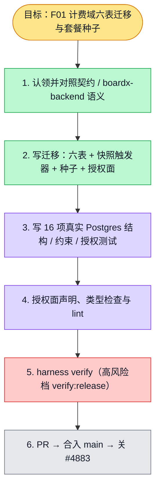

# 执行计划 — F01 计费域数据表迁移与套餐种子

> 规范：`.harness/instructions/execution-plan-visualization.md`。
> 改状态用 `node .harness/scripts/execution-plan.mjs set <本文件> <节点> <状态>`，
> 改完 `check` 一遍；不要手改 classDef 颜色。

## 我理解的目标
- **目标**：落 Phase 21 计费域六张表（套餐 / 订单 / 钱包 / 流水 / 组织开关 / 回调事件）+ 套餐种子，
  约束与授权面由库内门强制——即契约束 billing-credits `domain.md` I-1..I-14 的数据库层实现。
- **完成判据**：`pnpm harness verify --sprint 21/01 --feature F01 --owner coord-voice` 全绿并把 F01 置
  passing（含高风险档 `verify:release`：全量 lint / typecheck / test）。
- **不做什么**：不写订单创建、回调处理、钱包查询的服务端逻辑（F02+ 的 feature）；不引入微信 / Stripe SDK
  （真实调用在后续 feature）；不清理既有 payment 骨架（00-overview R10 的收尾项）。
- **实现边界**：五张按 `(owner_type, owner_id)` 归属的表以显式内核豁免声明配合后续应用鉴权；
  `org_billing_settings` 有 `org_id`，强制 RLS。当前恢复旧分支产物，所有验证重新执行。
  用户于 2026-10-10 豁免协调凭据接入，不豁免验证或 PR 门控。

## 执行计划

## 进度日志（append-only，每次改颜色追加一行）
| 时间 | 节点 | 状态变化 | 依据（命令 / 证据 / 堵塞原因） |
|---|---|---|---|
| 2026-10-01 | G, S1 | todo → doing | F01 领入 sprint-01（#4883），对照契约 domain.md 与 boardx-backend 语义 |
| 2026-10-01 | S2, S3 | todo → tested | 迁移落库 + 12 项结构测试三轮全过（with-test-isolation 封装） |
| 2026-10-01 | S4 | todo → tested | api lint 链退出 0；oss-secret 基线 +8 条经人类确认后重生成，门控 0 命中 |
| 2026-10-01 | S5 | todo → doing | `pnpm harness verify` 启动，证据相位 `phases/phase-21-billing-payment/sprints/sprint-01/evidence/F01.verify.log` |

| 2026-10-10 | S1–S5 | 历史验证状态重置 | 最新 main 恢复；本轮缺表红测试 14/14，恢复后初次绿测试 14/14；正在补真实 SQL 重放、事务回滚与跨组织 RLS |
| 2026-10-11 | S5 | blocked → doing | rebase main 882bd3339 后继续原官方门控；16 项专项通过，全量 verify:release 尚在运行，不声明 passing |
