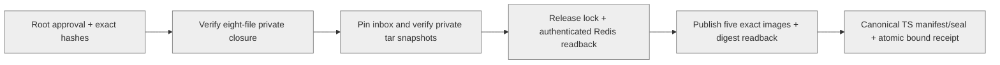

# Candidate v2 host publication boundary

This entry consumes original candidate bytes; it does not build, transport,
install, prepare, migrate or activate production. Refs #5547. Legacy v1 remains
unchanged. A candidate receipt is not publication authorization.

## Explicit entry and installed closure

`python3 -I -S -B /usr/local/lib/workspacex-cn/import-cn-image-candidates.py --check-plan|--publish SOURCE ATTEMPT APPROVAL_SHA256`

The entry and every helper are root:root 0700 regular files beneath the fixed
trusted tools directory. The approval pins exactly eight files: the new entry,
legacy `import-cn-image-archives.py`, `cn_candidate_host.py`,
`cn_candidate_publication.py`, `cn_image_candidate.py`, `cn_image_archive.py`,
`hosted-release.py` and `canonical_control.py`. Dynamic sibling imports execute
only verified bytes copied into a private directory. The operator must stage the
entry and closure through a separately reviewed installation mechanism; this
code grants no installer/sudoers permission.

Root:root 0600 inputs under `/etc/workspacex-cn/candidate-publish/SOURCE/ATTEMPT/`:

- `approval.json`, kind `cn-candidate-host-approval-v2`, schema 2, exact fields in
  `validate_approval`. It binds original plan/set/intent hashes, fixed account/ECS/
  Shanghai ACR target, bounded deadline, fresh immutable repository evidence,
  exact tool/binary/canonical closure hashes and explicit publication authority.
- `candidate-plan.json` and `publication-intent.json`, unchanged original bytes.
- `immutable-provider-response.json`, original independently collected repository
  evidence with matching hash, checked by the existing raw evidence validator.
- `canonical-control.json`, fixed `node` and `canonical-source/` closure; no
  ambient source or dependency downloads.

Root:root 0600 `candidate-set.json` and five `SERVICE.tar` files reside under
`/var/lib/workspacex-cn/candidate-inbox/SOURCE/ATTEMPT/`. Transport is deliberately
outside this entry: the inbox is a root-admitted boundary and there is no OSS,
GitHub, guessed bucket or credential fallback. Transport provenance must be
reviewed separately. Plan, set and intent cannot be renamed to v1 inputs.

## Execution and result

Check mode verifies private bounded snapshots but performs no Docker/registry
operations and publishes no receipt. It creates and removes temporary files;
`publicationSideEffects=false` does not mean zero local filesystem activity.
Publish mode additionally checks Docker capacity and acquires the existing
canonical release lock. Existing `Commands` supplies bounded subprocesses,
short-lived ECS-role ACR authentication in temporary Docker configuration,
collision checks and exact registry readback. Before STS/ACR credential acquisition
or Docker login, the v2 adapter obtains an IMDSv2 token and checks live `instance-id`
and `region-id` against the admitted target. The token is memory-only; requests
use fixed `100.100.100.200:80`, a 2-second socket timeout, a 4096-byte body cap,
no proxy environment, redirects, retries, IMDSv1 fallback or credential metadata
endpoints. A wrong host fails before requesting an ACR token. The sanitized host
observation is bound into the final atomic receipt. Endpoint/header definitions
were checked against [Alibaba Cloud instance metadata documentation](https://www.alibabacloud.com/help/en/ecs/user-guide/view-instance-metadata).
Redis pull and digest readback
precede every candidate load/tag/push. Every mutation checks original receipt
expiry; an expired successful build cannot be refreshed here.

The adapter runs the existing TypeScript manifest generator, sealer and validator.
The existing dirfd/rename-no-replace atomic writer publishes `release.json`,
`release.sealed.json`, and `published.json` together under
`/var/lib/workspacex-cn/archive-published/SOURCE/ATTEMPT/`. Receipt kind is
`cn-candidate-published-v2`; it binds all six digest references, original three
input hashes, root approval hash, candidate identity, source/control/attempt,
Redis readback time and original expiry. `ready`, `prepared`, `releaseReady`,
`productionReady` and `productionActivated` remain false. Existing attempt output
is never overwritten; a different fresh Redis observation can reject a replay
as a receipt collision, requiring operator reconciliation, not an automatic retry.

## Verification and remaining boundary

Run `test_cn_candidate_host.py` for schema/target/closure/expiry/private-copy and
binding negatives; `test_cn_candidate_host_canonical.py` uses fixed Node 22.20.0
and frozen tsx/zod to execute real canonical code. Final filesystem publication
is captured in the v2 canonical tests; the unchanged atomic writer has its own
Linux archive integration tests. `test_cn_candidate_publication.py` covers
credential-free ordering/TTL/Redis/collision/lost-ack failure injection.

These tests do not prove production installation, immutable repository policy,
actual ECS identity, transport availability, ACR credentials, Redis reachability,
or any production A0–A6/business acceptance. No existing expired receipt is
accepted and no automatic rebuild/retry is added.
