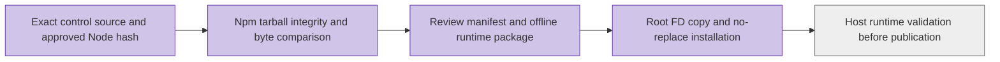

# Reviewable candidate canonical runtime

Refs #5547. The candidate host's eight Python tools do not include Node, TypeScript
source, tsx, zod or esbuild. Those eight paths have no intersection with the old
`cn-build-tool-identity.py` 129-source/90-install-target inventory. Installing either
inventory is not proof that this canonical runtime exists or executes.

`package-cn-candidate-runtime.py` is a local producer. It reads the eight canonical
source files directly from an exact Git commit, without working-tree bytes or
moving refs. The runtime pins tsx 4.20.6 and zod 3.25.76. The complete six-package
tree includes esbuild and its Linux-x64 native binary, get-tsconfig and
resolve-pkg-maps. Each independently supplied npm tarball must match the frozen
lockfile SHA512 integrity. Installed package files must equal every original
package member byte-for-byte. Unknown package roots, extra files, symlinks inside
packages, foreign native architecture and unexpected `.bin` shims are rejected.
No dependency installation or network access occurs inside the producer.

The output contains `runtime.tar.gz`, complete external `manifest.json`, and
`package-receipt.json`. Every archived file has a size, hash and target mode. The
manifest binds control SHA, application source SHA, original build attempt,
canonical configuration SHA, node hash and dependency provenance. It remains
`draft-unapproved`, `installed=false`, `runtimeExecuted=false`.

The package excludes Node. `existingNode` binds the exact root-owned
`/usr/bin/node` size/hash/mode. The operator must independently verify this hash,
architecture and runtime compatibility. The installed host validator accepts
hash-pinned Node; the 22.20.0 fixture version is not a host protocol constraint.
A different observed binary is not automatically admitted by earlier tests.

The protected destination remains:

`/etc/workspacex-cn/candidate-publish/<source>/<original-build-attempt>/`

It contains `node`, `canonical-source/` and root600 `canonical-control.json`.
Candidate revalidation uses its own verification identity without changing the
original build attempt or these paths.

## Installation boundary

`install-cn-candidate-runtime.py` has only this explicit invocation:

`python3 -I -S -B <reviewed-root-entry> SOURCE ATTEMPT MANIFEST_SHA PACKAGE_SHA`

The caller must independently approve the exact entry bytes and both external
hashes. The entry reads root600 `manifest.json` and `runtime.tar.gz` from the fixed
root-owned `/var/lib/workspacex-cn/runtime-inbox/SOURCE/ATTEMPT/`. There is no
transport or installer-download fallback and no credential acquisition.

It validates the bounded package and configuration binding, then reads
`/usr/bin/node` through a pinned directory FD, checks regular-file/root ownership,
mode0755, one link, size/hash and before/after/named identity. Only those verified
bytes are copied to the new attempt's `node`; the global binary is not changed.
The canonical release lock is held and its FD/named inode checked. Missing target
directories are created root-private. Existing directories are never chmodded;
existing files and full source trees must match exactly or installation rejects.

A private stage contains the complete runtime. Linux `renameat2(RENAME_NOREPLACE)`
installs each top-level object without overwriting. Config appears last after the
Node and entire source tree have been rechecked. A partial helper failure can
leave matching immutable Node/source objects, but no final config. A subsequent
explicit invocation may reuse exact matching objects. It never executes the
payload, starts containers, changes approval files or claims publication readiness.

## Validation

`python3 -I -B -m unittest discover -s tests -p test_cn_candidate_runtime.py -v`

All six tests run on the Linux CI job. They cover npm integrity/installed-byte
mismatch, unknown roots/escaping shims, wrong native architecture, original
attempt preservation, absent Node payload, no output overwrite, Node file hash,
symlink/hardlink/TOCTOU rejection, and actual Linux atomic install/failure/config-last
behavior. The filesystem installation test is explicitly skipped on non-Linux
hosts; that result alone is not acceptance.

A no-network Linux runtime test must also execute the exact approved Node and the
real canonical manifest/seal/validate TypeScript entrypoints. Synthetic Docker
responses in this compatibility test prove only Node/TS/native dependency closure;
they do not prove registry state, image digests or production readiness. Before
publication, repeat an independently reviewed credential-free runtime probe on
the actual installed host binary and closure. The real publication path continues
to require authenticated registry readback, valid original/revalidated evidence,
protected approvals and all subsequent release gates.
