# 可执行模板

卡片「产出」要落成可编辑的东西时用本文件。只在这里取骨架，不要自己发明分区名：聊天面板按分区名把便签放进画布格子，名字对不上的内容会渲染成空白。

## 通用规则

- **canvas 围栏**：```` ```canvas ```` 开头，首行 `模板: <key>`，接表头字段（`字段名: 值`），再接 `## 分区`。分区名、字段名逐字照抄下面的骨架，不加序号或括号注释。
- 每条 `- ` 是一张便签，一句话。每格 6–9 条封顶，放不下的会被截掉，宁可精简。
- 便签内容必须来自用户提供的材料；推断出来的写成「（推断）…」，没有依据的格子留空，不要填满凑数。
- 尖括号 `<…>` 是占位说明，交付前全部替换或删除。
- **mermaid 围栏**只用白名单类型（见 SKILL.md「能力检查」），下面的骨架都在白名单内。
- 本文件只收通用方法。用户要的方法不在下面时，用卡片「产出」描述的结构交付 markdown 表格。

## 一、canvas 画布模板（聊天里渲染成可拖拽编辑的工作坊画布）

### T-01 用户旅程地图 · M4-16

阶段 1–5 在表头写阶段名，分区按「行 · 阶段N」对应。阶段不足五个时，多余阶段的表头和分区都省略。

```canvas
模板: journey-map
阶段1: <阶段名，如：发现需求>
阶段2: <阶段名>
阶段3: <阶段名>
阶段4: <阶段名>
阶段5: <阶段名>

## 行为 · 阶段1
- <用户在这一阶段做了什么>

## 触点 · 阶段1
- <接触到的渠道、界面、人>

## 痛点 · 阶段1
- <卡住或不满的地方，附来源>

## 机会 · 阶段1
- <可以改进的方向>

## 行为 · 阶段2
- <…>

## 触点 · 阶段2
- <…>

## 痛点 · 阶段2
- <…>

## 机会 · 阶段2
- <…>
```

### T-02 同理心地图 · M4-21

```canvas
模板: empathy

## 说的与做的
- <原话或可观察的行为，附来源>

## 想的与感受到的
- <从材料推断的想法与情绪，标「（推断）」>

## 听到的
- <来自同事、朋友、媒体的影响>

## 看到的
- <环境里看到的东西、竞品、别人的做法>

## 痛点
- <恐惧、挫败、障碍>

## 收益
- <想要得到的、成功的样子>
```

### T-03 用户画像 · M5-03

表头人口属性只填用户材料里明确给出的，其余写「未知」，不要推断年龄、性别、收入等。

```canvas
模板: persona
姓名: <代称，不用真实姓名>
性别: 未知
年龄: 未知
区域: 未知
教育水平: 未知
职位: <角色>
行业: <行业>
家庭情况: 未知
收入水平: 未知

## 用户描述
- <一句话描述这类用户>

## 目标和需求
- <要完成的事>

## 行为与偏好
- <实际怎么做、用什么工具>

## 痛点和挑战
- <卡在哪>

## 动机
- <为什么在意>

## 影响因素
- <谁或什么影响他的决定>
```

### T-04 待完成任务画布 · M4-22

```canvas
模板: jtbd
执行者: <谁在完成这项任务>
决策者: <谁拍板>
付费者: <谁买单>
关键约束: <时间、预算、合规等>

## 情境触发
- <什么时候、什么情况下产生这个任务>

## 核心任务
- <要完成的进展，用动词开头>

## 期望成果
- <完成得好是什么样>

## 内在驱动
- <情感、社会层面的动机>

## 痛点阻力
- <现有做法的阻碍、转换的焦虑>

## 成功标准
- <用户自己怎么判断成功>
```

### T-05 「我们可以怎样…」 · M4-24

表头三项拼起来是一句问题：我们可以如何〈做什么〉，为给〈谁〉，以便〈达成什么〉。分区放围绕这个问题的点子。

```canvas
模板: hmw
我们可以如何: <动作，不预设方案>
为给: <具体用户>
以便: <期望结果>

## 想法1
- <点子>

## 想法2
- <点子>

## 想法3
- <点子>
```

### T-06 SWOT 分析 · M2-10

```canvas
模板: swot

## 优势
- <内部、可控、相对竞争者的长处>

## 劣势
- <内部短板>

## 机会
- <外部趋势带来的机会>

## 威胁
- <外部风险>
```

### T-07 宏观环境扫描 · M1-15

```canvas
模板: pestel

## 政治因素
- <政策、监管方向>

## 经济因素
- <增长、成本、资本环境>

## 社会因素
- <人口、观念、生活方式变化>

## 技术因素
- <新技术及成熟度>

## 环境因素
- <气候、资源、可持续>

## 法律因素
- <法规、合规要求>
```

每条注明信息来源或标「待核实」，不要编造数据。

### T-08 三层地平线 · M1-17

```canvas
模板: three-horizons

## 第一地平线（1-3年）
- <当前主业如何维持与优化>

## 第二地平线（3-5年）
- <过渡期的新兴业务与试验>

## 第三地平线（5年以上）
- <长远可能改变格局的方向>

## H1 焦点领域
- <现在要投入的领域>

## H2 焦点领域
- <…>

## H3 焦点领域
- <…>
```

### T-09 MVP 实验 · M7-14

```canvas
模板: mvp

## 早期客户
- <最先尝试的那群人>

## 未满足需求
- <他们现在没被满足的需求>

## 价值主张
- <这个 MVP 给他们什么>

## 愿景与假设
- <要验证的关键假设，一条一个>

## 核心用户旅程
- <MVP 里用户走的最短路径>

## 实验设计
- <怎么测：方式、样本、时长>

## 早期关键指标
- <判断成败的指标和阈值，实验前定好>

## 实验结果与下一步
- <实验跑完后由用户填写，不要预填结果>
```

### T-10 方案故事板 · M6-07

```canvas
模板: storyboard
故事主角: <谁>
故事主题: <这个方案解决的场景>

## 1 开场
- <主角所处的情境>

## 2 冲突
- <遇到的问题>

## 3 情节演进
- <开始使用方案>

## 4 高光点
- <方案带来改变的那一刻>

## 5 结束
- <问题解决后的状态>

## 6 收尾
- <长期的影响、下一次会怎样>
```

## 二、mermaid 图模板（聊天里渲染成图）

### T-11 亲和图 · M4-20

根是研究问题，第二层是主题，第三层是支撑的观察。每条观察后用括号写来源编号。

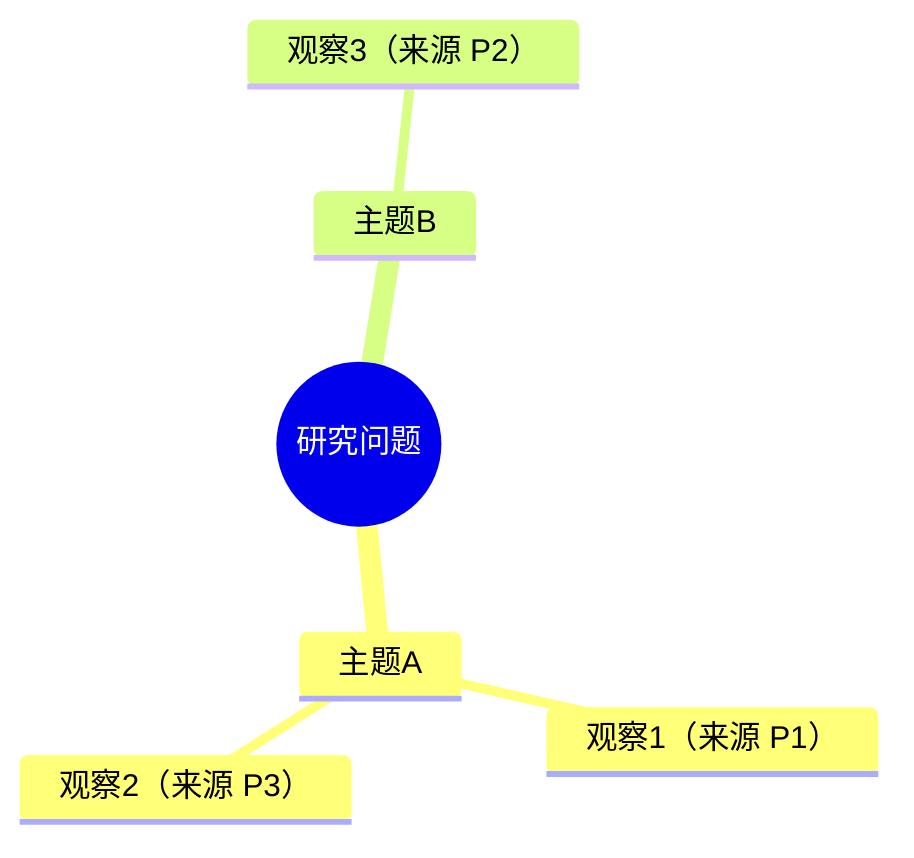

### T-12 机会思维导图 · M5-01

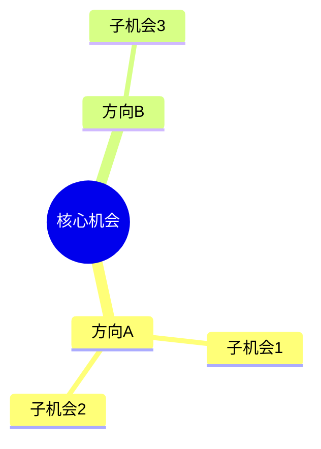

### T-13 影响-投入矩阵 · M6-18

坐标是团队评估的相对值（0–1），交付时说明打分依据，AI 草拟的分数标「待团队确认」。

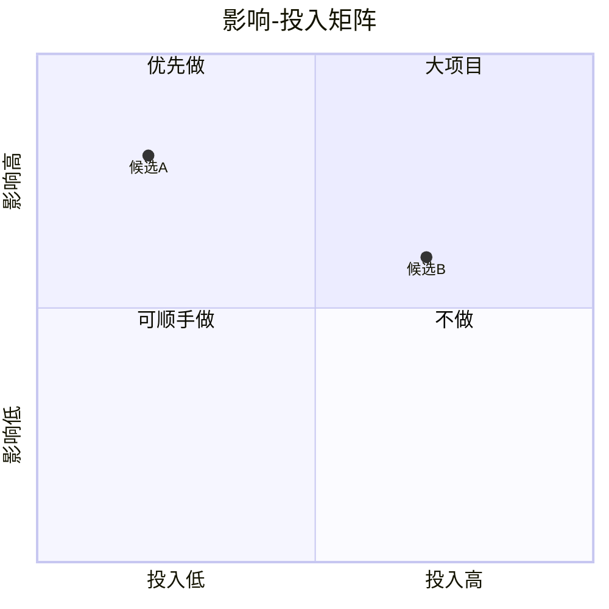

### T-14 定位图 · M4-06

两根轴是用户关心的维度，由用户或研究材料确定；点位要能说出依据。

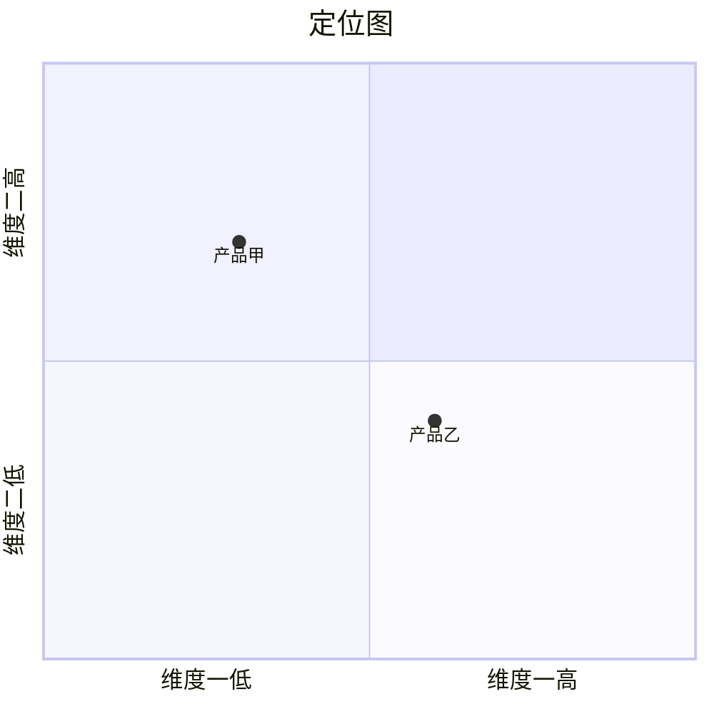

### T-15 因果回路图 · M4-27

边上写 + 或 −，表示同向或反向影响；在回路旁用注释标 R（增强）或 B（调节）。

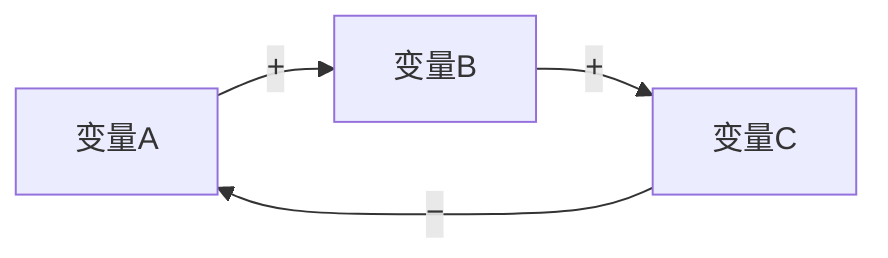

### T-16 冰山模型 · M4-26

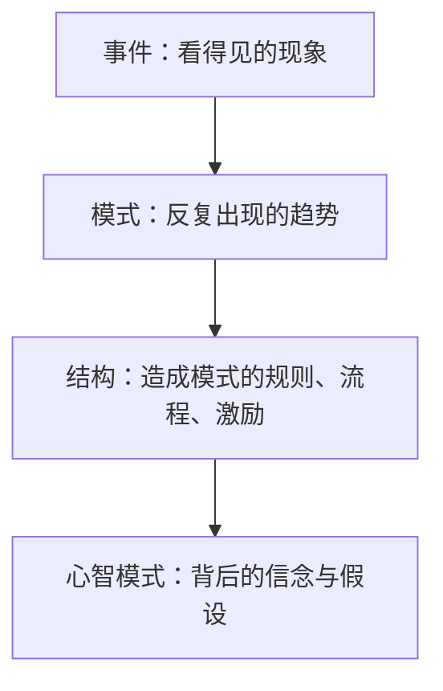

### T-17 五问法 · M4-25

每一层「为什么」都要有证据，推不下去就停在那一层，不要硬凑五层。

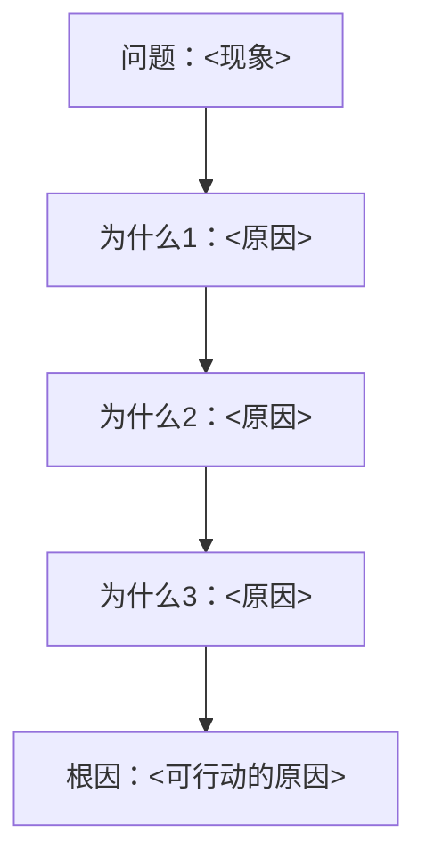

### T-18 服务蓝图 · M6-13

从上到下分层：用户行为、前台、后台、支撑流程。跨越「可见线」的连线就是需要重点设计的交接。

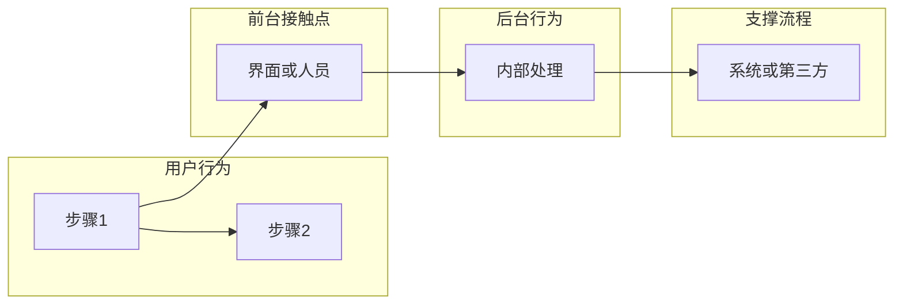

### T-19 利益相关方地图 · M2-13

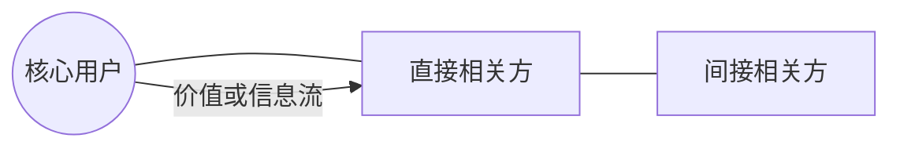

### T-20 历史演进时间线 · M2-03

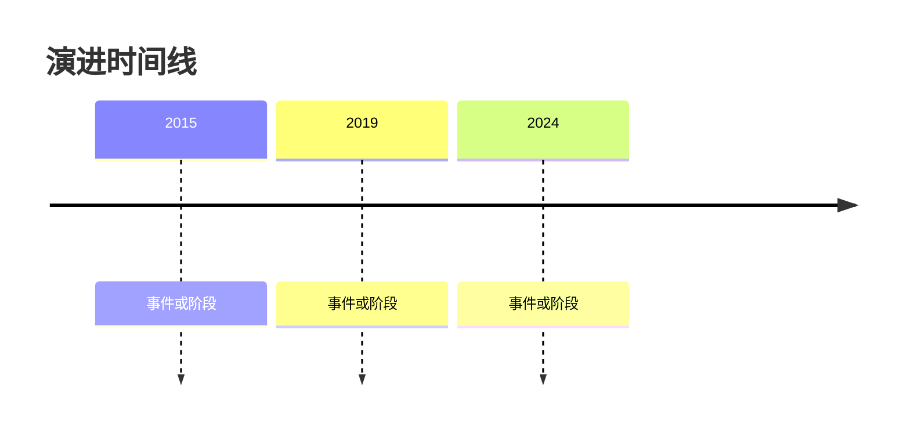

### T-21 实施计划 · M7-05

日期、时长由用户确认，AI 只按用户给的约束排。

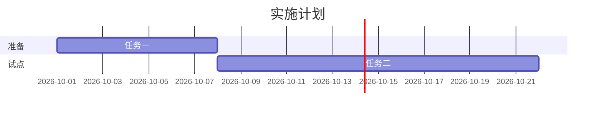

## 三、表格模板

### T-22 故事地图 · M7-10

首行是用户活动（从左到右按时间），下面每行是一个发布切片，越往上越先做。

| | 活动1 | 活动2 | 活动3 |
|---|---|---|---|
| 第一版 | <最小可用的任务> | <…> | <…> |
| 第二版 | <…> | <…> | <…> |

### T-23 MoSCoW 优先级 · M6-19

| 需求 | 分类（必须 / 应该 / 可以 / 不做） | 依据 |
|---|---|---|
| <需求> | <分类> | <为什么，引用证据或约束> |
